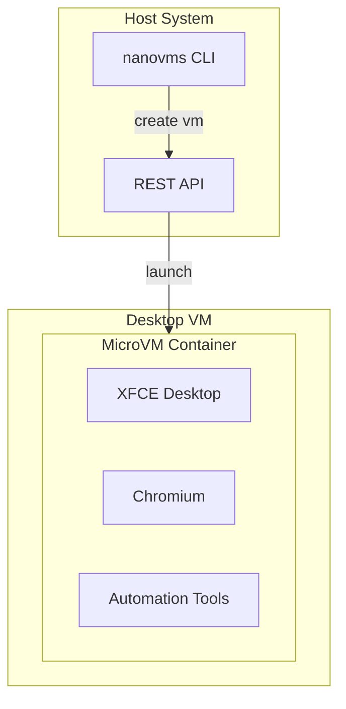
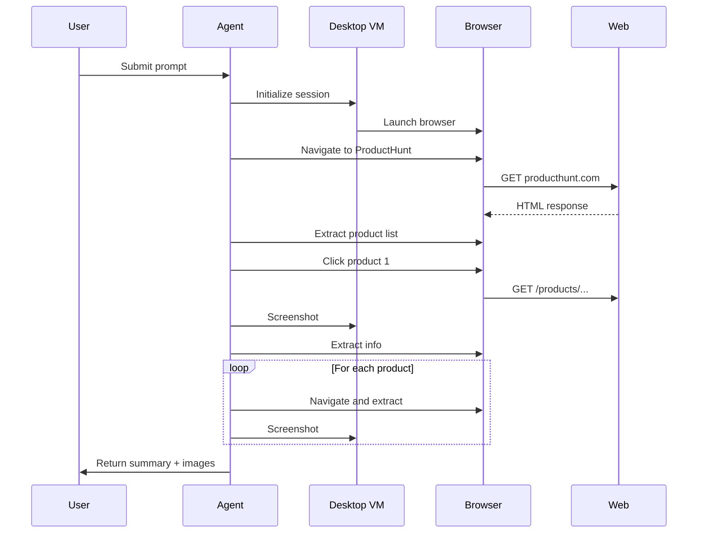

# Journey: Agent Desktop Environment

> Creating isolated desktop environments for AI agents with full computer use capabilities

## Overview

This journey demonstrates how to create and manage isolated desktop environments for AI agents that can interact with graphical applications, browsers, and desktop software.

<UserJourney
  title="Agent Desktop Environment"
  :steps="[
    { title: 'Create Desktop VM', description: 'Launch isolated desktop VM with browser and tools', icon: '🔧', status: 'complete' },
    { title: 'Configure Agent', description: 'Set up agent with desktop access permissions', icon: '⚙️', status: 'complete' },
    { title: 'Connect Display', description: 'Attach VNC or Looking Glass for visualization', icon: '🖥️', status: 'current' },
    { title: 'Run Task', description: 'Agent performs desktop automation task', icon: '🤖', status: 'pending' },
    { title: 'Review Results', description: 'Review screenshots, logs, and outputs', icon: '✅', status: 'pending' }
  ]"
/>

## Quick Start

::: tip TL;DR
```bash
# Create agent desktop VM
nanovms vm create agent-desktop --flavor microvm --desktop --browser

# Connect VNC display
nanovms display attach agent-desktop --vnc

# Launch agent with desktop access
nanovms agent run agent-desktop --prompt "Research competitors on ProductHunt"
```
:::

## Prerequisites

- NanoVMS CLI installed
- MicroVM tier supported (Firecracker or QEMU)
- 2GB+ available RAM per desktop VM

## Step-by-Step Guide

### Step 1: Create Desktop VM

Create a MicroVM with desktop environment pre-installed:

```bash
# Option A: MicroVM (faster startup, ~2s)
nanovms vm create agent-desktop \
  --flavor microvm \
  --desktop \
  --browser \
  --memory 2G \
  --vcpus 2

# Option B: Full VM (better compatibility, ~10s)
nanovms vm create agent-desktop \
  --flavor native \
  --desktop \
  --browser \
  --memory 4G \
  --vcpus 4
```

**What this creates:**



### Step 2: Configure Agent Permissions

Set up agent access to the desktop:

```bash
# Grant desktop permissions
nanovms vm config agent-desktop \
  --agent-permissions \
    desktop:control,\
    browser:automation,\
    filesystem:readwrite
```

Available permissions:

| Permission | Description |
|------------|-------------|
| `desktop:view` | View-only VNC access |
| `desktop:control` | Full mouse/keyboard control |
| `browser:automation` | Browser automation via Playwright |
| `filesystem:read` | Read files within VM |
| `filesystem:write` | Write files within VM |

### Step 3: Connect Display

Choose your display method:

**Option A: VNC (built-in)**

```bash
# Start VNC server on VM
nanovms display start agent-desktop --vnc --port 5900

# Connect with any VNC client
open vnc://localhost:5900
```

**Option B: Looking Glass (high performance)**

```bash
# For GPU-accelerated VMs
nanovms display start agent-desktop --looking-glass

# Launch Looking Glass client
looking-glass-client -f /tmp/agent-desktop.shm
```

**Option C: WebRTC (browser-based)**

```bash
# Stream to browser
nanovms display start agent-desktop --webrtc --port 8080

# Open in browser
open http://localhost:8080
```

### Step 4: Run Agent Task

Execute agent with desktop automation:

```bash
# Research task with desktop automation
nanovms agent run agent-desktop \
  --prompt "Go to ProductHunt.com and find the top 5 AI developer tools from this week. 
           Take screenshots of each product page and compile a summary 
           with pricing, key features, and user reviews." \
  --max-steps 50 \
  --screenshots ./captures/
```

**Agent execution flow:**



### Step 5: Review Results

```bash
# View session recordings
nanovms session list agent-desktop

# Download screenshots
nanovms artifacts download agent-desktop ./session-outputs/

# View agent reasoning trace
nanovms logs agent-desktop --level debug
```

## Real-World Examples

### Example 1: UI Testing

```bash
# Test web application UI
nanovms vm create ui-test \
  --flavor microvm \
  --desktop \
  --app https://staging.myapp.com

nanovms agent run ui-test \
  --prompt "Test the checkout flow: add item to cart, 
           proceed to checkout, fill payment form, 
           verify confirmation page. Report any errors." \
  --max-steps 30
```

### Example 2: Data Extraction

```bash
# Extract data from visual dashboards
nanovms vm create data-extract \
  --flavor microvm \
  --desktop

nanovms agent run data-extract \
  --prompt "Navigate to Salesforce dashboard, 
           extract Q4 sales figures from the charts,
           export to CSV format." \
  --output-format csv
```

### Example 3: Content Creation

```bash
# Create social media content
nanovms vm create content-creator \
  --flavor microvm \
  --desktop \
  --creative-tools

nanovms agent run content-creator \
  --prompt "Open Canva, create an Instagram post 
           about our new feature launch using 
           the brand templates. Export as PNG."
```

## Advanced Configuration

### Custom Desktop Environment

```yaml
# ~/.nanovms/profiles/desktop-creative.yaml
vm:
  flavor: microvm
  memory: 4G
  vcpus: 2
  
desktop:
  environment: creative  # minimal, creative, development
  resolution: 1920x1080
  
applications:
  - chrome
  - firefox
  - gimp
  - vscode
  
agent:
  permissions:
    - desktop:control
    - browser:automation
    - app:automation
```

### Persistent Sessions

```bash
# Save VM state for later
nanovms vm snapshot agent-desktop --name "ready-state"

# Resume later
nanovms vm restore agent-desktop --snapshot "ready-state"
```

### Parallel Agents

```bash
# Run multiple agents on different tasks
for task in research-1 research-2 research-3; do
  nanovms vm create $task --flavor microvm --desktop &
done

wait

# Distribute work
nanovms agent run-batch --vms research-1,research-2,research-3 \
  --tasks tasks.json
```

## Troubleshooting

### Issue: Display not connecting

```bash
# Check VM status
nanovms vm status agent-desktop

# Restart display server
nanovms display restart agent-desktop

# View logs
nanovms logs agent-desktop --follow
```

### Issue: Agent can't interact with elements

```bash
# Check permissions
nanovms vm config agent-desktop --show

# Verify desktop is responsive
nanovms vm ping agent-desktop

# Increase timeout
nanovms agent run agent-desktop --timeout 600s
```

### Issue: VM too slow

```bash
# Upgrade to more resources
nanovms vm resize agent-desktop --memory 4G --vcpus 4

# Or switch to native flavor
nanovms vm migrate agent-desktop --flavor native
```

## Performance Metrics

<TraceabilityMatrix
  title="Agent Desktop Performance"
  :items="[
    { feature: 'VM Startup', tests: 'test_vm_startup', coverage: '85', status: 'passing' },
    { feature: 'Desktop Init', tests: 'test_desktop_init', coverage: '92', status: 'passing' },
    { feature: 'Browser Launch', tests: 'test_browser_launch', coverage: '88', status: 'passing' },
    { feature: 'Agent Control', tests: 'test_agent_control', coverage: '95', status: 'passing' },
    { feature: 'Screenshot Capture', tests: 'test_screenshots', coverage: '90', status: 'passing' }
  ]"
/>

## Next Steps

- [GPU Passthrough for Visual AI](/journeys/gpu-passthrough)
- [Multi-Agent Workflows](/journeys/multi-agent)
- [Game Automation Testing](/journeys/game-automation)

<FeatureDetail
  :related="[
    { title: 'MicroVM Flavor', description: 'Lightweight VM tier for fast startup', href: '/guide/vm-flavors' },
    { title: 'Desktop Applications', description: 'Pre-installed app bundles', href: '/guide/applications' },
    { title: 'Agent Permissions', description: 'Security model for agent access', href: '/guide/security' }
  ]"
/>
