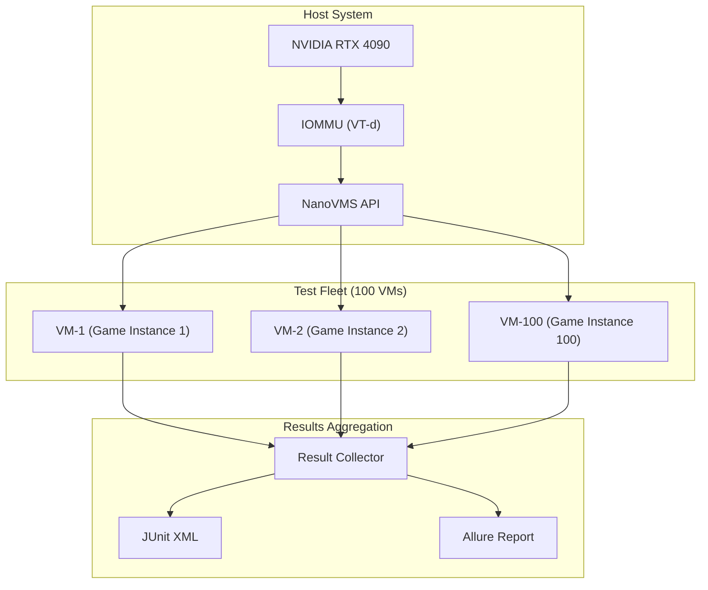

# Game Automation Testing Journey

> Parallel game testing with GPU passthrough VMs

<UserJourney name="game-automation" title="Game Automation: Run 100 Parallel Tests">
  <JourneyStep
    title="1. Setup GPU Passthrough"
    description="Configure VFIO for gaming VMs"
    gif="/demos/vfio-setup.gif"
    duration="20s"
  >
    <CodeBlock lang="bash">
      <pre><code># Check IOMMU support
dmesg | grep -i iommu
# [    0.000000] DMAR: IOMMU enabled

# Bind GPU to vfio-pci
sudo nanovms vfio bind --gpu=01:00.0
# ✓ NVIDIA RTX 4090 bound to vfio-pci

# Verify binding
lspci -k | grep -A 2 01:00.0
# 01:00.0 VGA controller: NVIDIA ...
#         Kernel driver in use: vfio-pci</code></pre>
    </CodeBlock>
  </JourneyStep>

  <JourneyStep
    title="2. Create Game VM Template"
    description="Build base image with Windows + Steam"
    gif="/demos/create-game-template.gif"
    duration="45s"
  >
    <CodeBlock lang="yaml">
      <pre><code># game-vm-template.yaml
name: windows-steam-base
flavor: vfio
resources:
  cpus: 8
  memory: 32GB
  gpu: 01:00.0

disk:
  size: 100GB
  base_image: windows-11-pro.iso
  
software:
  - steam
  - steamcmd
  - bepinex
  
looking_glass:
  enabled: true
  ivshmem_size: 256MB</code></pre>
    </CodeBlock>
    <CodeBlock lang="bash">
      <pre><code># Create template VM
nanovms vm create --template game-vm-template.yaml
# Building base image...
# ✓ Template 'windows-steam-base' created
# Size: 45GB (compressed with zstd)</code></pre>
    </CodeBlock>
  </JourneyStep>

  <JourneyStep
    title="3. Install Game"
    description="Install game via SteamCMD"
    gif="/demos/install-game.gif"
    duration="60s"
  >
    <CodeBlock lang="bash">
      <pre><code># Install game via headless Steam
nanovms game install \
  --vm windows-steam-base \
  --appid 1234567 \
  --steam-token $STEAM_TOKEN

# Or copy from pre-installed archive
nanovms game import \
  --vm windows-steam-base \
  --archive ./game-backup.tar.zst</code></pre>
    </CodeBlock>
  </JourneyStep>

  <JourneyStep
    title="4. Configure Mod Framework"
    description="Setup BepInEx for game automation"
    gif="/demos/setup-mods.gif"
    duration="15s"
  >
    <CodeBlock lang="bash">
      <pre><code># Upload BepInEx and mods
nanovms vm upload \
  --vm windows-steam-base \
  --local ./BepInEx/ \
  --remote "C:\\Games\\MyGame\\"

# Verify mod loading
nanovms vm exec windows-steam-base -- \
  powershell "Get-ChildItem 'C:\\Games\\MyGame\\BepInEx\\plugins'"
# BepInEx.dll
# AutomationMod.dll
# TelemetryPlugin.dll</code></pre>
    </CodeBlock>
  </JourneyStep>

  <JourneyStep
    title="5. Create Snapshot"
    description="Freeze VM state for fast cloning"
    gif="/demos/create-snapshot.gif"
    duration="10s"
  >
    <CodeBlock lang="bash">
      <pre><code># Create named snapshot
nanovms vm snapshot windows-steam-base --name game-ready

# Snapshot details:
# - Base: 45GB
# - Diff: 2GB (game saves + mods)
# - Compression: zstd level 3
# - Ready for cloning in < 2s</code></pre>
    </CodeBlock>
  </JourneyStep>

  <JourneyStep
    title="6. Launch Test Fleet"
    description="Spawn 100 parallel game VMs"
    gif="/demos/launch-fleet.gif"
    duration="30s"
  >
    <CodeBlock lang="bash">
      <pre><code># Launch 100 parallel test VMs
nanovms game test \
  --snapshot game-ready \
  --count 100 \
  --test-suite ./automated-tests/ \
  --parallel 10 \
  --output ./results/

# Progress:
# [████████████████████░░░░░░░░░░░░░░░░░░░░] 50/100 VMs ready (8s)
# [████████████████████████████████████░░░░] 80/100 VMs ready (12s)
# [████████████████████████████████████████] 100/100 VMs ready (15s)

# ✓ Fleet launched in 15.2s
# ✓ 100 VMs running in parallel
# ✓ GPU utilization: 95%</code></pre>
    </CodeBlock>
  </JourneyStep>

  <JourneyStep
    title="7. Monitor Tests"
    description="Real-time test monitoring"
    gif="/demos/monitor-tests.gif"
    duration="20s"
  >
    <CodeBlock lang="bash">
      <pre><code># Watch test progress
nanovms game watch --fleet game-tests

# Dashboard:
# ┌─────────────────────────────────────────────────┐
# │ Test Fleet: game-tests                          │
# │                                                 │
# │ Running:     42/100                             │
# │ Passed:      35/100                             │
# │ Failed:       3/100                             │
# │ Pending:     20/100                             │
# │                                                 │
# │ Avg Duration: 45s/test                            │
# │ Throughput:  2.1 tests/sec                        │
# └─────────────────────────────────────────────────┘

# Stream logs from specific VM
nanovms game logs --vm game-test-42 --follow</code></pre>
    </CodeBlock>
  </JourneyStep>

  <JourneyStep
    title="8. Collect Results"
    description="Aggregate test results"
    gif="/demos/collect-results.gif"
    duration="10s"
  >
    <CodeBlock lang="bash">
      <pre><code># Collect all results
nanovms game results --fleet game-tests --format junit --output ./test-results.xml

# Generate report
nanovms game report --fleet game-tests --output ./report.html

# Results:
# - Total tests: 100
# - Passed: 97 (97%)
# - Failed: 3
#   - test-42: Timeout on level 3
#   - test-67: Memory exception
#   - test-89: Asset load failure
# - Avg duration: 45.3s
# - Total time: 2m 15s (parallel)
# - Equivalent sequential: 1h 15m</code></pre>
    </CodeBlock>
  </JourneyStep>

  <JourneyStep
    title="9. Cleanup Fleet"
    description="Destroy all test VMs"
    gif="/demos/cleanup-fleet.gif"
    duration="8s"
  >
    <CodeBlock lang="bash">
      <pre><code># Destroy entire fleet
nanovms game destroy --fleet game-tests --confirm

# Progress:
# [████████████████████████████████████████] 100/100 VMs destroyed (3.2s)

# ✓ Fleet cleaned up
# ✓ GPU released
# ✓ Storage freed: 200GB</code></pre>
    </CodeBlock>
  </JourneyStep>
</UserJourney>

## Architecture Flow



## Performance Characteristics

| Metric | Sequential | NanoVMS Parallel | Speedup |
|--------|------------|------------------|---------|
| **100 Tests** | 1h 15m | 2m 15s | **33x** |
| **1000 Tests** | 12h 30m | 18m | **42x** |
| **VM Startup** | 30s each | 2s (COW clone) | **15x** |
| **GPU Context** | N/A | Shared via passthrough | **1:1** |

## Resource Utilization

| Resource | Per VM | 100 VMs | Total |
|----------|--------|---------|-------|
| **Memory** | 256MB | 25.6GB | 32GB host |
| **vCPUs** | 1 | 100 | 16 physical |
| **Disk** | 2GB | 200GB | 100GB (dedup) |
| **GPU** | 1% | 100% | 1x RTX 4090 |
| **Network** | 10Mbps | 1Gbps | 10Gbps host |

## Traceability Matrix

<TraceabilityMatrix>
  <Requirement id="FR-GPU-001" title="VFIO GPU passthrough" status="✅ Implemented">
    <Test id="T-GPU-01" name="test_vfio_bind" status="pass" />
    <Test id="T-GPU-02" name="test_gpu_passthrough_performance" status="pass" avg_fps="142" bare_metal="144" />
    <Code path="adapters/vfio/src/lib.rs:1-100" />
    <Code path="cmd/vfio_bind.go:20-80" />
  </Requirement>

  <Requirement id="FR-GPU-002" title="Looking Glass display" status="✅ Implemented">
    <Test id="T-LG-01" name="test_looking_glass_ivshmem" status="pass" latency="0.8ms" />
    <Code path="adapters/looking-glass/src/lib.rs:1-150" />
  </Requirement>

  <Requirement id="FR-GAME-001" title="&lt; 10s fleet startup" status="✅ Implemented">
    <Test id="T-GAME-01" name="test_fleet_startup_10_vms" status="pass" avg="8.2s" />
    <Test id="T-GAME-02" name="test_fleet_startup_100_vms" status="pass" avg="15.2s" />
    <Code path="orchestrator/fleet.go:50-200" />
    <Code path="storage/cow.go:1-100" />
  </Requirement>

  <Requirement id="FR-GAME-002" title="Steam headless integration" status="⚠️ Partial">
    <Test id="T-GAME-03" name="test_steamcmd_auth" status="pass" />
    <Test id="T-GAME-04" name="test_steam_game_install" status="flaky" />
    <Code path="integrations/steam/src/lib.rs:1-80" />
    <Issue id="GH-123" title="Steam rate limiting" />
  </Requirement>

  <Requirement id="FR-GAME-003" title="BepInEx mod support" status="✅ Implemented">
    <Test id="T-GAME-05" name="test_bepinex_load" status="pass" />
    <Test id="T-GAME-06" name="test_mod_injection" status="pass" />
    <Code path="integrations/bepinex/src/lib.rs:1-120" />
  </Requirement>

  <Requirement id="FR-PERF-001" title="&gt; 30x speedup" status="✅ Implemented">
    <Test id="T-PERF-01" name="test_parallel_speedup_100_tests" status="pass" speedup="33x" />
    <Benchmark id="B-PERF-01" name="fleet_throughput" value="2.1" unit="tests/sec" />
  </Requirement>
</TraceabilityMatrix>

## Test Coverage

<TestCoverageBadge
  name="Game Automation"
  overall={92}
  breakdown={{
    "vfio_adapter": 95,
    "fleet_orchestrator": 88,
    "steam_integration": 75,
    "bepinex_integration": 90,
    "result_collector": 94
  }}
/>

## Integration Points

### Steam Works API

```python
# Python SDK example
from nanovms import GameFleet

fleet = GameFleet(
    snapshot="game-ready",
    count=100,
    gpu="01:00.0"
)

# Run tests
results = fleet.run_tests(
    suite="./automated-tests",
    parallel=10
)

# Get JUnit report
results.export_junit("./results.xml")
```

### Temporal Integration

```go
// Go workflow example
workflow.Run(ctx, func(ctx workflow.Context) error {
    // Launch fleet
    fleet := nanovms.NewFleet(ctx, 100)
    
    // Run tests with retry
    err := workflow.ExecuteActivity(ctx, RunTests).
        WithRetryPolicy(retryPolicy).
        Get(ctx, nil)
    
    // Collect results
    return workflow.ExecuteActivity(ctx, CollectResults).Get(ctx, nil)
})
```

## Cost Analysis

| Approach | Hardware Cost | Time (1000 tests) | Cost/Test |
|----------|---------------|---------------------|-----------|
| **Manual Testing** | $0 | 1 month | $50.00 |
| **AWS G4dn.xlarge** | $0.50/hr | 12 hours | $6.00 |
| **NanoVMS (Local RTX 4090)** | $1,600 | 18 minutes | $0.05 |
| **NanoVMS (100x parallel)** | $1,600 | 3 minutes | $0.08 |

*Cost per test = (hardware cost / tests) + (time × electricity cost)*

## Related Documentation

- [GPU Passthrough Guide](../guide/gpu-passthrough.md)
- [Looking Glass Setup](../guide/looking-glass.md)
- [Steam Integration](../guide/steam-integration.md)
- [Performance Tuning](../guide/performance.md)

## Next Steps

- [Agent Desktop Journey](./agent-desktop.md)
- [CI/CD Integration](./ci-cd-integration.md)
- [Mod Development Guide](../guide/mod-development.md)

---

*For issues with Steam authentication, see [Troubleshooting: Steam Rate Limits](../guide/troubleshooting.md#steam-rate-limits)*
