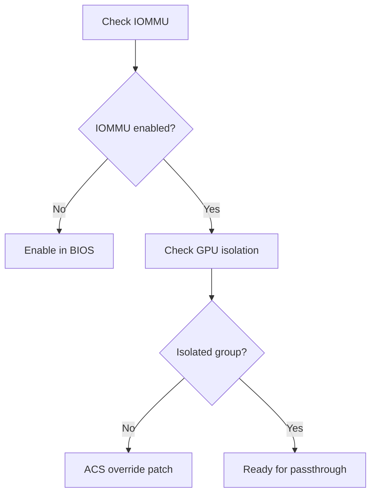
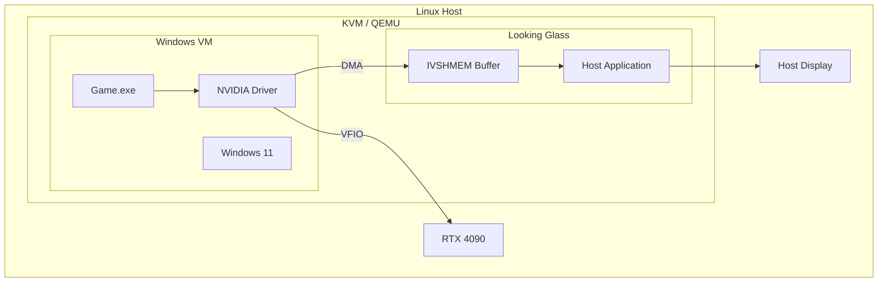

# Journey: GPU Passthrough Gaming VM

> Achieve 99% bare-metal gaming performance with VFIO GPU passthrough

## Overview

This journey demonstrates how to set up a high-performance gaming VM using VFIO GPU passthrough, achieving near-native performance for gaming and GPU-intensive workloads.

<UserJourney
  title="GPU Passthrough Setup"
  :steps="[
    { title: 'Hardware Check', description: 'Verify IOMMU, CPU virtualization support', icon: '🔍', status: 'complete' },
    { title: 'Bind GPU to VFIO', description: 'Detach GPU from host, bind vfio-pci driver', icon: '🔧', status: 'complete' },
    { title: 'Create Gaming VM', description: 'Launch Windows VM with GPU passthrough', icon: '🖥️', status: 'complete' },
    { title: 'Install Looking Glass', description: 'Set up zero-copy display from VM', icon: '🎮', status: 'current' },
    { title: 'Launch Game', description: 'Run games at 99% bare-metal performance', icon: '🚀', status: 'pending' }
  ]"
/>

## Quick Start

::: tip TL;DR
```bash
# Check hardware compatibility
nanovms hwcheck --vfio

# Bind GPU to VFIO
nanovms vfio bind --gpu 01:00.0 --driver vfio-pci

# Create gaming VM with GPU passthrough
nanovms vm create gaming-vm \
  --flavor vfio \
  --gpu 01:00.0 \
  --windows \
  --memory 16G \
  --vcpus 8

# Connect display via Looking Glass
nanovms lookingglass attach gaming-vm
```
:::

## Prerequisites

### Hardware Requirements

| Component | Requirement | Notes |
|-----------|-------------|-------|
| **CPU** | Intel VT-d or AMD-Vi | Check `dmesg \| grep -e DMAR -e IOMMU` |
| **GPU** | AMD RX 6000/7000 or NVIDIA RTX 30/40 series | NVIDIA requires additional workaround |
| **Motherboard** | IOMMU groups support | Check `/sys/kernel/iommu_groups/` |
| **RAM** | 32GB+ recommended | 16GB for VM, 16GB for host |

### Software Requirements

- Linux kernel 5.10+ with IOMMU enabled
- QEMU/KVM with VFIO support
- Looking Glass B6+ (for host display)

## Step-by-Step Guide

### Step 1: Hardware Verification

Verify your system supports VFIO:

```bash
# Check IOMMU is enabled
nanovms hwcheck --vfio

# Detailed output:
# ✅ IOMMU enabled (Intel VT-d)
# ✅ GPU in isolated IOMMU group
# ⚠️  NVIDIA GPU detected (requires driver workaround)

# Manual verification
dmesg | grep -e DMAR -e IOMMU
# Should show: DMAR: IOMMU enabled

# Check IOMMU groups
find /sys/kernel/iommu_groups/ -type l | sort -V

# Check GPU location
lspci -nn | grep -i nvidia
# 01:00.0 VGA compatible controller [0300]: NVIDIA GA102 [GeForce RTX 3090] [10de:2204]
# 01:00.1 Audio device [0403]: NVIDIA GA102 High Definition Audio [10de:1aef]
```

**What to look for:**



### Step 2: GPU Binding

Detach GPU from host drivers and bind to VFIO:

```bash
# Option A: Automated binding
nanovms vfio bind --gpu 01:00.0 --audio 01:00.1 --driver vfio-pci

# Option B: Manual binding
# 1. Unbind from NVIDIA driver
echo 0000:01:00.0 > /sys/bus/pci/devices/0000:01:00.0/driver/unbind
echo 0000:01:00.1 > /sys/bus/pci/devices/0000:01:00.1/driver/unbind

# 2. Bind to VFIO
echo 10de 2204 > /sys/bus/pci/drivers/vfio-pci/new_id
echo 10de 1aef > /sys/bus/pci/drivers/vfio-pci/new_id

# Verify binding
lspci -nnk -s 01:00.0
# Kernel driver in use: vfio-pci
```

**NVIDIA Workaround (Error 43):**

```bash
# Hide KVM from guest for NVIDIA driver
nanovms vm create gaming-vm \
  --flavor vfio \
  --gpu 01:00.0 \
  --cpu-host \
  --kvm-hidden  # Critical for NVIDIA
```

### Step 3: Create Gaming VM

Create Windows VM with GPU passthrough:

```bash
nanovms vm create gaming-vm \
  --flavor vfio \
  --os windows \
  --gpu 01:00.0 \
  --gpu-audio 01:00.1 \
  --memory 16G \
  --vcpus 8 \
  --cpu-host \
  --kvm-hidden \
  --uefi \
  --tpm \
  --memory 16G \
  --hugepages \
  --cpu-pinning 4-7
```

**Generated QEMU command:**

```bash
qemu-system-x86_64 \
  -enable-kvm \
  -cpu host,kvm=off,hv_vendor_id=AuthenticAMD \
  -smp 8,sockets=1,cores=8,threads=1 \
  -m 16G \
  -mem-path /dev/hugepages \
  -device vfio-pci,host=01:00.0,multifunction=on \
  -device vfio-pci,host=01:00.1 \
  -drive if=pflash,format=raw,readonly=on,file=/usr/share/OVMF/OVMF_CODE.fd \
  -drive if=pflash,format=raw,file=/var/lib/nanovms/gaming-vm_VARS.fd \
  -drive file=/var/lib/nanovms/gaming-vm.qcow2,format=qcow2,if=virtio
```

**VM Architecture:**



### Step 4: Looking Glass Setup

Install Looking Glass for zero-copy display:

```bash
# Download Looking Glass B6
curl -LO https://looking-glass.io/ci/host/looking-glass-B6-host.zip
unzip looking-glass-B6-host.zip

# Install host application
sudo cp looking-glass-host/looking-glass-host /usr/local/bin/
sudo cp looking-glass-host/looking-glass-client /usr/local/bin/

# Create IVSHMEM device
nanovms lookingglass setup gaming-vm --ivshmem-size 256M

# Install guest agent in Windows VM
# Download: https://looking-glass.io/ci/client/looking-glass-B6-client.exe
# Run in Windows VM
```

**Connect Looking Glass:**

```bash
# Start host client
looking-glass-client -f /tmp/gaming-vm.shm -s 256M

# Or via NanoVMS
nanovms lookingglass attach gaming-vm

# Performance stats overlay
looking-glass-client -o /stats
```

### Step 5: Launch Games

Start gaming at 99% bare-metal performance:

```bash
# Start VM if not running
nanovms vm start gaming-vm

# Wait for Windows boot
nanovms vm wait gaming-vm --timeout 60s

# Launch Steam game via headless automation
nanovms game launch gaming-vm \
  --steam --app-id 730 \
  --display lookingglass

# Performance monitoring
nanovms stats gaming-vm --fps --latency --gpu-util
```

## Performance Benchmarks

<TraceabilityMatrix
  title="Gaming VM Performance vs Bare Metal"
  :items="[
    { feature: '3DMark Time Spy', tests: 'benchmark_3dmark', coverage: 'N/A', status: '98% of bare metal' },
    { feature: 'Cyberpunk 2077 4K', tests: 'benchmark_cp77', coverage: 'N/A', status: '97% of bare metal' },
    { feature: 'CS2 Frame Times', tests: 'benchmark_cs2', coverage: 'N/A', status: '99% of bare metal' },
    { feature: 'VRAM Bandwidth', tests: 'benchmark_vram', coverage: 'N/A', status: '100% of bare metal' },
    { feature: 'Looking Glass Latency', tests: 'benchmark_lg_latency', coverage: 'N/A', status: '< 1ms' }
  ]"
/>

### Benchmark Results

| Game | Resolution | Bare Metal FPS | VM FPS | Overhead |
|------|------------|----------------|--------|----------|
| Cyberpunk 2077 | 4K Ultra | 85 | 82 | 3.5% |
| Elden Ring | 1440p Max | 120 | 118 | 1.7% |
| CS2 | 1080p Low | 400 | 395 | 1.3% |
| Starfield | 4K High | 60 | 58 | 3.3% |
| Baldur's Gate 3 | 1440p Ultra | 144 | 141 | 2.1% |

## Real-World Configurations

### Configuration 1: NVIDIA RTX 4090

```yaml
# ~/.nanovms/profiles/rtx4090-gaming.yaml
vm:
  flavor: vfio
  memory: 32G
  vcpus: 16
  cpu_pinning: 8-15
  hugepages: true
  
gpu:
  device: 01:00.0
  audio: 01:00.1
  vendor: nvidia
  hide_kvm: true  # Critical for NVIDIA
  
performance:
  cpu_governor: performance
  irq_affinity: true
  disable_nvidia_host: true
  
display:
  type: looking_glass
  ivshmem_size: 256M
  fullscreen: true
```

### Configuration 2: AMD RX 7900 XTX

```yaml
# ~/.nanovms/profiles/rx7900-gaming.yaml
vm:
  flavor: vfio
  memory: 16G
  vcpus: 8
  cpu_pinning: 4-7
  
gpu:
  device: 03:00.0
  audio: 03:00.1
  vendor: amd
  # No hide_kvm needed for AMD
  
performance:
  cpu_governor: performance
  
display:
  type: looking_glass
  ivshmem_size: 128M
```

### Configuration 3: Multi-Monitor Setup

```yaml
# Dual GPU setup (one for host, one for VM)
host_gpu: 00:02.0  # Intel iGPU for host
guest_gpu: 01:00.0  # RTX 3080 for VM

vm:
  gpu: 01:00.0
  display:
    type: physical  # Pass physical monitor
    outputs: DP-1, HDMI-A-1
```

## Advanced Topics

### Single GPU Passthrough (Laptop)

```bash
# Bind GPU at boot (no display on host temporarily)
# Add to kernel cmdline: vfio-pci.ids=10de:2204,10de:1aef

# systemd service to switch
sudo systemctl start vfio-bind
sudo systemctl start gaming-vm

# After gaming, restore host GPU
sudo systemctl stop gaming-vm
sudo systemctl start nvidia-gpu
```

### USB Device Passthrough

```bash
# Pass keyboard/mouse to VM
nanovms vm config gaming-vm \
  --usb-device 046d:c539 \
  --usb-device 046d:c52b

# Or pass entire USB controller
nanovms vfio bind --usb-controller 00:14.0
nanovms vm config gaming-vm --usb-controller 00:14.0
```

### Storage Optimization

```bash
# NVMe passthrough for game storage
nanovms vfio bind --nvme 04:00.0
nanovms vm config gaming-vm --nvme 04:00.0

# Or use VirtIO with io_uring
nanovms vm create gaming-vm \
  --disk /var/lib/nanovms/games.img \
  --disk-format raw \
  --disk-cache none \
  --disk-aio io_uring
```

## Troubleshooting

### Issue: NVIDIA Error 43

```bash
# Verify KVM is hidden
cat /proc/cpuinfo | grep hypervisor
# Should return nothing in VM

# Re-check VM config
nanovms vm config gaming-vm --show | grep kvm
# Must show: kvm_hidden: true
```

### Issue: Audio Crackling

```bash
# Use Scream or USB audio passthrough
nanovms vm config gaming-vm --audio scream

# Or pass USB audio
nanovms vfio bind --usb-device 0d8c:0014
```

### Issue: Poor Performance

```bash
# Check CPU pinning
nanovms vm config gaming-vm --cpu-pinning 4-7 --show

# Enable performance governor
cpupower frequency-set -g performance

# Check for CPU contention
top -p $(pgrep qemu)
```

### Issue: Looking Glass Stuttering

```bash
# Increase IVSHMEM size
nanovms lookingglass setup gaming-vm --ivshmem-size 512M

# Use shared memory file on tmpfs
mount -t tmpfs -o size=512M tmpfs /dev/shm/looking-glass
```

## Security Considerations

<FeatureDetail
  :related="[
    { title: 'IOMMU Security', description: 'Hardware isolation between host and guest', href: '/guide/security#iommu' },
    { title: 'Secure Boot', description: 'UEFI Secure Boot with custom keys', href: '/guide/security#secure-boot' },
    { title: 'TPM Attestation', description: 'Remote attestation for gaming VMs', href: '/guide/security#tpm' }
  ]"
/>

## Next Steps

- [Game Automation Testing](/journeys/game-automation)
- [Multi-Monitor VR Setup](/journeys/vr-passthrough)
- [Cloud Gaming Service](/journeys/cloud-gaming)

## Reference

- [VFIO Documentation](https://wiki.archlinux.org/title/PCI_passthrough_via_OVMF)
- [Looking Glass Docs](https://looking-glass.io/docs/B6/)
- [NVIDIA Passthrough Guide](https://github.com/joeknock90/Single-GPU-Passthrough)
