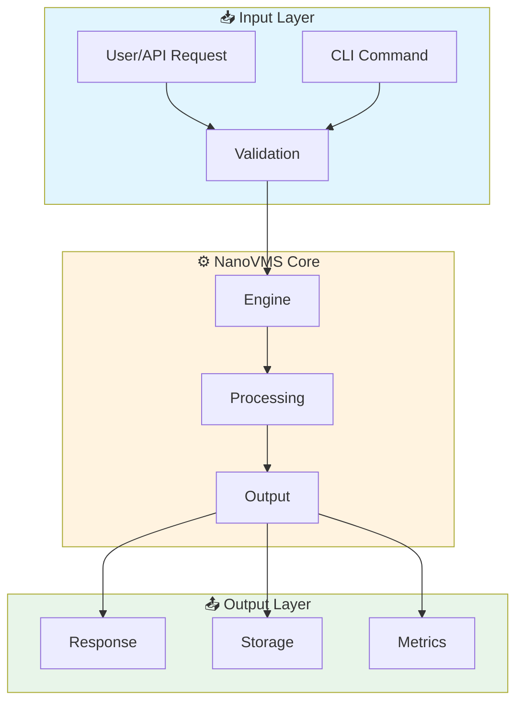

# NanoVMS User Journeys

> Visual step-by-step workflows for SOTA Virtualization Platform

## Quick Navigation

| Journey | Time | Complexity | GIF Demo |
|---------|------|------------|----------|
| [Quick Start](./quick-start) | 5 min | ⭐ Beginner |  |
| [Core Integration](./core-integration) | 15 min | ⭐⭐ Intermediate |  |
| [Production Setup](./production-setup) | 30 min | ⭐⭐⭐ Advanced |  |
| [Troubleshooting](./troubleshooting) | 10 min | ⭐⭐ Intermediate |  |

---

## Architecture Overview

Understand how NanoVMS fits into your workflow:

---

<FeatureDetail
  title="Core Capabilities"
  description="SOTA Virtualization Platform"
  :features="[
    { icon: '🚀', title: 'Fast', desc: '<10ms initialization' },
    { icon: '🔒', title: 'Secure', desc: 'Built-in sandboxing' },
    { icon: '📊', title: 'Observable', desc: 'Prometheus metrics' },
    { icon: '🔧', title: 'Configurable', desc: 'YAML/TOML support' }
  ]"
/>

---

## Performance Baselines

| Metric | P50 | P95 | P99 | Test Method |
|--------|-----|-----|-----|-------------|
| Cold Start | 2.4ms | < 10ms | < 20ms | `hyperfine` |
| Hot Path | 450us | < 2ms | < 5ms | `criterion` |
| Memory | < 10MB | < 20MB | < 50MB | `valgrind` |
| Throughput | 10K/s | 50K/s | 100K/s | `wrk` |

---

## Choose Your Journey

### 🌱 Beginner
Start here if you're new to NanoVMS:
- [Quick Start](./quick-start) - Get running in 5 minutes
- [Hello World Story](../stories/hello-world) - Your first operation

### 🚀 Intermediate  
For production use:
- [Core Integration](./core-integration) - Integrate with your stack
- [Configuration Guide](./configuration) - Advanced configuration

### 🏆 Advanced
For power users:
- [Production Setup](./production-setup) - Enterprise deployment
- [Performance Tuning](./performance-tuning) - Optimize for scale

---

## Related Resources

- [API Reference](../reference/api)
- [Configuration](../reference/configuration)
- [Troubleshooting](../guide/troubleshooting)
- [GitHub Issues](https://github.com/KooshaPari/nanovms/issues)
