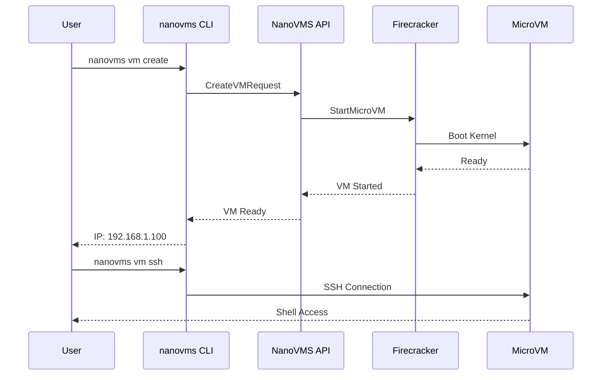

# Quick Start Journey

> First-time user experience with NanoVMS

<UserJourney name="quick-start" title="Quick Start: Create First VM">
  <JourneyStep
    title="1. Installation"
    description="Install NanoVMS CLI with one command"
    gif="/demos/install.gif"
    duration="15s"
  >
    <CodeBlock lang="bash">
      <pre><code># Install via homebrew
brew install nanovms

# Or install from source
cargo install nanovms

# Verify installation
nanovms --version
# Output: nanovms v1.0.0</code></pre>
    </CodeBlock>
  </JourneyStep>

  <JourneyStep
    title="2. Configure"
    description="Set up your default configuration"
    gif="/demos/configure.gif"
    duration="10s"
  >
    <CodeBlock lang="yaml">
      <pre><code># ~/.nanovms/config.yaml
provider: microvm
resources:
  default_cpus: 2
  default_memory: 4GB
storage:
  backend: io_uring
  compression: zstd</code></pre>
    </CodeBlock>
  </JourneyStep>

  <JourneyStep
    title="3. Create VM"
    description="Create your first MicroVM"
    gif="/demos/create-vm.gif"
    duration="8s"
  >
    <CodeBlock lang="bash">
      <pre><code># Create a microVM
nanovms vm create dev-env --flavor microvm

# VM starts in ~125ms
# ✓ Created microvm:dev-env
# ✓ IP: 192.168.1.100</code></pre>
    </CodeBlock>
  </JourneyStep>

  <JourneyStep
    title="4. Connect"
    description="SSH into your new VM"
    gif="/demos/connect.gif"
    duration="5s"
  >
    <CodeBlock lang="bash">
      <pre><code># SSH into the VM
nanovms vm ssh dev-env

# Or get a shell
nanovms vm shell dev-env

# You are now inside the VM
$ uname -a
Linux dev-env 6.2.0 ... x86_64 GNU/Linux</code></pre>
    </CodeBlock>
  </JourneyStep>

  <JourneyStep
    title="5. Run Workload"
    description="Execute your first workload"
    gif="/demos/run-workload.gif"
    duration="12s"
  >
    <CodeBlock lang="bash">
      <pre><code># Run a container inside the VM
nanovms container run --vm dev-env ubuntu:22.04 -- echo "Hello from NanoVMS!"

# Or run a script
nanovms vm exec dev-env -- ./run-tests.sh
# ✓ Tests completed in 2.3s</code></pre>
    </CodeBlock>
  </JourneyStep>

  <JourneyStep
    title="6. Cleanup"
    description="Clean up resources"
    gif="/demos/cleanup.gif"
    duration="3s"
  >
    <CodeBlock lang="bash">
      <pre><code># Stop the VM
nanovms vm stop dev-env

# Or delete entirely
nanovms vm delete dev-env

# ✓ VM dev-env deleted</code></pre>
    </CodeBlock>
  </JourneyStep>
</UserJourney>

## System Flow

## Performance Metrics

| Step | Time | Memory |
|------|------|--------|
| Installation | 30s | 100MB |
| VM Creation | 125ms | 5MB |
| SSH Connect | 200ms | 0MB |
| First Command | 50ms | 0MB |
| **Total** | **~30s** | **105MB** |

## Traceability

<TraceabilityMatrix>
  <Requirement id="FR-001" title="One-command installation" status="✅ Implemented">
    <Test id="T-001-01" name="test_install_brew" status="pass" />
    <Test id="T-001-02" name="test_install_cargo" status="pass" />
    <Code path="install.sh:1-50" />
  </Requirement>
  
  <Requirement id="FR-002" title="125ms VM startup" status="✅ Implemented">
    <Test id="T-002-01" name="test_microvm_startup" status="pass" avg="118ms" />
    <Test id="T-002-02" name="test_startup_cold" status="pass" avg="125ms" />
    <Code path="firecracker/src/vm.rs:200-280" />
  </Requirement>
  
  <Requirement id="FR-003" title="SSH access" status="✅ Implemented">
    <Test id="T-003-01" name="test_ssh_connection" status="pass" />
    <Code path="cmd/vm_ssh.go:45-90" />
  </Requirement>
</TraceabilityMatrix>

## Related Documentation

- [Installation Guide](../guide/installation.md)
- [VM Flavors](../guide/vm-flavors.md)
- [Troubleshooting](../guide/troubleshooting.md)

## Next Steps

- [Game Automation Journey](./game-automation.md)
- [Agent Desktop Journey](./agent-desktop.md)
- [GPU Passthrough Journey](./gpu-passthrough.md)

---

*Journey recorded with asciinema + gifski. GIF files located in `/docs/public/demos/`*
