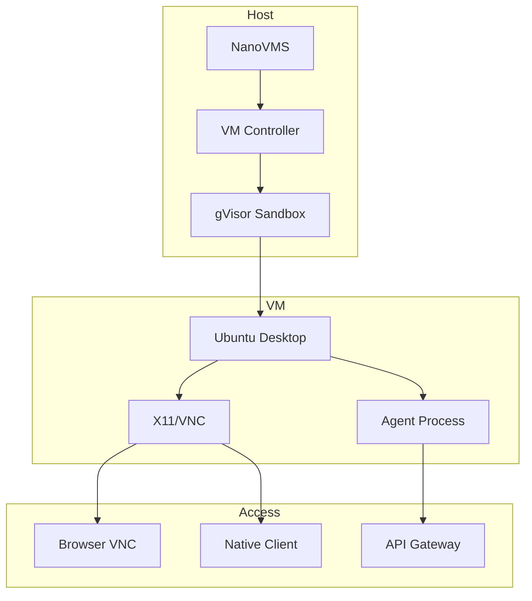

---
head:
  - - meta
    - name: description
      content: "Create isolated desktop environments for AI agents with GUI access"
---

# Agent Desktop Environment

> Isolated GUI environments for AI agent computer use

**Time**: 20 minutes | **Level**: Intermediate | **Prerequisites**: Linux host

## Goal

Create sandboxed desktop environments where AI agents can interact with GUI applications safely.

## Use Cases

- **Web Automation**: Agents browsing websites with full browser capabilities
- **GUI Testing**: Automated UI testing across different desktop environments
- **Data Entry**: Agents processing forms and interacting with desktop apps
- **Research**: Agents gathering information from visual interfaces

## Architecture



## Step 1: Create Desktop VM

```bash
# Create Ubuntu desktop VM
nanovms vm create agent-desktop \
  --flavor microvm \
  --image ubuntu-24.04-desktop \
  --memory 4g \
  --vcpus 2 \
  --display vnc
```

## Step 2: Install Browser & Tools

```bash
# SSH into VM
nanovms vm exec agent-desktop -- bash -c "
  apt-get update && \
  apt-get install -y firefox-esr chromium-browser xdotool scrot && \
  mkdir -p ~/agent-tools
"
```

## Step 3: Configure Agent

```yaml
# agent-config.yaml
agent:
  name: web-researcher
  type: desktop
  
vm:
  id: agent-desktop
  display: vnc://localhost:5901
  
capabilities:
  - browser_automation
  - screenshot
  - click
  - type
  - scroll

restrictions:
  network: isolated  # or bridged
  filesystem: readonly
  max_runtime: 1h
```

## Step 4: Spawn Agent

```bash
# Start agent with desktop environment
nanovms agent spawn \
  --config agent-config.yaml \
  --task "Research latest AI news on TechCrunch"
```

## Agent Interaction

```python
# Example: Python agent SDK
from nanovms.agent import DesktopAgent

agent = DesktopAgent(vm_id="agent-desktop")

# Navigate to website
agent.browser.navigate("https://techcrunch.com")

# Take screenshot
screenshot = agent.display.screenshot()

# Click element
agent.input.click(x=100, y=200)

# Type text
agent.input.type("AI news")

# Scroll
agent.input.scroll(-3)
```

## Monitoring

```bash
# Watch agent activity
nanovms agent logs agent-web-researcher --follow

# View live VNC
nanovms vm vnc agent-desktop --port 5901
```

## Security

### Isolation Levels

| Level | Description | Use Case |
|-------|-------------|----------|
| **VM** | Full hardware isolation | Untrusted code |
| **gVisor** | Syscall filtering | Semi-trusted |
| **Network** | Isolated bridge | Data protection |
| **Filesystem** | Overlay/readonly | System protection |

## Example: Automated Form Filling

```python
# form_automation.py
from nanovms.agent import DesktopAgent

agent = DesktopAgent(vm_id="agent-desktop")

# Navigate to form
agent.browser.navigate("https://example.com/contact")

# Fill form
agent.input.click(x=150, y=100)  # Name field
agent.input.type("John Doe")

agent.input.click(x=150, y=150)  # Email field
agent.input.type("john@example.com")

agent.input.click(x=150, y=300)  # Submit button

# Wait for confirmation
agent.wait_for_element("confirmation", timeout=10)

# Cleanup
agent.terminate()
```

## Performance

| Metric | Target |
|--------|--------|
| VM startup | < 5s |
| Browser launch | < 3s |
| Screenshot latency | < 500ms |
| Input latency | < 100ms |

## Troubleshooting

### VNC Connection Issues

```bash
# Check VNC server
nanovms vm exec agent-desktop -- pgrep Xvnc

# Restart VNC
nanovms vm exec agent-desktop -- systemctl restart vncserver
```

### Agent Not Responding

```bash
# Check agent status
nanovms agent status agent-web-researcher

# Restart agent
nanovms agent restart agent-web-researcher
```

## Success!

Your agent now has a secure, isolated desktop environment for GUI automation.

## Next Steps

- [Create Custom Agent Types](./custom-agents.md)
- [Integrate with LLM APIs](./llm-integration.md)
- [Build Agent Workflows](./agent-workflows.md)
