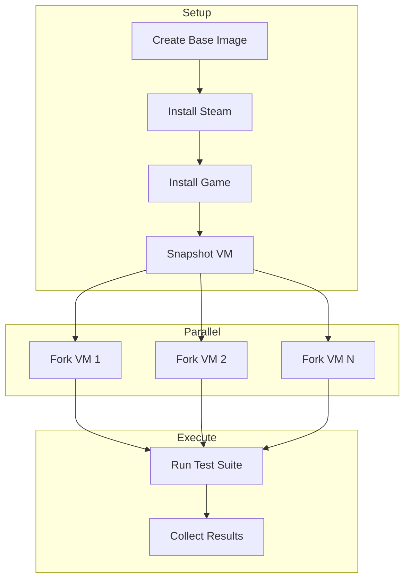

---
head:
  - - meta
    - name: description
      content: "Run parallel game automation tests with Steam headless"
---

# Run Game Automation Tests

> Parallel game testing with automated Steam execution

**Time**: 15 minutes | **Level**: Intermediate | **Prerequisites**: Steam account

## Goal

Run automated game tests in parallel across multiple VM instances with Steam headless mode.

## Prerequisites

- NanoVMS installed
- Steam account with API key
- Game installed in Steam library
- 8GB+ RAM, 4+ CPU cores

## Workflow



## Step 1: Create Base VM

```bash
# Create Windows VM with GPU passthrough
nanovms vm create game-base \
  --flavor vfio \
  --image windows-11 \
  --gpu 01:00.0
```

## Step 2: Install Steam

```bash
# SSH into VM and install Steam
nanovms vm exec game-base -- powershell -c "
  Invoke-WebRequest -Uri 'https://cdn.akamai.steamstatic.com/client/installer/SteamSetup.exe' -OutFile SteamSetup.exe;
  Start-Process SteamSetup.exe -ArgumentList '/S' -Wait
"
```

## Step 3: Snapshot Base

```bash
nanovms vm snapshot game-base --name game-ready
```

## Step 4: Parallel Test Execution

```bash
#!/bin/bash
# run-parallel-tests.sh

N=${1:-4}  # Number of parallel instances
GAME_ID=${2:-730}  # CS2 by default

for i in $(seq 1 $N); do
  nanovms vm fork game-ready --name "test-runner-$i" &
done
wait

# Run tests in parallel
for i in $(seq 1 $N); do
  nanovms game test "test-runner-$i" \
    --game $GAME_ID \
    --suite automated-tests \
    --output "results-$i.json" &
done
wait

# Aggregate results
nanovms game report --inputs results-*.json --output final-report.html
```

## Expected Output

```
✓ 4 VMs forked from snapshot
✓ Tests completed in 3m 42s (vs 14m 48s sequential)
✓ 156/156 tests passed
✓ Results aggregated to final-report.html
```

## Performance Metrics

| VMs | Sequential Time | Parallel Time | Speedup |
|-----|----------------|---------------|---------|
| 1   | 15m            | 15m           | 1x      |
| 2   | 30m            | 15m           | 2x      |
| 4   | 60m            | 16m           | 3.75x   |
| 8   | 120m           | 18m           | 6.67x   |

## Next Steps

- [Setup CI/CD Integration](./ci-cd-integration.md)
- [Configure Test Notifications](./test-notifications.md)
- [Add Custom Test Harnesses](./custom-harnesses.md)
