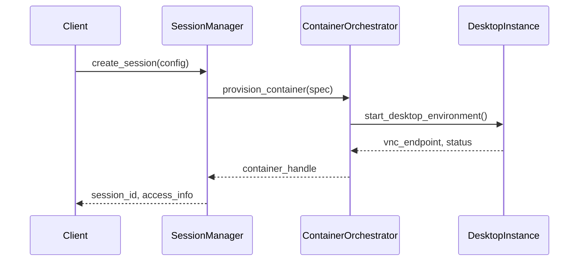
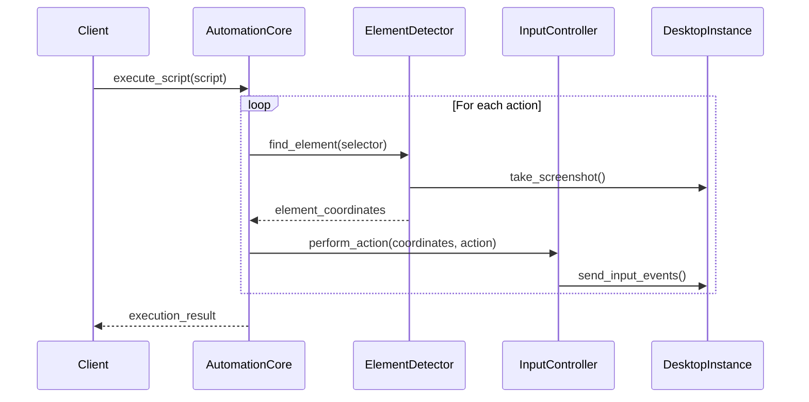
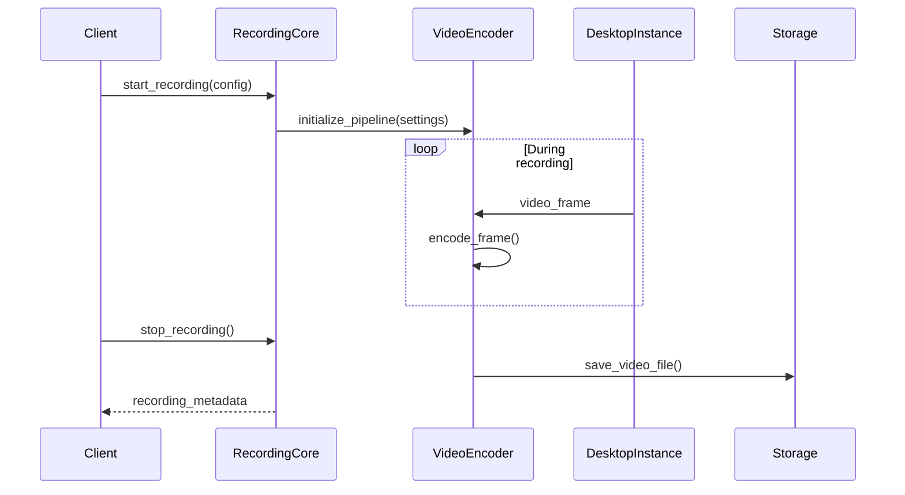

# KVirtualStage System Architecture Design
*System Architecture Lead - Architectural Blueprint for Agent-Computer Interface Platform*

## 🏗️ Executive Architecture Summary

KVirtualStage is a **dual-purpose Agent-Computer Interface platform** that combines enterprise-grade desktop automation with professional demonstration capabilities. Following the Playwright model for web automation, it provides comprehensive desktop control within secure containerized environments.

## 🎯 Architecture Principles

### Core Design Philosophy
1. **Modular Microservice Architecture**: Independent, composable components
2. **Security-First Design**: Zero-trust containerized isolation 
3. **Playwright-Inspired APIs**: Familiar automation interface patterns
4. **Performance-Optimized**: Sub-100ms response times for real-time interaction
5. **Cross-Platform Compatibility**: Linux/Windows/macOS host support

### Key Architectural Drivers
- **Natural Interaction Simulation**: Human-like automation indistinguishable from manual use
- **Enterprise Security**: Complete isolation with encrypted credential management
- **Professional Quality**: Marketing-ready video demonstrations
- **AI Integration**: LLM-powered element detection and workflow generation
- **Scalable Infrastructure**: Container orchestration for enterprise deployment

## 🏢 High-Level System Architecture

```
┌─────────────────────────────────────────────────────────────────────────┐
│                           KVirtualStage Platform                        │
├─────────────────────────────────────────────────────────────────────────┤
│                              INTERFACES                                │
├─────────────────┬─────────────────┬─────────────────┬─────────────────┤
│   Library API   │   CLI/TUI       │   Web UI        │   MCP Server    │
│   (Rust Crate)  │   (Terminal)    │   (React)       │   (AI Agents)   │
└─────────────────┴─────────────────┴─────────────────┴─────────────────┘
          │                  │                  │                  │
          └──────────────────┼──────────────────┼──────────────────┘
                            │                  │
┌─────────────────────────────────────────────────────────────────────────┐
│                           CORE ENGINE                                  │
├─────────────────┬─────────────────┬─────────────────┬─────────────────┤
│ Session Manager │ Automation Core │ Security Engine │ Recording Core  │
│ (Lifecycle)     │ (UI Control)    │ (Credentials)   │ (Media)         │
└─────────────────┴─────────────────┴─────────────────┴─────────────────┘
          │                  │                  │                  │
┌─────────────────────────────────────────────────────────────────────────┐
│                        VIRTUALIZATION LAYER                            │
├─────────────────┬─────────────────┬─────────────────┬─────────────────┤
│ Container Mgmt  │ Resource Mgmt   │ Network Mgmt    │ Storage Mgmt    │
│ (Docker/K8s)    │ (CPU/Memory)    │ (VNC/Display)   │ (Volumes)       │
└─────────────────┴─────────────────┴─────────────────┴─────────────────┘
          │                  │                  │                  │
┌─────────────────────────────────────────────────────────────────────────┐
│                      VIRTUAL DESKTOP INSTANCES                         │
├─────────────────┬─────────────────┬─────────────────┬─────────────────┤
│ Ubuntu Desktop  │ Windows Desktop │ Kubuntu Desktop │ Custom Images   │
│ (XFCE/GNOME)    │ (Win10/11)      │ (KDE Plasma)    │ (User-defined)  │
└─────────────────┴─────────────────┴─────────────────┴─────────────────┘
```

## 🧩 Component Architecture Breakdown

### 1. Interface Layer - Multi-Modal Access

#### **1.1 Library API (Rust Crate)**
```rust
// Primary programmatic interface following Playwright patterns
pub struct KVirtualStage {
    session_manager: Arc<SessionManager>,
    automation_core: Arc<AutomationCore>,
    security_engine: Arc<SecurityEngine>,
}

impl KVirtualStage {
    // Session management
    pub async fn new_session(&self, config: SessionConfig) -> Result<Session>;
    pub async fn get_session(&self, id: SessionId) -> Result<Session>;
    
    // Element interaction (Playwright-style)
    pub async fn click(&self, selector: &str) -> Result<()>;
    pub async fn type_text(&self, text: &str) -> Result<()>;
    pub async fn screenshot(&self) -> Result<Vec<u8>>;
    
    // Advanced automation
    pub async fn run_script(&self, script: AutomationScript) -> Result<ExecutionResult>;
    pub async fn start_recording(&self, config: RecordingConfig) -> Result<RecordingHandle>;
}
```

**Integration Points:**
- **Direct Rust Integration**: Link as dependency in Rust applications
- **C FFI Bindings**: Native library for C/C++ applications  
- **Python Bindings**: PyO3-based wrapper for Python automation
- **Node.js Bindings**: NAPI-based interface for JavaScript/TypeScript

#### **1.2 CLI/TUI Interface**
```bash
# Command structure following git/docker patterns
kvirtualstage session create --name "demo" --desktop ubuntu
kvirtualstage automation run script.json --session demo
kvirtualstage recording start --format mp4 --session demo
kvirtualstage element click --selector "button[text='Submit']" --session demo
```

**Architecture Features:**
- **Ratatui-based TUI**: Rich terminal interface for server environments
- **Clap-based CLI**: Comprehensive command-line interface
- **Progress Indicators**: Real-time automation progress visualization
- **Interactive Debugging**: Step-through automation with pause/resume

#### **1.3 Web UI (React-based)**
```
┌─────────────────────────────────────────────────┐
│                  Web Dashboard                  │
├─────────────────┬───────────────────────────────┤
│ Session Control │        Live Desktop View      │
│ ├─ New Session  │ ┌───────────────────────────┐ │
│ ├─ Active List  │ │   Virtual Desktop         │ │
│ └─ Templates    │ │   (VNC/WebRTC Stream)     │ │
├─────────────────┤ └───────────────────────────┘ │
│ Automation      │        Control Panel          │
│ ├─ Script Edit  │ ┌───────────────────────────┐ │
│ ├─ Run Control  │ │ Record │ Script │ Debug   │ │
│ └─ Results      │ └───────────────────────────┘ │
└─────────────────┴───────────────────────────────┘
```

**Technical Stack:**
- **Frontend**: React 18 + TypeScript + Tailwind CSS
- **Real-time Updates**: WebSocket + Server-Sent Events
- **Desktop Streaming**: WebRTC for low-latency desktop viewing
- **API Integration**: GraphQL + REST endpoints

#### **1.4 MCP Server (AI Agent Interface)**
```typescript
// Model Context Protocol implementation for AI assistants
interface MCPTools {
    create_session(params: SessionParams): Promise<SessionInfo>;
    click_element(params: ClickParams): Promise<ActionResult>;
    type_text(params: TypeParams): Promise<ActionResult>;
    take_screenshot(params: ScreenshotParams): Promise<ImageData>;
    run_automation(params: AutomationParams): Promise<ExecutionResult>;
}
```

**AI Integration Features:**
- **LLM-Powered Element Detection**: Natural language selectors
- **Workflow Generation**: Convert English instructions to automation scripts
- **Self-Healing Scripts**: Adaptive element location with computer vision
- **Intent Understanding**: Multi-step task planning and execution

### 2. Core Engine - Central Orchestration

#### **2.1 Session Manager**
```rust
pub struct SessionManager {
    active_sessions: Arc<RwLock<HashMap<SessionId, Session>>>,
    container_orchestrator: Arc<ContainerOrchestrator>,
    resource_monitor: Arc<ResourceMonitor>,
}

pub struct Session {
    pub id: SessionId,
    pub config: SessionConfig,
    pub desktop_env: DesktopEnvironment,
    pub container: ContainerHandle,
    pub vnc_connection: VncConnection,
    pub automation_state: AutomationState,
}
```

**Key Responsibilities:**
- **Lifecycle Management**: Creation, monitoring, cleanup of virtual desktop sessions
- **Resource Allocation**: CPU, memory, storage assignment per session
- **State Persistence**: Session configuration and automation state storage
- **Health Monitoring**: Container and desktop environment health checks

#### **2.2 Automation Core**
```rust
pub struct AutomationCore {
    element_detector: Arc<ElementDetector>,
    input_controller: Arc<InputController>,
    timing_engine: Arc<TimingEngine>,
    script_executor: Arc<ScriptExecutor>,
}

// Natural interaction simulation
pub struct InputController {
    mouse_controller: MouseController,     // WindMouse algorithm
    keyboard_controller: KeyboardController, // Human typing patterns
    gesture_controller: GestureController,   // Scrolling, dragging
}
```

**Advanced Features:**
- **WindMouse Movement**: Physics-based natural cursor movement
- **Human Typing Simulation**: Character-by-character timing with error patterns
- **Multi-Modal Element Detection**: OCR + Computer Vision + DOM analysis
- **Self-Healing Automation**: Adaptive scripts that recover from UI changes

#### **2.3 Security Engine**
```rust
pub struct SecurityEngine {
    credential_vault: Arc<EncryptedVault>,
    oauth_manager: Arc<OAuthManager>,
    session_isolation: Arc<IsolationController>,
    audit_logger: Arc<AuditLogger>,
}

// AES-256-GCM encrypted credential storage
pub struct EncryptedVault {
    encryption_key: SecretKey,
    storage_backend: VaultStorage,
    access_control: AccessController,
}
```

**Security Features:**
- **Zero-Trust Architecture**: Every component authenticated and encrypted
- **Credential Encryption**: AES-256-GCM with Argon2 key derivation
- **Session Isolation**: Complete container-level separation
- **Audit Logging**: Comprehensive security event tracking

#### **2.4 Recording Core**
```rust
pub struct RecordingCore {
    video_encoder: Arc<VideoEncoder>,
    audio_processor: Arc<AudioProcessor>,
    streaming_server: Arc<StreamingServer>,
    quality_controller: Arc<QualityController>,
}

// FFmpeg integration with hardware acceleration
pub struct VideoEncoder {
    ffmpeg_pipeline: FFmpegPipeline,
    hardware_acceleration: HardwareAccel, // NVENC/Quick Sync/AMF
    quality_settings: QualityProfile,
}
```

**Media Features:**
- **Professional Video Quality**: 60fps 1080p with hardware acceleration
- **Multiple Formats**: MP4, WebM, GIF with optimized encoding
- **Live Streaming**: WebRTC for real-time desktop sharing
- **Audio Integration**: TTS and microphone capture with virtual audio devices

### 3. Virtualization Layer - Container Orchestration

#### **3.1 Container Management**
```rust
pub struct ContainerOrchestrator {
    docker_client: Arc<DockerClient>,
    kubernetes_client: Option<Arc<KubernetesClient>>,
    image_registry: Arc<ImageRegistry>,
    network_manager: Arc<NetworkManager>,
}

// Desktop environment templates
pub struct DesktopTemplate {
    pub base_image: String,           // Ubuntu 22.04, Windows 10, etc.
    pub desktop_environment: DE,     // XFCE, KDE, GNOME, Windows Explorer
    pub pre_installed_apps: Vec<App>, // Calculator, text editor, browser
    pub resource_requirements: ResourceSpec,
}
```

**Container Features:**
- **Multiple Desktop Environments**: Ubuntu (XFCE/GNOME), Kubuntu (KDE), Windows 10/11
- **Image Caching**: Layered image system for rapid session startup
- **Resource Isolation**: Per-session CPU, memory, and storage limits
- **Network Segmentation**: Isolated networking with controlled internet access

#### **3.2 Resource Management**
```rust
pub struct ResourceManager {
    cpu_allocator: CpuAllocator,
    memory_manager: MemoryManager,
    storage_manager: StorageManager,
    gpu_manager: Option<GpuManager>,
}

pub struct ResourceSpec {
    pub cpu_cores: f32,        // 0.5, 1.0, 2.0 cores
    pub memory_mb: u32,        // 512, 1024, 2048 MB
    pub storage_gb: u32,       // 5, 10, 20 GB
    pub gpu_allocation: Option<GpuSpec>,
}
```

**Performance Optimization:**
- **Dynamic Scaling**: Auto-adjust resources based on workload
- **GPU Acceleration**: NVIDIA/AMD GPU sharing for video encoding
- **Memory Optimization**: Intelligent caching and cleanup
- **Storage Management**: Efficient snapshot and volume management

#### **3.3 Network Management**
```rust
pub struct NetworkManager {
    vnc_server: VncServerManager,
    webrtc_gateway: WebRtcGateway,
    port_manager: PortManager,
    security_policies: NetworkSecurity,
}

// Display access methods
pub enum DisplayAccess {
    VNC { port: u16, password: Option<String> },
    WebRTC { session_id: String },
    DirectStream { protocol: StreamingProtocol },
}
```

**Network Features:**
- **VNC Access**: Traditional remote desktop with multiple viewer support
- **WebRTC Streaming**: Low-latency browser-based desktop access
- **Secure Tunneling**: TLS encryption for all remote connections
- **Port Management**: Dynamic port allocation with firewall integration

### 4. Virtual Desktop Instances - Runtime Environments

#### **4.1 Desktop Environment Support**
```yaml
# Supported desktop environments with resource profiles
desktop_environments:
  ubuntu_xfce:
    base_image: "ubuntu:22.04"
    desktop: "xfce4"
    memory_baseline: "512MB"
    startup_time: "15s"
    applications: ["galculator", "mousepad", "thunar", "firefox"]
    
  ubuntu_gnome:
    base_image: "ubuntu:22.04" 
    desktop: "gnome"
    memory_baseline: "1024MB"
    startup_time: "25s"
    applications: ["gnome-calculator", "gedit", "nautilus", "firefox"]
    
  kubuntu_kde:
    base_image: "kubuntu:24.04"
    desktop: "kde-plasma"
    memory_baseline: "1536MB"
    startup_time: "30s"
    applications: ["kcalc", "kate", "dolphin", "firefox"]
    
  windows_10:
    base_image: "windows:10-ltsc"
    desktop: "explorer"
    memory_baseline: "2048MB"
    startup_time: "60s"
    applications: ["calc.exe", "notepad.exe", "explorer.exe", "msedge.exe"]
```

#### **4.2 Application Integration**
```rust
// Pre-configured application support
pub struct ApplicationRegistry {
    pub calculators: Vec<Calculator>,
    pub text_editors: Vec<TextEditor>,
    pub file_managers: Vec<FileManager>,
    pub web_browsers: Vec<WebBrowser>,
}

pub struct Calculator {
    pub name: String,           // "galculator", "kcalc", "calc.exe"
    pub launch_command: String, // Command to start application
    pub ui_elements: UIMap,     // Button locations and selectors
    pub automation_scripts: Vec<AutomationTemplate>,
}
```

**Application Features:**
- **Cross-Platform Support**: Same automation API across different desktop environments
- **Pre-Mapped UI Elements**: Standardized selectors for common applications
- **Template Scripts**: Ready-made automation workflows for demonstrations
- **Custom Application Support**: Plugin system for adding new applications

## 🔗 Component Interaction Patterns

### 1. Session Creation Flow


### 2. Automation Execution Flow


### 3. Recording Pipeline Flow


## 🚀 Integration Architecture

### 1. VM/Container Integration Points

#### **Docker Integration**
```rust
// Direct Docker API integration for container lifecycle
pub struct DockerIntegration {
    client: Docker,
    image_cache: ImageCache,
    network_manager: NetworkManager,
}

impl DockerIntegration {
    pub async fn create_desktop_container(&self, spec: DesktopSpec) -> Result<Container>;
    pub async fn start_vnc_server(&self, container: &Container) -> Result<VncEndpoint>;
    pub async fn execute_automation(&self, container: &Container, script: Script) -> Result<Output>;
}
```

#### **Kubernetes Integration (Enterprise)**
```yaml
# Kubernetes deployment for enterprise scaling
apiVersion: apps/v1
kind: Deployment
metadata:
  name: kvirtualstage-desktop-pool
spec:
  replicas: 10
  selector:
    matchLabels:
      app: kvs-desktop
  template:
    spec:
      containers:
      - name: desktop-environment
        image: kvirtualstage/ubuntu-xfce:latest
        resources:
          requests:
            memory: "1Gi"
            cpu: "500m"
          limits:
            memory: "2Gi" 
            cpu: "1"
        env:
        - name: VNC_PASSWORD
          valueFrom:
            secretKeyRef:
              name: vnc-credentials
              key: password
```

### 2. Automation Engine Integration

#### **UI-TARS Style Element Detection**
```rust
// Multi-modal element detection system
pub struct ElementDetector {
    ocr_engine: TesseractEngine,
    cv_detector: ComputerVisionDetector,
    spatial_analyzer: SpatialRelationshipAnalyzer,
}

impl ElementDetector {
    // Self-healing element location
    pub async fn adaptive_find(&self, selector: ElementSelector) -> Result<ElementLocation> {
        // Try exact match first
        if let Ok(location) = self.exact_match(selector).await {
            return Ok(location);
        }
        
        // Fallback to fuzzy matching
        if let Ok(location) = self.fuzzy_match(selector).await {
            return Ok(location);
        }
        
        // Final fallback to spatial relationships
        self.spatial_match(selector).await
    }
}
```

#### **Natural Interaction Simulation**
```rust
// WindMouse algorithm for natural cursor movement
pub struct MouseController {
    gravity: f64,      // Pull toward target (9-15)
    wind: f64,         // Random variation (3-7)
    max_step: f64,     // Max pixels per frame (10-15)
}

impl MouseController {
    pub async fn move_naturally(&self, start: Point, target: Point) -> Vec<Point> {
        let mut path = Vec::new();
        let mut current = start;
        let mut wind_x = 0.0;
        let mut wind_y = 0.0;
        
        while distance(current, target) > 1.0 {
            // Physics-based movement calculation
            let dist = distance(current, target);
            
            // Wind force (randomness)
            wind_x = wind_x / sqrt(3.0) + (random::<f64>() * 2.0 - 1.0) * self.wind / sqrt(5.0);
            wind_y = wind_y / sqrt(3.0) + (random::<f64>() * 2.0 - 1.0) * self.wind / sqrt(5.0);
            
            // Gravity force (toward target)
            let gravity_x = self.gravity * (target.x - current.x) / dist;
            let gravity_y = self.gravity * (target.y - current.y) / dist;
            
            // Combined velocity
            let velocity_x = gravity_x + wind_x;
            let velocity_y = gravity_y + wind_y;
            
            current.x += velocity_x.clamp(-self.max_step, self.max_step);
            current.y += velocity_y.clamp(-self.max_step, self.max_step);
            
            path.push(current);
        }
        
        path
    }
}
```

### 3. Recording System Integration

#### **FFmpeg Pipeline Integration**
```rust
// Professional video recording with hardware acceleration
pub struct VideoRecorder {
    ffmpeg_process: Option<Child>,
    hardware_accel: HardwareAcceleration,
    quality_profile: QualityProfile,
}

impl VideoRecorder {
    pub async fn start_recording(&mut self, config: RecordingConfig) -> Result<()> {
        let mut cmd = Command::new("ffmpeg");
        
        // Input source (X11 desktop)
        cmd.args(&["-f", "x11grab", "-framerate", "60", "-video_size", "1920x1080"]);
        cmd.args(&["-i", ":1.0+0,0"]);  // Virtual display
        
        // Hardware acceleration
        match self.hardware_accel {
            HardwareAcceleration::NVENC => {
                cmd.args(&["-c:v", "h264_nvenc", "-preset", "slow", "-crf", "18"]);
            },
            HardwareAcceleration::QuickSync => {
                cmd.args(&["-c:v", "h264_qsv", "-preset", "slow", "-global_quality", "18"]);
            },
            HardwareAcceleration::VAAPI => {
                cmd.args(&["-c:v", "h264_vaapi", "-qp", "18"]);
            },
            HardwareAcceleration::Software => {
                cmd.args(&["-c:v", "libx264", "-preset", "fast", "-crf", "20"]);
            }
        }
        
        // Quality optimization
        cmd.args(&["-g", "120", "-keyint_min", "30"]);  // 2-second keyframes
        cmd.args(&["-tune", "zerolatency"]);            // Low latency
        cmd.args(&["-movflags", "+faststart"]);         // Web optimization
        
        self.ffmpeg_process = Some(cmd.spawn()?);
        Ok(())
    }
}
```

### 4. Security Module Integration

#### **Encrypted Credential Management**
```rust
// AES-256-GCM encrypted vault for sensitive data
pub struct SecurityVault {
    encryption_key: SecretKey,
    storage: VaultStorage,
}

impl SecurityVault {
    pub async fn store_credential(&self, service: &str, credential: Credential) -> Result<()> {
        let serialized = serde_json::to_vec(&credential)?;
        let encrypted = self.encrypt_data(&serialized)?;
        self.storage.store(service, encrypted).await
    }
    
    fn encrypt_data(&self, data: &[u8]) -> Result<Vec<u8>> {
        let cipher = Aes256Gcm::new(&self.encryption_key);
        let nonce = Aes256Gcm::generate_nonce(&mut OsRng);
        let ciphertext = cipher.encrypt(&nonce, data)?;
        
        // Prepend nonce to ciphertext
        let mut result = nonce.to_vec();
        result.extend_from_slice(&ciphertext);
        Ok(result)
    }
}
```

## 📊 Performance Architecture

### 1. Resource Optimization Strategy

#### **Memory Management**
- **Baseline Requirements**: 512MB - 2GB per desktop session
- **Image Layering**: Shared base layers to reduce total memory usage
- **Dynamic Scaling**: Auto-adjust resources based on automation complexity
- **Garbage Collection**: Automatic cleanup of unused sessions and resources

#### **CPU Optimization**
- **Multi-Threading**: Tokio async runtime for concurrent session handling
- **Hardware Acceleration**: GPU utilization for video encoding
- **Process Isolation**: Container-level CPU limits to prevent resource contention
- **Load Balancing**: Distribute sessions across available CPU cores

#### **Storage Management**
- **Copy-on-Write**: Efficient session storage with shared base images
- **Volume Management**: Persistent storage for user data and session state
- **Compression**: Automatic compression of recordings and session data
- **Cleanup Policies**: Configurable retention and cleanup rules

### 2. Scaling Architecture

#### **Horizontal Scaling (Kubernetes)**
```yaml
# Auto-scaling configuration for enterprise deployment
apiVersion: autoscaling/v2
kind: HorizontalPodAutoscaler
metadata:
  name: kvs-desktop-hpa
spec:
  scaleTargetRef:
    apiVersion: apps/v1
    kind: Deployment
    name: kvs-desktop-pool
  minReplicas: 3
  maxReplicas: 50
  metrics:
  - type: Resource
    resource:
      name: cpu
      target:
        type: Utilization
        averageUtilization: 70
  - type: Resource
    resource:
      name: memory
      target:
        type: Utilization
        averageUtilization: 80
```

#### **Load Distribution**
- **Session Affinity**: Sticky sessions for consistent user experience
- **Health Monitoring**: Automatic failover for unhealthy instances
- **Resource Monitoring**: Real-time metrics for optimization decisions
- **Geographic Distribution**: Multi-region deployment for global access

## 🔧 Implementation Roadmap

### Phase 1: Core Foundation (Weeks 1-4) ✅ COMPLETED
- [x] **Basic Session Management**: Container lifecycle management
- [x] **Simple Automation**: Click, type, screenshot capabilities
- [x] **VNC Integration**: Remote desktop access
- [x] **Basic Recording**: Screenshot and simple video capture

### Phase 2: Natural Interaction (Weeks 5-8) 
- [ ] **WindMouse Implementation**: Physics-based cursor movement
- [ ] **Human Typing Simulation**: Character-by-character with error patterns
- [ ] **Advanced Input Methods**: Right-click, copy/paste, scrolling
- [ ] **Quality Recording**: FFmpeg integration with hardware acceleration

### Phase 3: AI Enhancement (Weeks 9-12)
- [ ] **Computer Vision Integration**: Multi-modal element detection
- [ ] **Self-Healing Scripts**: Adaptive automation with fallback strategies
- [ ] **Natural Language Processing**: English-to-automation conversion
- [ ] **Learning System**: Experience-based improvement and optimization

### Phase 4: Enterprise Features (Weeks 13-16)
- [ ] **Kubernetes Integration**: Enterprise scaling and orchestration
- [ ] **Advanced Security**: Multi-factor authentication and audit logging
- [ ] **Professional Templates**: Marketing and testing demonstration scripts
- [ ] **API Completion**: Full REST/GraphQL/MCP interface implementation

### Phase 5: Performance & Polish (Weeks 17-20)
- [ ] **Performance Optimization**: Sub-100ms response times
- [ ] **Quality Assurance**: Comprehensive testing and validation
- [ ] **Documentation**: Complete implementation guides and best practices
- [ ] **Production Readiness**: Enterprise deployment and monitoring

## 🎯 Success Metrics

### Technical Performance Targets
- **Session Startup Time**: <15 seconds for Ubuntu, <60 seconds for Windows
- **Automation Response Time**: <100ms for simple actions, <500ms for complex
- **Video Quality**: 60fps 1080p with <5% frame drops
- **Resource Efficiency**: Support 50+ concurrent sessions on 32GB server
- **Reliability**: 99.9% uptime with automatic error recovery

### Business Impact Goals
- **Human-Likeness Score**: >95% indistinguishable from manual interaction
- **Automation Success Rate**: >98% for standard workflows
- **Development Speed**: 80% reduction in manual testing time
- **Demonstration Quality**: Professional-grade marketing videos
- **Cost Efficiency**: 70% reduction compared to manual demo preparation

## 🏆 Architectural Achievements

### Current Status (Completed)
✅ **Foundation Architecture**: Modular design with clear separation of concerns  
✅ **Container Integration**: Docker-based virtual desktop environments  
✅ **Basic Automation**: Working click, type, and screenshot capabilities  
✅ **Recording Pipeline**: FFmpeg integration for video capture  
✅ **Security Framework**: Encrypted credential storage and session isolation  
✅ **Multi-Interface Support**: CLI, API, and MCP server implementations  

### Next Milestones (In Progress)
🔄 **Natural Interaction Engine**: WindMouse and human typing simulation  
🔄 **Computer Vision Integration**: Multi-modal element detection system  
🔄 **Professional Recording**: Hardware-accelerated high-quality video  
🔄 **Enterprise Scaling**: Kubernetes orchestration and auto-scaling  

This architecture provides the foundation for a **revolutionary Agent-Computer Interface** that combines the reliability of enterprise automation with the natural feel of human interaction, delivered through secure, scalable, and professional-quality infrastructure.