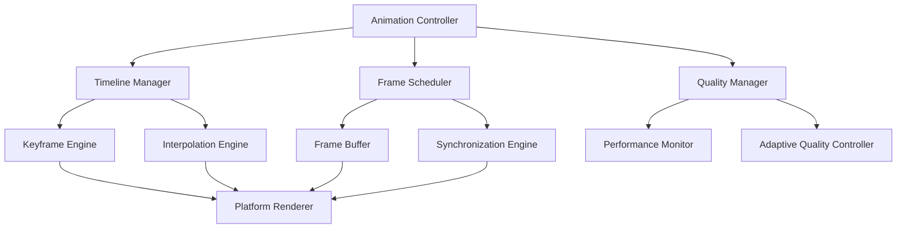

# Animation and Timing Framework Specification
## Frame-by-Frame Control for Natural Interactions

**Architect:** Automation_Engine_Architect  
**Date:** 2025-07-12  
**Component:** Animation & Timing Systems  

---

## 🎬 Framework Overview

The Animation and Timing Framework provides precise frame-by-frame control over all visual aspects of automation, ensuring smooth, professional-quality demonstrations that are indistinguishable from human interaction.

### Core Principles:
- **Frame-Perfect Timing**: Every visual element synchronized to target framerate
- **Adaptive Quality**: Dynamic quality adjustment based on system performance
- **Natural Motion**: Physics-based animation with human-like characteristics
- **Temporal Consistency**: Consistent timing across different system loads

---

## 🏗️ Architecture Components

### System Architecture:



### Core Components:

1. **Animation Controller**: Central coordinator for all animation systems
2. **Timeline Manager**: Manages animation timelines and sequencing
3. **Frame Scheduler**: Ensures consistent frame timing and delivery
4. **Quality Manager**: Monitors and adapts animation quality
5. **Platform Renderer**: Executes platform-specific rendering commands

---

## ⏱️ Temporal Control System

### High-Precision Timing Architecture:

```rust
pub struct TemporalController {
    // Core timing
    master_clock: MasterClock,
    frame_scheduler: FrameScheduler,
    timeline_manager: TimelineManager,
    
    // Quality control
    performance_monitor: PerformanceMonitor,
    adaptive_controller: AdaptiveQualityController,
    
    // Synchronization
    sync_manager: SynchronizationManager,
    buffer_manager: FrameBufferManager,
    
    // Configuration
    target_fps: f64,
    quality_settings: QualitySettings,
    timing_tolerances: TimingTolerances,
}

pub struct MasterClock {
    start_time: Instant,
    current_time: f64,
    time_scale: f64,           // Allows slow-motion or time-lapse
    drift_compensation: f64,   // Compensates for system clock drift
    precision_mode: bool,      // High-precision timing for critical sections
}

pub struct FrameScheduler {
    target_frame_duration: Duration,
    frame_budget: FrameBudget,
    scheduling_strategy: SchedulingStrategy,
    
    // Frame timing data
    frame_history: CircularBuffer<FrameTimingData>,
    predicted_frame_times: Vec<f64>,
    
    // Performance adaptation
    adaptive_scheduling: bool,
    quality_scaling: QualityScaling,
}
```

### Timing Implementation:

```rust
impl TemporalController {
    pub async fn start_animation_sequence(
        &mut self, 
        sequence: AnimationSequence
    ) -> Result<()> {
        // Initialize timing system
        self.master_clock.reset();
        self.frame_scheduler.prepare_for_sequence(&sequence);
        
        // Calculate optimal frame scheduling
        let frame_schedule = self.calculate_optimal_frame_schedule(&sequence).await?;
        
        // Execute animation with precise timing
        for frame_spec in frame_schedule {
            let frame_start = Instant::now();
            
            // === FRAME PREPARATION ===
            
            // Calculate current animation states
            let animation_states = self.calculate_animation_states(
                frame_spec.timestamp
            ).await?;
            
            // Generate frame actions
            let frame_actions = self.generate_frame_actions(
                &animation_states,
                &frame_spec
            ).await?;
            
            // === QUALITY ADAPTATION ===
            
            // Monitor current performance
            let performance_metrics = self.performance_monitor
                .get_current_metrics();
            
            // Adapt quality if needed
            if self.should_adapt_quality(&performance_metrics) {
                self.adaptive_controller.adapt_quality(
                    &mut frame_actions,
                    &performance_metrics
                ).await?;
            }
            
            // === FRAME EXECUTION ===
            
            // Execute frame actions with precise timing
            self.execute_frame_actions(frame_actions).await?;
            
            // === TIMING SYNCHRONIZATION ===
            
            // Calculate frame execution time
            let frame_duration = frame_start.elapsed();
            
            // Maintain target framerate
            self.maintain_frame_timing(
                frame_duration,
                frame_spec.target_duration
            ).await?;
            
            // Update timing statistics
            self.update_timing_statistics(frame_duration, &frame_spec);
        }
        
        Ok(())
    }
    
    async fn calculate_optimal_frame_schedule(
        &self, 
        sequence: &AnimationSequence
    ) -> Result<Vec<FrameSpec>> {
        let mut frame_schedule = Vec::new();
        let frame_duration = 1.0 / self.target_fps;
        
        // Analyze sequence for timing requirements
        let timing_analysis = self.analyze_sequence_timing(sequence).await?;
        
        let mut current_time = 0.0;
        
        while current_time < sequence.total_duration {
            // Calculate frame importance (some frames are more critical)
            let frame_importance = self.calculate_frame_importance(
                current_time,
                &timing_analysis
            );
            
            // Determine quality requirements for this frame
            let quality_requirements = self.determine_frame_quality_requirements(
                current_time,
                frame_importance,
                &timing_analysis
            );
            
            // Create frame specification
            frame_schedule.push(FrameSpec {
                timestamp: current_time,
                target_duration: Duration::from_secs_f64(frame_duration),
                quality_requirements,
                importance: frame_importance,
                
                // Performance hints
                expected_complexity: timing_analysis.get_complexity_at(current_time),
                render_budget: self.calculate_render_budget(frame_importance),
                
                // Synchronization requirements
                sync_requirements: timing_analysis.get_sync_requirements_at(current_time),
            });
            
            current_time += frame_duration;
        }
        
        Ok(frame_schedule)
    }
    
    async fn maintain_frame_timing(
        &mut self,
        actual_duration: Duration,
        target_duration: Duration
    ) -> Result<()> {
        let timing_error = actual_duration.as_secs_f64() - target_duration.as_secs_f64();
        
        if timing_error > 0.0 {
            // Frame took longer than expected
            if timing_error > self.timing_tolerances.max_frame_overrun {
                // Significant overrun - adapt quality for next frames
                self.adaptive_controller.reduce_quality_temporarily();
            }
            
            // No sleep needed - we're already behind
        } else {
            // Frame completed early - sleep for remainder
            let sleep_duration = target_duration - actual_duration;
            
            // Use high-precision sleep for better timing
            self.precision_sleep(sleep_duration).await?;
        }
        
        // Update drift compensation
        self.master_clock.update_drift_compensation(timing_error);
        
        Ok(())
    }
    
    async fn precision_sleep(&self, duration: Duration) -> Result<()> {
        if duration.as_nanos() < 1_000_000 { // Less than 1ms
            // Use spin wait for sub-millisecond precision
            let start = Instant::now();
            while start.elapsed() < duration {
                std::hint::spin_loop();
            }
        } else {
            // Use async sleep for longer durations
            tokio::time::sleep(duration).await;
        }
        
        Ok(())
    }
}
```

---

## 🎨 Interpolation and Smoothing Engine

### Advanced Interpolation System:

```rust
pub struct InterpolationEngine {
    // Interpolation methods
    position_interpolator: PositionInterpolator,
    velocity_interpolator: VelocityInterpolator,
    timing_interpolator: TimingInterpolator,
    
    // Smoothing systems
    temporal_smoother: TemporalSmoother,
    spatial_smoother: SpatialSmoother,
    
    // Caching for performance
    interpolation_cache: LRUCache<InterpolationKey, InterpolationResult>,
    spline_cache: HashMap<SplineKey, SplineData>,
}

pub struct PositionInterpolator {
    interpolation_method: InterpolationMethod,
    spline_tension: f64,
    smoothing_factor: f64,
    
    // Sub-pixel precision
    sub_pixel_precision: bool,
    anti_aliasing_level: f64,
}

pub enum InterpolationMethod {
    Linear,
    CubicBezier { control_points: [Point; 2] },
    CatmullRom { tension: f64 },
    Hermite { tangent_scale: f64 },
    NaturalSpline { smoothness: f64 },
    PhysicsBased { physics_params: PhysicsParams },
}
```

### Interpolation Implementation:

```rust
impl InterpolationEngine {
    pub fn interpolate_position_sequence(
        &mut self,
        keyframes: &[PositionKeyframe],
        timestamp: f64,
        quality_level: QualityLevel
    ) -> Result<InterpolatedPosition> {
        // Find surrounding keyframes
        let (prev_keyframe, next_keyframe) = self.find_surrounding_keyframes(
            keyframes, 
            timestamp
        )?;
        
        // Calculate local interpolation parameter
        let local_t = (timestamp - prev_keyframe.timestamp) / 
                     (next_keyframe.timestamp - prev_keyframe.timestamp);
        
        // Apply easing function
        let eased_t = self.apply_easing_function(
            local_t, 
            prev_keyframe.easing_function
        );
        
        // Perform interpolation based on method
        let base_position = match self.position_interpolator.interpolation_method {
            InterpolationMethod::Linear => {
                self.linear_interpolation(
                    prev_keyframe.position,
                    next_keyframe.position,
                    eased_t
                )
            },
            
            InterpolationMethod::CubicBezier { control_points } => {
                self.cubic_bezier_interpolation(
                    prev_keyframe.position,
                    next_keyframe.position,
                    control_points,
                    eased_t
                )
            },
            
            InterpolationMethod::CatmullRom { tension } => {
                self.catmull_rom_interpolation(
                    keyframes,
                    timestamp,
                    tension
                )
            },
            
            InterpolationMethod::NaturalSpline { smoothness } => {
                self.natural_spline_interpolation(
                    keyframes,
                    timestamp,
                    smoothness
                )
            },
            
            InterpolationMethod::PhysicsBased { physics_params } => {
                self.physics_based_interpolation(
                    prev_keyframe,
                    next_keyframe,
                    eased_t,
                    physics_params
                )
            },
        };
        
        // Apply quality-based smoothing
        let smoothed_position = self.apply_quality_smoothing(
            base_position,
            quality_level
        );
        
        // Add sub-pixel precision if enabled
        let final_position = if self.position_interpolator.sub_pixel_precision {
            self.add_sub_pixel_precision(smoothed_position)
        } else {
            smoothed_position
        };
        
        Ok(InterpolatedPosition {
            position: final_position,
            velocity: self.calculate_instantaneous_velocity(
                keyframes, 
                timestamp
            ),
            acceleration: self.calculate_instantaneous_acceleration(
                keyframes, 
                timestamp
            ),
            quality_metrics: self.calculate_interpolation_quality_metrics(
                &base_position,
                &final_position
            ),
        })
    }
    
    fn natural_spline_interpolation(
        &mut self,
        keyframes: &[PositionKeyframe],
        timestamp: f64,
        smoothness: f64
    ) -> Point {
        // Check cache first
        let spline_key = SplineKey::new(keyframes, smoothness);
        
        let spline_data = if let Some(cached) = self.spline_cache.get(&spline_key) {
            cached.clone()
        } else {
            // Calculate natural spline coefficients
            let spline_data = self.calculate_natural_spline_coefficients(
                keyframes, 
                smoothness
            );
            self.spline_cache.insert(spline_key, spline_data.clone());
            spline_data
        };
        
        // Evaluate spline at timestamp
        self.evaluate_spline_at_time(&spline_data, timestamp)
    }
    
    fn physics_based_interpolation(
        &self,
        prev_keyframe: &PositionKeyframe,
        next_keyframe: &PositionKeyframe,
        t: f64,
        physics_params: PhysicsParams
    ) -> Point {
        // Simulate physics between keyframes
        let mut position = prev_keyframe.position;
        let mut velocity = prev_keyframe.velocity.unwrap_or(Vector2::ZERO);
        
        let total_time = next_keyframe.timestamp - prev_keyframe.timestamp;
        let current_time = t * total_time;
        let dt = 0.001; // Small timestep for integration
        
        let mut sim_time = 0.0;
        while sim_time < current_time {
            // Calculate forces
            let target_force = self.calculate_target_attraction_force(
                position,
                next_keyframe.position,
                physics_params.gravity_strength
            );
            
            let drag_force = velocity * (-physics_params.drag_coefficient);
            
            let total_force = target_force + drag_force;
            
            // Integrate using Verlet integration for stability
            let acceleration = total_force / physics_params.mass;
            velocity += acceleration * dt;
            position += velocity * dt;
            
            sim_time += dt;
        }
        
        position
    }
    
    fn apply_quality_smoothing(
        &self,
        position: Point,
        quality_level: QualityLevel
    ) -> Point {
        match quality_level {
            QualityLevel::Ultra => {
                // Apply multiple smoothing passes
                let mut smoothed = position;
                for _ in 0..3 {
                    smoothed = self.temporal_smoother.smooth_position(smoothed);
                }
                self.spatial_smoother.anti_alias_position(smoothed, 2.0)
            },
            
            QualityLevel::High => {
                let smoothed = self.temporal_smoother.smooth_position(position);
                self.spatial_smoother.anti_alias_position(smoothed, 1.5)
            },
            
            QualityLevel::Medium => {
                self.temporal_smoother.smooth_position(position)
            },
            
            QualityLevel::Low => {
                position // No smoothing for performance
            },
        }
    }
}
```

---

## 🎯 Frame Buffer Management

### Efficient Frame Buffering System:

```rust
pub struct FrameBufferManager {
    // Buffer configuration
    buffer_size: usize,
    frame_buffers: Vec<FrameBuffer>,
    current_buffer_index: usize,
    
    // Memory management
    memory_pool: MemoryPool,
    buffer_allocator: BufferAllocator,
    
    // Performance optimization
    pre_allocation_strategy: PreAllocationStrategy,
    garbage_collection: GarbageCollectionStrategy,
    
    // Quality management
    buffer_quality_levels: HashMap<QualityLevel, BufferConfig>,
}

pub struct FrameBuffer {
    buffer_id: BufferId,
    frame_data: Vec<AnimationFrame>,
    metadata: FrameBufferMetadata,
    
    // Memory management
    capacity: usize,
    memory_usage: usize,
    
    // Synchronization
    read_ready: bool,
    write_ready: bool,
    lock_state: BufferLockState,
}

pub struct AnimationFrame {
    timestamp: f64,
    frame_number: u64,
    
    // Visual data
    cursor_position: Point,
    cursor_velocity: Vector2,
    cursor_trail: Option<CursorTrail>,
    
    // Interaction data
    active_interactions: Vec<Interaction>,
    ui_state_changes: Vec<UIStateChange>,
    
    // Rendering hints
    quality_level: QualityLevel,
    motion_blur_amount: f64,
    anti_aliasing_level: f64,
    
    // Performance data
    render_cost: RenderCost,
    memory_usage: usize,
}
```

### Buffer Management Implementation:

```rust
impl FrameBufferManager {
    pub fn new(config: FrameBufferConfig) -> Self {
        let buffer_count = config.buffer_count.max(3); // Minimum triple buffering
        
        let mut frame_buffers = Vec::with_capacity(buffer_count);
        for i in 0..buffer_count {
            frame_buffers.push(FrameBuffer::new(
                BufferId(i),
                config.frames_per_buffer
            ));
        }
        
        Self {
            buffer_size: config.frames_per_buffer,
            frame_buffers,
            current_buffer_index: 0,
            memory_pool: MemoryPool::new(config.total_memory_budget),
            buffer_allocator: BufferAllocator::new(),
            pre_allocation_strategy: config.pre_allocation_strategy,
            garbage_collection: config.garbage_collection_strategy,
            buffer_quality_levels: Self::initialize_quality_configs(),
        }
    }
    
    pub async fn prepare_frame(
        &mut self,
        frame_spec: &FrameSpec
    ) -> Result<FramePreparation> {
        // Get available buffer
        let buffer_index = self.get_next_available_buffer().await?;
        let buffer = &mut self.frame_buffers[buffer_index];
        
        // Pre-allocate memory if needed
        self.ensure_buffer_capacity(buffer, frame_spec).await?;
        
        // Create frame preparation context
        Ok(FramePreparation {
            buffer_id: buffer.buffer_id,
            buffer_index,
            allocated_memory: buffer.memory_usage,
            quality_config: self.get_quality_config_for_frame(frame_spec),
            
            // Performance hints
            expected_render_cost: self.estimate_render_cost(frame_spec),
            memory_budget: self.calculate_memory_budget_for_frame(frame_spec),
        })
    }
    
    pub async fn commit_frame(
        &mut self,
        preparation: FramePreparation,
        frame: AnimationFrame
    ) -> Result<()> {
        let buffer = &mut self.frame_buffers[preparation.buffer_index];
        
        // Validate frame data
        self.validate_frame_data(&frame)?;
        
        // Store frame in buffer
        buffer.add_frame(frame).await?;
        
        // Update buffer metadata
        buffer.metadata.last_commit_time = Instant::now();
        buffer.metadata.frame_count += 1;
        
        // Trigger garbage collection if needed
        if self.should_trigger_garbage_collection() {
            self.perform_garbage_collection().await?;
        }
        
        Ok(())
    }
    
    pub async fn get_frame_for_rendering(
        &self,
        timestamp: f64
    ) -> Result<Option<&AnimationFrame>> {
        // Find buffer containing frame for timestamp
        for buffer in &self.frame_buffers {
            if let Some(frame) = buffer.find_frame_at_timestamp(timestamp) {
                if frame.is_ready_for_rendering() {
                    return Ok(Some(frame));
                }
            }
        }
        
        Ok(None)
    }
    
    async fn ensure_buffer_capacity(
        &mut self,
        buffer: &mut FrameBuffer,
        frame_spec: &FrameSpec
    ) -> Result<()> {
        let required_memory = self.estimate_frame_memory_usage(frame_spec);
        
        if buffer.available_memory() < required_memory {
            // Try to free memory first
            self.try_free_buffer_memory(buffer).await?;
            
            // If still not enough, allocate more
            if buffer.available_memory() < required_memory {
                let additional_memory = required_memory - buffer.available_memory();
                self.allocate_additional_buffer_memory(buffer, additional_memory).await?;
            }
        }
        
        Ok(())
    }
    
    async fn perform_garbage_collection(&mut self) -> Result<()> {
        match self.garbage_collection {
            GarbageCollectionStrategy::Aggressive => {
                // Clean up all unused frames immediately
                for buffer in &mut self.frame_buffers {
                    buffer.remove_expired_frames();
                    buffer.compact_memory();
                }
            },
            
            GarbageCollectionStrategy::Lazy => {
                // Only clean up when memory pressure is high
                if self.memory_pool.utilization() > 0.8 {
                    self.partial_garbage_collection().await?;
                }
            },
            
            GarbageCollectionStrategy::Scheduled => {
                // Clean up during natural pauses in animation
                if self.is_in_animation_pause() {
                    self.scheduled_garbage_collection().await?;
                }
            },
        }
        
        Ok(())
    }
}
```

---

## 📊 Quality Management System

### Adaptive Quality Control:

```rust
pub struct QualityManager {
    // Quality monitoring
    quality_monitor: QualityMonitor,
    performance_analyzer: PerformanceAnalyzer,
    
    // Quality control
    quality_controller: QualityController,
    adaptation_engine: QualityAdaptationEngine,
    
    // Quality configurations
    quality_presets: HashMap<QualityPreset, QualityConfiguration>,
    current_quality: QualityConfiguration,
    
    // Performance tracking
    performance_history: CircularBuffer<PerformanceMetrics>,
    quality_history: CircularBuffer<QualityMetrics>,
}

pub struct QualityConfiguration {
    // Rendering quality
    interpolation_quality: InterpolationQuality,
    smoothing_level: SmoothingLevel,
    anti_aliasing: AntiAliasingConfig,
    
    // Animation quality
    frame_rate_target: f64,
    motion_blur_quality: MotionBlurQuality,
    sub_pixel_precision: bool,
    
    // Performance limits
    max_render_cost_per_frame: f64,
    memory_budget_per_frame: usize,
    cpu_time_budget_per_frame: Duration,
    
    // Fallback settings
    quality_reduction_steps: Vec<QualityReductionStep>,
    minimum_quality_threshold: f64,
}
```

### Quality Management Implementation:

```rust
impl QualityManager {
    pub async fn monitor_and_adapt_quality(
        &mut self,
        current_performance: &PerformanceMetrics
    ) -> Result<QualityAdaptation> {
        // Update performance history
        self.performance_history.push(current_performance.clone());
        
        // Analyze performance trends
        let performance_analysis = self.performance_analyzer
            .analyze_recent_performance(&self.performance_history);
        
        // Determine if quality adaptation is needed
        let adaptation_needed = self.should_adapt_quality(&performance_analysis);
        
        if adaptation_needed {
            // Calculate optimal quality adjustments
            let quality_adjustments = self.adaptation_engine
                .calculate_quality_adjustments(
                    &performance_analysis,
                    &self.current_quality
                ).await?;
            
            // Apply quality adjustments
            let new_quality = self.apply_quality_adjustments(
                &self.current_quality,
                quality_adjustments
            );
            
            // Validate new quality configuration
            let validated_quality = self.validate_quality_configuration(new_quality)?;
            
            // Update current quality
            self.current_quality = validated_quality.clone();
            
            Ok(QualityAdaptation {
                quality_changed: true,
                new_quality: validated_quality,
                adaptation_reason: performance_analysis.primary_bottleneck,
                expected_performance_improvement: self.estimate_performance_improvement(
                    &quality_adjustments
                ),
            })
        } else {
            Ok(QualityAdaptation {
                quality_changed: false,
                new_quality: self.current_quality.clone(),
                adaptation_reason: AdaptationReason::NoAdaptationNeeded,
                expected_performance_improvement: 0.0,
            })
        }
    }
    
    fn should_adapt_quality(&self, analysis: &PerformanceAnalysis) -> bool {
        // Check for performance issues
        if analysis.average_frame_time > self.current_quality.cpu_time_budget_per_frame {
            return true;
        }
        
        if analysis.memory_pressure > 0.9 {
            return true;
        }
        
        if analysis.frame_drops_per_second > 2.0 {
            return true;
        }
        
        // Check for potential quality improvements
        if analysis.performance_headroom > 0.3 && 
           self.current_quality != self.get_maximum_quality() {
            return true;
        }
        
        false
    }
    
    async fn calculate_quality_adjustments(
        &self,
        analysis: &PerformanceAnalysis,
        current_quality: &QualityConfiguration
    ) -> Result<Vec<QualityAdjustment>> {
        let mut adjustments = Vec::new();
        
        // Address primary bottleneck first
        match analysis.primary_bottleneck {
            Bottleneck::CpuBound => {
                adjustments.extend(self.calculate_cpu_optimization_adjustments(
                    current_quality,
                    analysis.cpu_utilization
                ));
            },
            
            Bottleneck::MemoryBound => {
                adjustments.extend(self.calculate_memory_optimization_adjustments(
                    current_quality,
                    analysis.memory_pressure
                ));
            },
            
            Bottleneck::GpuBound => {
                adjustments.extend(self.calculate_gpu_optimization_adjustments(
                    current_quality,
                    analysis.gpu_utilization
                ));
            },
            
            Bottleneck::None => {
                // System has headroom - potentially increase quality
                adjustments.extend(self.calculate_quality_improvement_adjustments(
                    current_quality,
                    analysis.performance_headroom
                ));
            },
        }
        
        // Secondary optimizations
        adjustments.extend(self.calculate_secondary_optimizations(
            current_quality,
            analysis
        ));
        
        Ok(adjustments)
    }
    
    fn calculate_cpu_optimization_adjustments(
        &self,
        current_quality: &QualityConfiguration,
        cpu_utilization: f64
    ) -> Vec<QualityAdjustment> {
        let mut adjustments = Vec::new();
        
        if cpu_utilization > 0.9 {
            // High CPU usage - aggressive reductions
            adjustments.push(QualityAdjustment {
                setting: QualitySetting::FrameRate,
                adjustment: AdjustmentType::Reduce(0.7), // Reduce to 70%
                priority: AdjustmentPriority::High,
                expected_cpu_savings: 0.25,
            });
            
            adjustments.push(QualityAdjustment {
                setting: QualitySetting::InterpolationQuality,
                adjustment: AdjustmentType::Reduce(0.8),
                priority: AdjustmentPriority::Medium,
                expected_cpu_savings: 0.15,
            });
        } else if cpu_utilization > 0.8 {
            // Moderate CPU usage - conservative reductions
            adjustments.push(QualityAdjustment {
                setting: QualitySetting::SmoothingLevel,
                adjustment: AdjustmentType::Reduce(0.85),
                priority: AdjustmentPriority::Low,
                expected_cpu_savings: 0.1,
            });
        }
        
        adjustments
    }
}
```

---

## 🔄 Synchronization Engine

### Multi-System Synchronization:

```rust
pub struct SynchronizationEngine {
    // Synchronization primitives
    sync_coordinator: SyncCoordinator,
    timing_synchronizer: TimingSynchronizer,
    
    // System coordination
    cursor_system_sync: CursorSystemSync,
    input_system_sync: InputSystemSync,
    render_system_sync: RenderSystemSync,
    
    // Cross-system communication
    event_bus: EventBus,
    state_synchronizer: StateSynchronizer,
    
    // Timing coordination
    global_timeline: GlobalTimeline,
    sync_points: Vec<SynchronizationPoint>,
}

pub struct SynchronizationPoint {
    timestamp: f64,
    sync_type: SyncType,
    systems_to_sync: Vec<SystemId>,
    tolerance: Duration,
    priority: SyncPriority,
}

pub enum SyncType {
    FrameSync,          // Synchronize frame rendering
    ActionSync,         // Synchronize user actions
    StateSync,          // Synchronize system state
    TimingSync,         // Synchronize timing systems
    QualitySync,        // Synchronize quality changes
}
```

### Synchronization Implementation:

```rust
impl SynchronizationEngine {
    pub async fn synchronize_animation_systems(
        &mut self,
        animation_state: &AnimationState
    ) -> Result<SynchronizationResult> {
        // Identify required synchronization points
        let sync_points = self.identify_sync_points(animation_state).await?;
        
        // Execute synchronization for each point
        let mut sync_results = Vec::new();
        
        for sync_point in sync_points {
            let sync_result = self.execute_synchronization_point(
                &sync_point,
                animation_state
            ).await?;
            
            sync_results.push(sync_result);
        }
        
        // Verify overall synchronization success
        let overall_result = self.verify_synchronization_success(&sync_results);
        
        Ok(overall_result)
    }
    
    async fn execute_synchronization_point(
        &mut self,
        sync_point: &SynchronizationPoint,
        animation_state: &AnimationState
    ) -> Result<PointSyncResult> {
        match sync_point.sync_type {
            SyncType::FrameSync => {
                self.synchronize_frame_systems(sync_point, animation_state).await
            },
            
            SyncType::ActionSync => {
                self.synchronize_action_systems(sync_point, animation_state).await
            },
            
            SyncType::StateSync => {
                self.synchronize_state_systems(sync_point, animation_state).await
            },
            
            SyncType::TimingSync => {
                self.synchronize_timing_systems(sync_point, animation_state).await
            },
            
            SyncType::QualitySync => {
                self.synchronize_quality_systems(sync_point, animation_state).await
            },
        }
    }
    
    async fn synchronize_frame_systems(
        &mut self,
        sync_point: &SynchronizationPoint,
        animation_state: &AnimationState
    ) -> Result<PointSyncResult> {
        // Wait for all systems to reach sync point
        let sync_barriers = self.create_sync_barriers(&sync_point.systems_to_sync);
        
        // Coordinate timing
        let timing_coordinator = TimingCoordinator::new(
            sync_point.timestamp,
            sync_point.tolerance
        );
        
        // Execute coordinated frame operations
        let frame_operations = self.prepare_coordinated_frame_operations(
            &sync_point.systems_to_sync,
            animation_state
        );
        
        // Execute all operations simultaneously
        let operation_results = timing_coordinator
            .execute_coordinated_operations(frame_operations)
            .await?;
        
        // Verify synchronization success
        let sync_success = self.verify_frame_sync_success(
            &operation_results,
            sync_point.tolerance
        );
        
        Ok(PointSyncResult {
            sync_point_id: sync_point.timestamp,
            success: sync_success,
            timing_error: timing_coordinator.get_timing_error(),
            operation_results,
        })
    }
}
```

---

## 📈 Performance Monitoring and Optimization

### Real-time Performance Tracking:

```rust
pub struct PerformanceMonitor {
    // Metrics collection
    metrics_collector: MetricsCollector,
    performance_analyzer: PerformanceAnalyzer,
    
    // Real-time monitoring
    frame_rate_monitor: FrameRateMonitor,
    latency_monitor: LatencyMonitor,
    resource_monitor: ResourceMonitor,
    
    // Historical data
    performance_history: TimeSeriesBuffer<PerformanceSnapshot>,
    trend_analyzer: TrendAnalyzer,
    
    // Alerting system
    alert_system: PerformanceAlertSystem,
    threshold_manager: ThresholdManager,
}

pub struct PerformanceSnapshot {
    timestamp: f64,
    
    // Frame metrics
    frame_rate: f64,
    frame_time: Duration,
    frame_drops: u32,
    
    // Resource usage
    cpu_usage: f64,
    memory_usage: usize,
    gpu_usage: Option<f64>,
    
    // Quality metrics
    visual_quality_score: f64,
    smoothness_score: f64,
    responsiveness_score: f64,
    
    // System health
    thermal_state: ThermalState,
    power_state: PowerState,
}
```

---

*This animation and timing framework provides the foundation for creating smooth, professional-quality automation with frame-perfect precision and adaptive performance optimization, ensuring consistent results across different system configurations and performance requirements.*