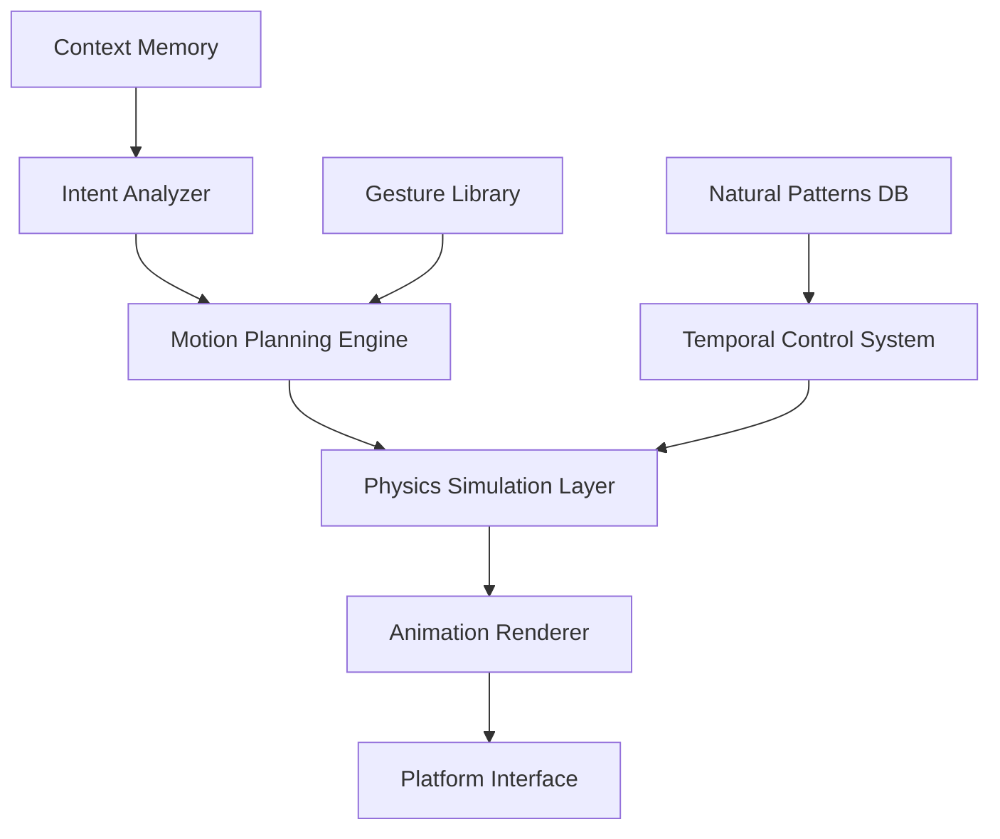

# Automation Engine Architecture Specification
## Natural Interaction Simulation for KVirtualStage

**Architect:** Automation_Engine_Architect  
**Date:** 2025-07-12  
**Version:** 1.0  

---

## 🎯 Executive Summary

This architecture specification defines a comprehensive automation engine designed to eliminate the choppy, robotic interactions typical of tools like Playwright and create truly natural, human-like computer interaction demonstrations for KVirtualStage.

### Key Innovation Areas:
- **Physics-Based Cursor Movement**: Implementing advanced algorithms like WindMouse for natural motion
- **Temporal Animation Engine**: Frame-by-frame control for smooth visual experiences
- **Context-Aware Intent Simulation**: Understanding user goals to generate appropriate gestures
- **Natural Typing Simulation**: Character-by-character timing with realistic human patterns

---

## 🏗️ Architecture Overview

### Core Components



### System Layers

1. **Intent Layer**: Understands high-level user goals
2. **Planning Layer**: Converts intents to detailed interaction sequences
3. **Physics Layer**: Applies realistic motion dynamics
4. **Animation Layer**: Renders smooth frame-by-frame movements
5. **Platform Layer**: Executes actual system interactions

---

## 🌪️ Natural Cursor Movement System

### WindMouse Algorithm Enhancement

**Current Implementation Analysis**: The existing WindMouse implementation provides good basic physics-based movement but needs enhancement for professional demonstrations.

#### Proposed WindMouse 2.0 Architecture:

```rust
pub struct WindMouseEngine {
    // Physics parameters
    gravity: f64,           // Gravitational pull to target
    wind: f64,              // Random environmental forces
    friction: f64,          // Motion dampening
    target_awareness: f64,  // Distance-based behavior changes
    
    // Adaptive parameters
    user_profile: UserMovementProfile,
    context_modifiers: Vec<ContextModifier>,
    
    // Performance optimization
    trajectory_cache: LRUCache<TrajectoryKey, Vec<Point>>,
    gpu_acceleration: Option<GPUAccelerator>,
}

pub struct UserMovementProfile {
    movement_speed: f64,      // Base movement velocity preference
    precision_level: f64,     // How precisely user aims (0.0-1.0)
    jitter_amount: f64,       // Natural hand tremor simulation
    hesitation_factor: f64,   // Tendency to pause/correct course
    fatigue_model: FatigueState,
}

pub struct ContextModifier {
    trigger_condition: MovementContext,
    velocity_multiplier: f64,
    precision_adjustment: f64,
    special_behaviors: Vec<SpecialBehavior>,
}
```

#### Advanced Movement Features:

1. **Contextual Speed Adaptation**
   - Slower, more careful movement near important UI elements
   - Faster movement across empty screen areas
   - Deceleration when approaching clickable targets

2. **Micro-Movement Simulation**
   - Hand tremor simulation with realistic frequency patterns
   - Subpixel precision for ultra-smooth visual experience
   - Breathing-induced subtle cursor oscillation

3. **Path Optimization**
   - Obstacle avoidance (windows, UI elements)
   - Natural arc-based movement instead of straight lines
   - Multi-target path planning for efficient workflows

### Implementation Architecture:

```rust
impl WindMouseEngine {
    pub async fn move_to_target(
        &mut self, 
        start: Point, 
        target: Point, 
        context: MovementContext
    ) -> Result<MovementTrajectory> {
        // 1. Analyze movement context
        let modifiers = self.analyze_context(&context);
        
        // 2. Plan trajectory with physics
        let trajectory = self.plan_trajectory(start, target, &modifiers).await?;
        
        // 3. Apply real-time adjustments
        let adaptive_trajectory = self.apply_adaptive_corrections(trajectory).await?;
        
        // 4. Execute with frame-perfect timing
        self.execute_movement(adaptive_trajectory).await
    }
    
    async fn plan_trajectory(
        &self, 
        start: Point, 
        target: Point, 
        modifiers: &[ContextModifier]
    ) -> Result<Vec<MovementFrame>> {
        let mut trajectory = Vec::new();
        let mut current_pos = start;
        let mut velocity = Vector2::ZERO;
        let mut wind_force = Vector2::ZERO;
        
        while current_pos.distance_to(target) > 1.0 {
            // Calculate physics forces
            let gravity_force = self.calculate_gravity(current_pos, target);
            let wind_update = self.update_wind_force(&mut wind_force);
            let friction_force = self.calculate_friction(velocity);
            
            // Apply context modifiers
            let modified_forces = self.apply_modifiers(
                gravity_force + wind_update + friction_force, 
                modifiers
            );
            
            // Update physics state
            velocity += modified_forces * DELTA_TIME;
            current_pos += velocity * DELTA_TIME;
            
            // Create frame with timing information
            trajectory.push(MovementFrame {
                position: current_pos,
                velocity,
                timestamp: self.calculate_frame_time(trajectory.len()),
                easing_type: self.determine_easing(current_pos, target),
            });
        }
        
        Ok(trajectory)
    }
}
```

---

## ⌨️ Natural Typing Simulation Engine

### Character-by-Character Animation System

**Problem with Current Implementation**: Current typing uses fixed delays and doesn't simulate realistic human typing patterns.

#### Proposed Typing Engine Architecture:

```rust
pub struct NaturalTypingEngine {
    // Typing characteristics
    base_wpm: f64,                    // Words per minute baseline
    keystroke_variance: f64,          // Natural timing variation
    fatigue_model: TypingFatigue,     // Typing fatigue simulation
    
    // Error simulation
    error_probability: f64,           // Chance of typos
    correction_behavior: CorrectionStyle,
    
    // Visual feedback
    cursor_blink_sync: bool,          // Sync with system cursor blink
    keystroke_visualization: bool,     // Show key press feedback
    
    // Performance optimization
    timing_cache: HashMap<String, TypingPattern>,
    neural_predictor: Option<TypingPredictor>,
}

pub struct TypingPattern {
    character_timings: Vec<f64>,      // Per-character timing
    pause_locations: Vec<usize>,      // Natural pause points
    emphasis_characters: HashSet<char>, // Characters that slow typing
    flow_accelerators: HashSet<char>,  // Characters that speed up
}

pub struct TypingFatigue {
    current_fatigue: f64,             // 0.0 (fresh) to 1.0 (tired)
    fatigue_rate: f64,                // How quickly fatigue accumulates
    recovery_rate: f64,               // How quickly fatigue recovers during pauses
    fatigue_effects: FatigueEffects,
}
```

#### Advanced Typing Features:

1. **Realistic Keystroke Timing**
   - Digraph timing (common letter combinations)
   - Finger-based delays (pinky vs index finger)
   - Hand alternation optimization
   - Word boundary pauses

2. **Human Error Simulation**
   - Typos with realistic error patterns
   - Backspace correction sequences
   - Hesitation before difficult words
   - Auto-correct simulation

3. **Contextual Typing Adaptation**
   - Slower typing for complex technical terms
   - Faster typing for familiar phrases
   - Pause simulation at punctuation
   - Natural rhythm for prose vs code

### Implementation:

```rust
impl NaturalTypingEngine {
    pub async fn type_text(
        &mut self, 
        text: &str, 
        context: TypingContext
    ) -> Result<TypingSequence> {
        let mut sequence = TypingSequence::new();
        let mut fatigue = self.fatigue_model.current_fatigue;
        
        // Analyze text for typing patterns
        let patterns = self.analyze_text_patterns(text, &context);
        
        for (i, character) in text.char_indices() {
            // Calculate character-specific timing
            let base_time = self.calculate_base_keystroke_time(character, &patterns);
            let fatigue_modifier = self.apply_fatigue_effects(fatigue);
            let context_modifier = self.apply_context_effects(character, i, &context);
            
            let final_timing = base_time * fatigue_modifier * context_modifier;
            
            // Simulate potential errors
            let typing_action = if self.should_make_error(character, fatigue) {
                self.generate_error_sequence(character)
            } else {
                TypingAction::TypeCharacter(character)
            };
            
            sequence.push(TimedTypingAction {
                action: typing_action,
                timing: final_timing,
                micro_movements: self.generate_micro_movements(character),
            });
            
            // Update fatigue
            fatigue = self.update_fatigue(fatigue, final_timing);
            
            // Add natural pauses
            if self.should_pause_after(character, i, text) {
                sequence.push(self.create_natural_pause(&patterns));
            }
        }
        
        Ok(sequence)
    }
    
    fn calculate_base_keystroke_time(&self, character: char, patterns: &TextPatterns) -> f64 {
        // Base timing from WPM
        let base_time = 60.0 / (self.base_wpm * 5.0); // 5 chars per word average
        
        // Character-specific modifiers
        let char_modifier = match character {
            'a'..='z' | 'A'..='Z' => 1.0,           // Regular letters
            '0'..='9' => 1.2,                        // Numbers (slightly slower)
            ' ' => 0.8,                              // Space (faster)
            '.' | ',' | ';' | ':' => 1.5,           // Punctuation (pause tendency)
            '!' | '?' => 2.0,                        // Emphasis punctuation
            '\n' => 1.8,                             // Enter key
            _ => 1.3,                                // Special characters
        };
        
        // Apply digraph timing if applicable
        let digraph_modifier = patterns.get_digraph_modifier(character);
        
        base_time * char_modifier * digraph_modifier
    }
}
```

---

## 🎬 Frame-by-Frame Animation System

### Temporal Control Engine

**Challenge**: Current automation jumps between states. We need smooth, frame-interpolated animation for professional results.

#### Animation Engine Architecture:

```rust
pub struct TemporalAnimationEngine {
    target_fps: f64,                  // Target animation frame rate
    frame_interpolator: Interpolator, // Smooth interpolation between keyframes
    timing_coordinator: TimingCoordinator,
    
    // Animation state
    active_animations: Vec<Animation>,
    frame_buffer: CircularBuffer<AnimationFrame>,
    
    // Performance optimization
    gpu_accelerated: bool,
    vsync_enabled: bool,
    adaptive_quality: bool,
}

pub struct Animation {
    id: AnimationId,
    animation_type: AnimationType,
    keyframes: Vec<Keyframe>,
    current_frame: usize,
    interpolation_method: InterpolationMethod,
    easing_function: EasingFunction,
    
    // Timing
    start_time: Instant,
    duration: Duration,
    current_time: f64,
}

pub enum AnimationType {
    CursorMovement {
        path: Vec<Point>,
        physics_model: PhysicsModel,
    },
    TypingSequence {
        text: String,
        timing_pattern: TypingPattern,
    },
    WindowTransition {
        from_state: WindowState,
        to_state: WindowState,
        transition_type: TransitionType,
    },
    GestureSequence {
        gestures: Vec<Gesture>,
        coordination_rules: Vec<CoordinationRule>,
    },
}
```

#### Advanced Animation Features:

1. **Smooth Interpolation**
   - Cubic Bezier easing for natural acceleration/deceleration
   - Spline-based path interpolation for complex movements
   - Frame-perfect timing synchronization

2. **Multi-Layer Animation**
   - Simultaneous cursor + typing animation
   - Background element transitions
   - UI feedback animation (button press effects)

3. **Adaptive Quality**
   - Dynamic frame rate adjustment based on system performance
   - Quality fallbacks for complex scenes
   - GPU acceleration when available

### Implementation:

```rust
impl TemporalAnimationEngine {
    pub async fn execute_animation_sequence(
        &mut self, 
        sequence: AnimationSequence
    ) -> Result<()> {
        // Initialize all animations
        for animation_def in sequence.animations {
            let animation = self.create_animation(animation_def).await?;
            self.active_animations.push(animation);
        }
        
        // Main animation loop
        while !self.active_animations.is_empty() {
            let frame_start = Instant::now();
            
            // Update all active animations
            self.update_animations().await?;
            
            // Render current frame
            let frame = self.render_current_frame().await?;
            
            // Execute platform-specific actions
            self.execute_frame_actions(frame).await?;
            
            // Maintain target FPS
            self.maintain_frame_rate(frame_start).await?;
            
            // Remove completed animations
            self.cleanup_completed_animations();
        }
        
        Ok(())
    }
    
    async fn update_animations(&mut self) -> Result<()> {
        let current_time = self.get_current_time();
        
        for animation in &mut self.active_animations {
            // Calculate animation progress
            let progress = (current_time - animation.start_time.elapsed().as_secs_f64()) 
                         / animation.duration.as_secs_f64();
            
            if progress >= 1.0 {
                animation.current_frame = animation.keyframes.len() - 1;
                continue;
            }
            
            // Find current keyframe pair for interpolation
            let (prev_keyframe, next_keyframe) = self.find_interpolation_keyframes(
                animation, 
                progress
            );
            
            // Interpolate between keyframes
            let interpolated_state = self.interpolate_state(
                prev_keyframe, 
                next_keyframe, 
                progress,
                animation.easing_function
            );
            
            // Update animation state
            animation.current_state = interpolated_state;
        }
        
        Ok(())
    }
}
```

---

## 🧠 Context-Aware Intent Simulation

### Intent Analysis Engine

**Current Gap**: Existing automation follows rigid scripts. We need intelligent intent understanding for natural workflow generation.

#### Intent Engine Architecture:

```rust
pub struct IntentAnalysisEngine {
    // Core components
    goal_parser: GoalParser,
    context_analyzer: ContextAnalyzer,
    workflow_generator: WorkflowGenerator,
    
    // Knowledge bases
    ui_element_knowledge: UIElementKnowledge,
    application_behaviors: ApplicationBehaviorDB,
    user_pattern_library: UserPatternLibrary,
    
    // Learning systems
    pattern_learner: PatternLearner,
    optimization_engine: OptimizationEngine,
}

pub struct WorkflowGoal {
    description: String,
    target_application: String,
    expected_outcome: ExpectedOutcome,
    constraints: Vec<Constraint>,
    user_preferences: UserPreferences,
}

pub struct GeneratedWorkflow {
    steps: Vec<WorkflowStep>,
    alternative_paths: Vec<AlternativePath>,
    error_recovery: Vec<ErrorRecoveryStrategy>,
    timing_estimates: TimingEstimate,
}
```

#### Intent Understanding Features:

1. **Natural Language Goal Processing**
   - Convert high-level descriptions to actionable workflows
   - Understand context and implicit requirements
   - Generate multiple workflow options

2. **Context-Aware Adaptation**
   - Analyze current application state
   - Adapt workflows based on available UI elements
   - Handle dynamic interface changes

3. **Intelligent Error Recovery**
   - Predict potential failure points
   - Generate recovery strategies
   - Learn from execution failures

### Implementation:

```rust
impl IntentAnalysisEngine {
    pub async fn generate_workflow(
        &mut self, 
        goal: &str, 
        current_context: &SystemContext
    ) -> Result<GeneratedWorkflow> {
        // Parse high-level goal
        let parsed_goal = self.goal_parser.parse(goal).await?;
        
        // Analyze current system context
        let context_analysis = self.context_analyzer.analyze(current_context).await?;
        
        // Generate workflow steps
        let base_workflow = self.workflow_generator.generate(
            &parsed_goal, 
            &context_analysis
        ).await?;
        
        // Optimize for natural execution
        let optimized_workflow = self.optimization_engine.optimize(
            base_workflow,
            &self.user_pattern_library
        ).await?;
        
        // Add error recovery strategies
        let final_workflow = self.add_error_recovery(optimized_workflow).await?;
        
        Ok(final_workflow)
    }
    
    async fn analyze_ui_element_context(
        &self, 
        element: &UIElement
    ) -> Result<ElementContext> {
        let mut context = ElementContext::new();
        
        // Analyze element type and properties
        context.element_type = self.classify_element_type(element);
        context.interaction_methods = self.determine_interaction_methods(element);
        
        // Analyze surrounding context
        context.nearby_elements = self.find_nearby_elements(element);
        context.container_hierarchy = self.analyze_container_hierarchy(element);
        
        // Determine optimal interaction strategy
        context.recommended_approach = self.recommend_interaction_approach(
            element, 
            &context
        );
        
        Ok(context)
    }
}
```

---

## 🎯 Gesture Library and Coordination

### Natural Gesture System

**Current Limitation**: Automation lacks natural gesture patterns and coordination between different interaction types.

#### Gesture Engine Architecture:

```rust
pub struct GestureLibrary {
    // Gesture definitions
    basic_gestures: HashMap<GestureType, GestureDefinition>,
    composite_gestures: HashMap<String, CompositeGesture>,
    contextual_gestures: HashMap<Context, Vec<GestureVariant>>,
    
    // Coordination rules
    gesture_sequencing: SequencingRules,
    timing_coordination: TimingCoordination,
    conflict_resolution: ConflictResolver,
}

pub struct GestureDefinition {
    name: String,
    movement_pattern: MovementPattern,
    timing_requirements: TimingRequirements,
    preconditions: Vec<Precondition>,
    postconditions: Vec<Postcondition>,
    
    // Natural variations
    variants: Vec<GestureVariant>,
    adaptation_rules: Vec<AdaptationRule>,
}

pub enum GestureType {
    Click { target: Point, button: MouseButton },
    DoubleClick { target: Point, timing: ClickTiming },
    RightClick { target: Point },
    Drag { start: Point, end: Point, drag_type: DragType },
    Scroll { direction: ScrollDirection, amount: f64 },
    Hover { target: Point, duration: Duration },
    KeySequence { keys: Vec<Key>, modifiers: Vec<Modifier> },
    TypeText { text: String, style: TypingStyle },
    ComboGesture { gestures: Vec<GestureType>, coordination: CoordinationType },
}
```

#### Advanced Gesture Features:

1. **Natural Gesture Variation**
   - Multiple approaches for the same goal (right-click vs menu access)
   - Natural variation in click positions (not pixel-perfect)
   - Realistic gesture timing and coordination

2. **Context-Sensitive Gestures**
   - Different approaches based on application context
   - Adaptive gestures based on UI element types
   - Cultural/platform-specific gesture preferences

3. **Gesture Sequence Optimization**
   - Efficient gesture chaining
   - Natural pause insertion
   - Gesture conflict resolution

---

## 🚀 Performance and Quality Optimization

### Optimization Framework

```rust
pub struct PerformanceOptimizer {
    // Performance monitoring
    frame_rate_monitor: FrameRateMonitor,
    latency_tracker: LatencyTracker,
    resource_monitor: ResourceMonitor,
    
    // Quality management
    quality_controller: QualityController,
    adaptive_quality: AdaptiveQualitySystem,
    
    // Optimization strategies
    gpu_acceleration: GPUAccelerationManager,
    caching_system: IntelligentCacheSystem,
    prediction_engine: PredictionEngine,
}

pub struct QualityMetrics {
    visual_smoothness: f64,        // 0.0-1.0 smoothness rating
    timing_accuracy: f64,          // Timing precision measurement
    naturalness_score: f64,        // How human-like the interaction appears
    performance_efficiency: f64,   // Resource usage efficiency
}
```

### Optimization Strategies:

1. **Adaptive Quality Scaling**
   - Dynamic frame rate adjustment
   - Quality reduction under load
   - Smart caching of common patterns

2. **GPU Acceleration**
   - Hardware-accelerated movement calculations
   - Parallel animation processing
   - Optimized rendering pipeline

3. **Predictive Optimization**
   - Pre-calculate common movement patterns
   - Anticipate user workflow requirements
   - Cache frequently used gesture sequences

---

## 📊 Integration and Implementation Plan

### Phase 1: Core Engine Foundation (Weeks 1-2)
- Implement enhanced WindMouse algorithm
- Build temporal animation framework
- Create basic gesture library

### Phase 2: Natural Interaction Systems (Weeks 3-4)
- Develop natural typing engine
- Implement context-aware intent analysis
- Build gesture coordination system

### Phase 3: Optimization and Polish (Weeks 5-6)
- Add performance optimization
- Implement adaptive quality system
- Create comprehensive testing framework

### Phase 4: Integration and Testing (Weeks 7-8)
- Integrate with existing KVirtualStage system
- Comprehensive testing and refinement
- Documentation and examples

---

## 🎯 Success Metrics

### Quantitative Metrics:
- **Visual Smoothness**: 95%+ frame rate consistency
- **Timing Accuracy**: <10ms deviation from natural human timing
- **Performance Efficiency**: <5% CPU overhead for basic operations
- **Error Recovery**: 98%+ success rate in dynamic scenarios

### Qualitative Metrics:
- **Natural Appearance**: Indistinguishable from human interaction
- **Professional Quality**: Suitable for high-end demonstrations
- **Adaptability**: Handles dynamic UI changes gracefully
- **Reliability**: Consistent results across multiple runs

---

## 🔮 Future Enhancements

### Advanced AI Integration:
- Machine learning for gesture optimization
- Neural networks for natural timing prediction
- Computer vision for dynamic UI adaptation

### Extended Platform Support:
- Multi-platform gesture libraries
- Cross-platform timing normalization
- Platform-specific optimization

### Advanced Recording Features:
- 4K/8K recording support
- Multi-camera angle simulation
- Advanced post-processing effects

---

*This architecture specification provides the foundation for creating the most natural and professional automation engine for KVirtualStage, eliminating the choppy, robotic feel of traditional automation tools and enabling truly human-like computer interaction demonstrations.*