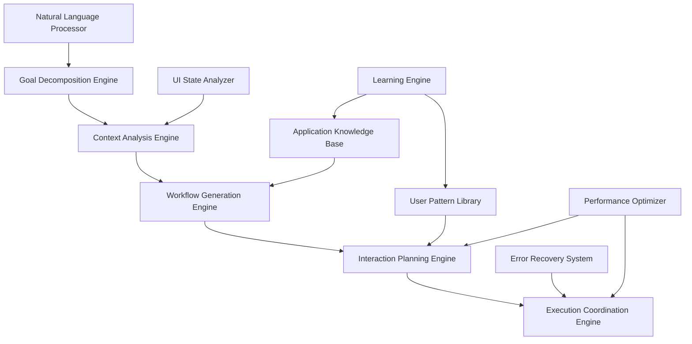

# Intent Simulation System Architecture
## Context-Aware Interaction Planning and Execution

**Architect:** Automation_Engine_Architect  
**Date:** 2025-07-12  
**Component:** Intent-Based Automation System  

---

## 🧠 System Overview

The Intent Simulation System transforms high-level automation goals into natural, context-aware interaction sequences. Unlike traditional automation that follows rigid scripts, this system understands user intent, analyzes context, and generates adaptive workflows that appear genuinely human-like.

### Core Capabilities:
- **Natural Language Goal Processing**: Convert descriptions to actionable workflows
- **Context-Aware Adaptation**: Adapt behavior based on current system state
- **Intelligent Error Recovery**: Predict and handle unexpected scenarios
- **Multi-Modal Interaction**: Coordinate cursor, keyboard, and visual attention
- **Learning and Optimization**: Improve performance through pattern recognition

---

## 🏗️ Architecture Overview

### System Architecture:



### Core Components:

1. **Natural Language Processor**: Understands automation goals from descriptions
2. **Goal Decomposition Engine**: Breaks complex goals into manageable subgoals
3. **Context Analysis Engine**: Analyzes current system and application state
4. **Workflow Generation Engine**: Creates step-by-step interaction plans
5. **Interaction Planning Engine**: Plans natural gesture sequences
6. **Execution Coordination Engine**: Coordinates execution with timing and quality
7. **Learning Engine**: Learns from successful and failed interactions

---

## 📝 Natural Language Processing Engine

### Goal Understanding Architecture:

```rust
pub struct NaturalLanguageProcessor {
    // Core NLP components
    intent_classifier: IntentClassifier,
    entity_extractor: EntityExtractor,
    context_resolver: ContextResolver,
    
    // Domain-specific understanding
    ui_vocabulary: UIVocabulary,
    action_vocabulary: ActionVocabulary,
    application_knowledge: ApplicationKnowledge,
    
    // Learning and adaptation
    pattern_learner: PatternLearner,
    feedback_processor: FeedbackProcessor,
}

pub struct ParsedGoal {
    primary_intent: Intent,
    sub_intents: Vec<SubIntent>,
    target_entities: Vec<Entity>,
    constraints: Vec<Constraint>,
    context_requirements: Vec<ContextRequirement>,
    
    // Metadata
    confidence_score: f64,
    ambiguity_flags: Vec<AmbiguityFlag>,
    alternative_interpretations: Vec<AlternativeInterpretation>,
}

pub struct Intent {
    intent_type: IntentType,
    action_sequence: Vec<ActionTemplate>,
    target_application: Option<String>,
    success_criteria: Vec<SuccessCriterion>,
    
    // Behavioral preferences
    interaction_style: InteractionStyle,
    timing_preferences: TimingPreferences,
}

pub enum IntentType {
    Navigate { target: NavigationTarget },
    Create { content_type: ContentType, specifications: Vec<Specification> },
    Modify { target: ModificationTarget, changes: Vec<Change> },
    Analyze { data_source: DataSource, analysis_type: AnalysisType },
    Demonstrate { workflow: WorkflowType, audience_level: AudienceLevel },
    Test { test_type: TestType, coverage: TestCoverage },
    Configure { system: SystemType, settings: Vec<Setting> },
}
```

### NLP Implementation:

```rust
impl NaturalLanguageProcessor {
    pub async fn parse_automation_goal(
        &mut self,
        goal_description: &str,
        context: &SystemContext
    ) -> Result<ParsedGoal> {
        // === INTENT CLASSIFICATION ===
        
        // Analyze the goal description for primary intent
        let primary_intent = self.intent_classifier
            .classify_primary_intent(goal_description, context)
            .await?;
        
        // Identify sub-intents and dependencies
        let sub_intents = self.intent_classifier
            .extract_sub_intents(goal_description, &primary_intent)
            .await?;
        
        // === ENTITY EXTRACTION ===
        
        // Extract target entities (applications, UI elements, data)
        let entities = self.entity_extractor
            .extract_entities(goal_description, &primary_intent)
            .await?;
        
        // Resolve entity references with context
        let resolved_entities = self.context_resolver
            .resolve_entity_references(&entities, context)
            .await?;
        
        // === CONSTRAINT ANALYSIS ===
        
        // Identify explicit constraints
        let explicit_constraints = self.extract_explicit_constraints(
            goal_description
        );
        
        // Infer implicit constraints from context
        let implicit_constraints = self.infer_implicit_constraints(
            &primary_intent,
            &resolved_entities,
            context
        );
        
        let all_constraints = [explicit_constraints, implicit_constraints].concat();
        
        // === CONTEXT REQUIREMENTS ===
        
        let context_requirements = self.determine_context_requirements(
            &primary_intent,
            &resolved_entities,
            &all_constraints
        );
        
        // === CONFIDENCE AND VALIDATION ===
        
        let confidence_score = self.calculate_confidence_score(
            &primary_intent,
            &sub_intents,
            &resolved_entities
        );
        
        let ambiguity_flags = self.identify_ambiguities(
            goal_description,
            &primary_intent
        );
        
        let alternatives = if confidence_score < 0.8 {
            self.generate_alternative_interpretations(
                goal_description,
                &primary_intent
            ).await?
        } else {
            Vec::new()
        };
        
        Ok(ParsedGoal {
            primary_intent,
            sub_intents,
            target_entities: resolved_entities,
            constraints: all_constraints,
            context_requirements,
            confidence_score,
            ambiguity_flags,
            alternative_interpretations: alternatives,
        })
    }
    
    async fn classify_primary_intent(
        &self,
        description: &str,
        context: &SystemContext
    ) -> Result<Intent> {
        // Tokenize and analyze the description
        let tokens = self.tokenize_with_context(description, context);
        let semantic_features = self.extract_semantic_features(&tokens);
        
        // Use trained classifier to determine intent type
        let intent_classification = self.intent_classifier
            .classify(&semantic_features)
            .await?;
        
        // Extract action templates based on intent type
        let action_templates = match intent_classification.intent_type {
            IntentType::Navigate { target } => {
                self.generate_navigation_templates(&target, context)
            },
            
            IntentType::Create { content_type, specifications } => {
                self.generate_creation_templates(&content_type, &specifications, context)
            },
            
            IntentType::Modify { target, changes } => {
                self.generate_modification_templates(&target, &changes, context)
            },
            
            IntentType::Demonstrate { workflow, audience_level } => {
                self.generate_demonstration_templates(&workflow, &audience_level, context)
            },
            
            _ => self.generate_generic_templates(&intent_classification, context),
        };
        
        // Determine success criteria
        let success_criteria = self.extract_success_criteria(
            description,
            &intent_classification
        );
        
        // Infer interaction style preferences
        let interaction_style = self.infer_interaction_style(
            description,
            context.user_preferences.as_ref()
        );
        
        Ok(Intent {
            intent_type: intent_classification.intent_type,
            action_sequence: action_templates,
            target_application: intent_classification.target_application,
            success_criteria,
            interaction_style,
            timing_preferences: self.infer_timing_preferences(description),
        })
    }
    
    fn generate_demonstration_templates(
        &self,
        workflow: &WorkflowType,
        audience_level: &AudienceLevel,
        context: &SystemContext
    ) -> Vec<ActionTemplate> {
        let mut templates = Vec::new();
        
        // Adjust demonstration style based on audience
        let demo_style = match audience_level {
            AudienceLevel::Beginner => DemonstrationStyle {
                pace: DemonstrationPace::Slow,
                explanation_level: ExplanationLevel::Detailed,
                pause_frequency: PauseFrequency::Frequent,
                visual_emphasis: VisualEmphasis::High,
            },
            
            AudienceLevel::Intermediate => DemonstrationStyle {
                pace: DemonstrationPace::Medium,
                explanation_level: ExplanationLevel::Moderate,
                pause_frequency: PauseFrequency::Moderate,
                visual_emphasis: VisualEmphasis::Medium,
            },
            
            AudienceLevel::Expert => DemonstrationStyle {
                pace: DemonstrationPace::Fast,
                explanation_level: ExplanationLevel::Minimal,
                pause_frequency: PauseFrequency::Rare,
                visual_emphasis: VisualEmphasis::Low,
            },
        };
        
        // Generate workflow-specific templates
        match workflow {
            WorkflowType::SoftwareUsage { application, tasks } => {
                templates.extend(self.generate_software_demo_templates(
                    application,
                    tasks,
                    &demo_style,
                    context
                ));
            },
            
            WorkflowType::CreativeProcess { process_type, tools } => {
                templates.extend(self.generate_creative_demo_templates(
                    process_type,
                    tools,
                    &demo_style,
                    context
                ));
            },
            
            WorkflowType::ProblemSolving { problem_domain, solution_approach } => {
                templates.extend(self.generate_problem_solving_demo_templates(
                    problem_domain,
                    solution_approach,
                    &demo_style,
                    context
                ));
            },
        }
        
        templates
    }
}
```

---

## 🔍 Context Analysis Engine

### Intelligent Context Understanding:

```rust
pub struct ContextAnalysisEngine {
    // State analysis
    ui_state_analyzer: UIStateAnalyzer,
    application_state_analyzer: ApplicationStateAnalyzer,
    system_state_analyzer: SystemStateAnalyzer,
    
    // Pattern recognition
    pattern_recognizer: PatternRecognizer,
    anomaly_detector: AnomalyDetector,
    
    // Prediction systems
    state_predictor: StatePredictor,
    interaction_predictor: InteractionPredictor,
    
    // Knowledge bases
    ui_element_knowledge: UIElementKnowledge,
    application_behavior_models: ApplicationBehaviorModels,
    user_interaction_patterns: UserInteractionPatterns,
}

pub struct ContextAnalysis {
    // Current state
    ui_state: UIState,
    application_states: HashMap<String, ApplicationState>,
    system_state: SystemState,
    
    // Interaction opportunities
    available_interactions: Vec<InteractionOpportunity>,
    recommended_interactions: Vec<RecommendedInteraction>,
    
    // Constraints and limitations
    current_constraints: Vec<ContextConstraint>,
    potential_obstacles: Vec<PotentialObstacle>,
    
    // Predictions
    state_predictions: Vec<StatePrediction>,
    interaction_predictions: Vec<InteractionPrediction>,
    
    // Metadata
    analysis_confidence: f64,
    context_stability: f64,
    change_likelihood: f64,
}

pub struct UIState {
    visible_elements: Vec<UIElement>,
    focused_element: Option<UIElement>,
    active_windows: Vec<WindowInfo>,
    screen_regions: Vec<ScreenRegion>,
    
    // Dynamic state
    element_states: HashMap<ElementId, ElementState>,
    interaction_history: CircularBuffer<RecentInteraction>,
    
    // Accessibility information
    accessibility_tree: AccessibilityTree,
    screen_reader_state: Option<ScreenReaderState>,
}
```

### Context Analysis Implementation:

```rust
impl ContextAnalysisEngine {
    pub async fn analyze_current_context(
        &mut self,
        snapshot_time: Instant
    ) -> Result<ContextAnalysis> {
        // === UI STATE ANALYSIS ===
        
        // Capture current UI state
        let ui_snapshot = self.ui_state_analyzer
            .capture_ui_snapshot(snapshot_time)
            .await?;
        
        // Analyze UI elements and their states
        let ui_state = self.ui_state_analyzer
            .analyze_ui_state(&ui_snapshot)
            .await?;
        
        // === APPLICATION STATE ANALYSIS ===
        
        // Analyze each running application
        let mut application_states = HashMap::new();
        
        for window in &ui_state.active_windows {
            if let Some(app_analysis) = self.application_state_analyzer
                .analyze_application_state(window, &ui_state)
                .await? {
                application_states.insert(
                    window.application_name.clone(),
                    app_analysis
                );
            }
        }
        
        // === INTERACTION OPPORTUNITY ANALYSIS ===
        
        // Identify available interactions
        let available_interactions = self.identify_interaction_opportunities(
            &ui_state,
            &application_states
        ).await?;
        
        // Generate interaction recommendations
        let recommended_interactions = self.generate_interaction_recommendations(
            &available_interactions,
            &ui_state,
            &application_states
        ).await?;
        
        // === CONSTRAINT ANALYSIS ===
        
        // Identify current constraints
        let current_constraints = self.identify_context_constraints(
            &ui_state,
            &application_states
        );
        
        // Predict potential obstacles
        let potential_obstacles = self.predict_potential_obstacles(
            &ui_state,
            &available_interactions
        ).await?;
        
        // === PREDICTIVE ANALYSIS ===
        
        // Predict likely state changes
        let state_predictions = self.state_predictor
            .predict_state_changes(&ui_state, &application_states)
            .await?;
        
        // Predict interaction outcomes
        let interaction_predictions = self.interaction_predictor
            .predict_interaction_outcomes(&available_interactions, &ui_state)
            .await?;
        
        // === CONFIDENCE CALCULATION ===
        
        let analysis_confidence = self.calculate_analysis_confidence(
            &ui_state,
            &application_states,
            &available_interactions
        );
        
        let context_stability = self.calculate_context_stability(
            &ui_state,
            &state_predictions
        );
        
        let change_likelihood = self.calculate_change_likelihood(
            &state_predictions,
            &interaction_predictions
        );
        
        Ok(ContextAnalysis {
            ui_state,
            application_states,
            system_state: self.system_state_analyzer.get_current_state(),
            available_interactions,
            recommended_interactions,
            current_constraints,
            potential_obstacles,
            state_predictions,
            interaction_predictions,
            analysis_confidence,
            context_stability,
            change_likelihood,
        })
    }
    
    async fn identify_interaction_opportunities(
        &self,
        ui_state: &UIState,
        application_states: &HashMap<String, ApplicationState>
    ) -> Result<Vec<InteractionOpportunity>> {
        let mut opportunities = Vec::new();
        
        // Analyze each UI element for interaction potential
        for element in &ui_state.visible_elements {
            if let Some(element_opportunities) = self.analyze_element_opportunities(
                element,
                ui_state,
                application_states
            ).await? {
                opportunities.extend(element_opportunities);
            }
        }
        
        // Identify global interaction opportunities
        opportunities.extend(
            self.identify_global_opportunities(ui_state, application_states).await?
        );
        
        // Filter and prioritize opportunities
        let filtered_opportunities = self.filter_interaction_opportunities(
            opportunities,
            ui_state
        );
        
        Ok(filtered_opportunities)
    }
    
    async fn analyze_element_opportunities(
        &self,
        element: &UIElement,
        ui_state: &UIState,
        application_states: &HashMap<String, ApplicationState>
    ) -> Result<Option<Vec<InteractionOpportunity>>> {
        // Get element knowledge from knowledge base
        let element_knowledge = self.ui_element_knowledge
            .get_element_knowledge(&element.element_type);
        
        if element_knowledge.is_none() {
            return Ok(None);
        }
        
        let knowledge = element_knowledge.unwrap();
        let mut opportunities = Vec::new();
        
        // Analyze based on element type
        match element.element_type {
            ElementType::Button => {
                if element.is_enabled() && element.is_visible() {
                    opportunities.push(InteractionOpportunity {
                        opportunity_type: OpportunityType::Click,
                        target_element: element.clone(),
                        expected_outcome: knowledge.click_outcomes.clone(),
                        confidence: self.calculate_click_confidence(element, ui_state),
                        prerequisites: knowledge.click_prerequisites.clone(),
                    });
                    
                    // Right-click opportunities
                    if knowledge.supports_context_menu {
                        opportunities.push(InteractionOpportunity {
                            opportunity_type: OpportunityType::RightClick,
                            target_element: element.clone(),
                            expected_outcome: vec![ExpectedOutcome::ContextMenuAppears],
                            confidence: 0.8,
                            prerequisites: Vec::new(),
                        });
                    }
                }
            },
            
            ElementType::TextInput | ElementType::TextArea => {
                if element.is_enabled() && element.is_visible() {
                    opportunities.push(InteractionOpportunity {
                        opportunity_type: OpportunityType::Click,
                        target_element: element.clone(),
                        expected_outcome: vec![ExpectedOutcome::ElementGainsFocus],
                        confidence: 0.95,
                        prerequisites: Vec::new(),
                    });
                    
                    if element.has_focus() || element.contains_text() {
                        opportunities.push(InteractionOpportunity {
                            opportunity_type: OpportunityType::TypeText,
                            target_element: element.clone(),
                            expected_outcome: vec![ExpectedOutcome::TextAppears],
                            confidence: 0.9,
                            prerequisites: vec![Prerequisite::ElementHasFocus],
                        });
                        
                        if element.contains_text() {
                            opportunities.push(InteractionOpportunity {
                                opportunity_type: OpportunityType::SelectText,
                                target_element: element.clone(),
                                expected_outcome: vec![ExpectedOutcome::TextSelected],
                                confidence: 0.85,
                                prerequisites: Vec::new(),
                            });
                        }
                    }
                }
            },
            
            ElementType::Menu | ElementType::MenuItem => {
                opportunities.push(InteractionOpportunity {
                    opportunity_type: OpportunityType::Click,
                    target_element: element.clone(),
                    expected_outcome: if element.has_submenu() {
                        vec![ExpectedOutcome::SubmenuAppears]
                    } else {
                        knowledge.click_outcomes.clone()
                    },
                    confidence: 0.9,
                    prerequisites: Vec::new(),
                });
                
                // Hover opportunities for menus
                opportunities.push(InteractionOpportunity {
                    opportunity_type: OpportunityType::Hover,
                    target_element: element.clone(),
                    expected_outcome: vec![ExpectedOutcome::ElementHighlighted],
                    confidence: 0.95,
                    prerequisites: Vec::new(),
                });
            },
            
            _ => {
                // Generic interaction opportunities
                if element.is_clickable() {
                    opportunities.push(InteractionOpportunity {
                        opportunity_type: OpportunityType::Click,
                        target_element: element.clone(),
                        expected_outcome: knowledge.click_outcomes.clone(),
                        confidence: 0.7,
                        prerequisites: knowledge.click_prerequisites.clone(),
                    });
                }
            },
        }
        
        Ok(Some(opportunities))
    }
}
```

---

## 🎯 Workflow Generation Engine

### Intelligent Workflow Creation:

```rust
pub struct WorkflowGenerationEngine {
    // Core generation systems
    goal_decomposer: GoalDecomposer,
    step_sequencer: StepSequencer,
    dependency_resolver: DependencyResolver,
    
    // Optimization systems
    efficiency_optimizer: EfficiencyOptimizer,
    naturalness_optimizer: NaturalnessOptimizer,
    
    // Knowledge systems
    workflow_templates: WorkflowTemplateLibrary,
    best_practices: BestPracticesKnowledge,
    user_preferences: UserPreferenceModel,
    
    // Learning systems
    workflow_learner: WorkflowLearner,
    success_analyzer: SuccessAnalyzer,
}

pub struct GeneratedWorkflow {
    workflow_id: WorkflowId,
    goal: ParsedGoal,
    
    // Workflow structure
    steps: Vec<WorkflowStep>,
    dependencies: Vec<StepDependency>,
    alternative_paths: Vec<AlternativePath>,
    
    // Execution metadata
    estimated_duration: Duration,
    complexity_score: f64,
    success_probability: f64,
    
    // Error handling
    error_recovery_strategies: Vec<ErrorRecoveryStrategy>,
    checkpoint_locations: Vec<CheckpointLocation>,
    
    // Quality attributes
    naturalness_score: f64,
    efficiency_score: f64,
    user_preference_alignment: f64,
}

pub struct WorkflowStep {
    step_id: StepId,
    step_type: StepType,
    description: String,
    
    // Execution details
    target_element: Option<UIElement>,
    action_sequence: Vec<AtomicAction>,
    expected_duration: Duration,
    
    // Dependencies and constraints
    prerequisites: Vec<Prerequisite>,
    postconditions: Vec<Postcondition>,
    constraints: Vec<StepConstraint>,
    
    // Error handling
    validation_criteria: Vec<ValidationCriterion>,
    recovery_actions: Vec<RecoveryAction>,
    
    // Natural execution properties
    timing_requirements: TimingRequirements,
    interaction_style: InteractionStyle,
}
```

### Workflow Generation Implementation:

```rust
impl WorkflowGenerationEngine {
    pub async fn generate_workflow(
        &mut self,
        parsed_goal: ParsedGoal,
        context_analysis: ContextAnalysis
    ) -> Result<GeneratedWorkflow> {
        // === GOAL DECOMPOSITION ===
        
        // Break down the primary goal into achievable subgoals
        let subgoals = self.goal_decomposer
            .decompose_goal(&parsed_goal, &context_analysis)
            .await?;
        
        // === STEP GENERATION ===
        
        // Generate workflow steps for each subgoal
        let mut all_steps = Vec::new();
        
        for subgoal in &subgoals {
            let subgoal_steps = self.generate_steps_for_subgoal(
                subgoal,
                &context_analysis,
                &parsed_goal.constraints
            ).await?;
            
            all_steps.extend(subgoal_steps);
        }
        
        // === DEPENDENCY RESOLUTION ===
        
        // Analyze dependencies between steps
        let dependencies = self.dependency_resolver
            .analyze_step_dependencies(&all_steps, &context_analysis)
            .await?;
        
        // Resolve dependency conflicts
        let resolved_dependencies = self.dependency_resolver
            .resolve_dependency_conflicts(dependencies)
            .await?;
        
        // === STEP SEQUENCING ===
        
        // Determine optimal step order
        let sequenced_steps = self.step_sequencer
            .sequence_steps(all_steps, &resolved_dependencies)
            .await?;
        
        // === OPTIMIZATION ===
        
        // Optimize for efficiency
        let efficiency_optimized = self.efficiency_optimizer
            .optimize_workflow(&sequenced_steps, &context_analysis)
            .await?;
        
        // Optimize for naturalness
        let naturalness_optimized = self.naturalness_optimizer
            .optimize_workflow(&efficiency_optimized, &parsed_goal.primary_intent)
            .await?;
        
        // === ALTERNATIVE PATH GENERATION ===
        
        // Generate alternative execution paths
        let alternative_paths = self.generate_alternative_paths(
            &naturalness_optimized,
            &context_analysis
        ).await?;
        
        // === ERROR RECOVERY PLANNING ===
        
        // Generate error recovery strategies
        let error_recovery = self.generate_error_recovery_strategies(
            &naturalness_optimized,
            &context_analysis
        ).await?;
        
        // Identify checkpoint locations
        let checkpoints = self.identify_checkpoint_locations(
            &naturalness_optimized
        );
        
        // === WORKFLOW VALIDATION ===
        
        // Validate workflow completeness and correctness
        self.validate_workflow(
            &naturalness_optimized,
            &parsed_goal,
            &context_analysis
        )?;
        
        // === METADATA CALCULATION ===
        
        let estimated_duration = self.calculate_estimated_duration(
            &naturalness_optimized
        );
        
        let complexity_score = self.calculate_complexity_score(
            &naturalness_optimized,
            &dependencies
        );
        
        let success_probability = self.calculate_success_probability(
            &naturalness_optimized,
            &context_analysis
        );
        
        let naturalness_score = self.calculate_naturalness_score(
            &naturalness_optimized
        );
        
        let efficiency_score = self.calculate_efficiency_score(
            &naturalness_optimized
        );
        
        let preference_alignment = self.calculate_preference_alignment(
            &naturalness_optimized,
            &parsed_goal.primary_intent
        );
        
        Ok(GeneratedWorkflow {
            workflow_id: WorkflowId::new(),
            goal: parsed_goal,
            steps: naturalness_optimized,
            dependencies: resolved_dependencies,
            alternative_paths,
            estimated_duration,
            complexity_score,
            success_probability,
            error_recovery_strategies: error_recovery,
            checkpoint_locations: checkpoints,
            naturalness_score,
            efficiency_score,
            user_preference_alignment: preference_alignment,
        })
    }
    
    async fn generate_steps_for_subgoal(
        &self,
        subgoal: &Subgoal,
        context_analysis: &ContextAnalysis,
        constraints: &[Constraint]
    ) -> Result<Vec<WorkflowStep>> {
        let mut steps = Vec::new();
        
        match &subgoal.subgoal_type {
            SubgoalType::NavigateToApplication { application_name } => {
                steps.extend(self.generate_navigation_steps(
                    application_name,
                    context_analysis,
                    constraints
                ).await?);
            },
            
            SubgoalType::InteractWithElement { element_description, interaction_type } => {
                steps.extend(self.generate_interaction_steps(
                    element_description,
                    interaction_type,
                    context_analysis,
                    constraints
                ).await?);
            },
            
            SubgoalType::InputData { data_type, content } => {
                steps.extend(self.generate_input_steps(
                    data_type,
                    content,
                    context_analysis,
                    constraints
                ).await?);
            },
            
            SubgoalType::VerifyState { expected_state } => {
                steps.extend(self.generate_verification_steps(
                    expected_state,
                    context_analysis
                ).await?);
            },
            
            SubgoalType::PerformCalculation { calculation_type, parameters } => {
                steps.extend(self.generate_calculation_steps(
                    calculation_type,
                    parameters,
                    context_analysis,
                    constraints
                ).await?);
            },
        }
        
        // Add contextual enhancement to steps
        for step in &mut steps {
            self.enhance_step_with_context(step, context_analysis).await?;
        }
        
        Ok(steps)
    }
    
    async fn generate_navigation_steps(
        &self,
        application_name: &str,
        context_analysis: &ContextAnalysis,
        constraints: &[Constraint]
    ) -> Result<Vec<WorkflowStep>> {
        let mut steps = Vec::new();
        
        // Check if application is already running
        if let Some(app_state) = context_analysis.application_states.get(application_name) {
            if app_state.is_visible && app_state.is_responsive {
                // Application is already available - just bring to focus
                steps.push(WorkflowStep {
                    step_id: StepId::new(),
                    step_type: StepType::BringToFocus,
                    description: format!("Bring {} to focus", application_name),
                    target_element: app_state.main_window.clone(),
                    action_sequence: vec![
                        AtomicAction::ClickWindow { 
                            window_id: app_state.window_id,
                            click_type: ClickType::Single,
                        }
                    ],
                    expected_duration: Duration::from_millis(500),
                    prerequisites: vec![
                        Prerequisite::ApplicationRunning { name: application_name.to_string() }
                    ],
                    postconditions: vec![
                        Postcondition::ApplicationInFocus { name: application_name.to_string() }
                    ],
                    constraints: constraints.to_vec(),
                    validation_criteria: vec![
                        ValidationCriterion::WindowActive { window_id: app_state.window_id }
                    ],
                    recovery_actions: vec![
                        RecoveryAction::RetryClick,
                        RecoveryAction::UseKeyboardShortcut { 
                            shortcut: KeyboardShortcut::AltTab 
                        }
                    ],
                    timing_requirements: TimingRequirements::standard(),
                    interaction_style: InteractionStyle::Efficient,
                });
            }
        } else {
            // Application needs to be launched
            steps.extend(self.generate_application_launch_steps(
                application_name,
                context_analysis,
                constraints
            ).await?);
        }
        
        Ok(steps)
    }
}
```

---

## 🎮 Interaction Planning Engine

### Natural Gesture Coordination:

```rust
pub struct InteractionPlanningEngine {
    // Core planning systems
    gesture_planner: GesturePlanner,
    timing_coordinator: TimingCoordinator,
    coordination_engine: CoordinationEngine,
    
    // Natural behavior systems
    attention_simulator: AttentionSimulator,
    hesitation_modeler: HesitationModeler,
    micro_movement_generator: MicroMovementGenerator,
    
    // Adaptation systems
    style_adapter: StyleAdapter,
    context_adapter: ContextAdapter,
    user_preference_adapter: UserPreferenceAdapter,
}

pub struct InteractionPlan {
    plan_id: PlanId,
    target_workflow_step: StepId,
    
    // Planned interactions
    gesture_sequence: Vec<PlannedGesture>,
    timing_coordination: TimingCoordination,
    attention_pattern: AttentionPattern,
    
    // Natural behavior elements
    micro_movements: Vec<MicroMovement>,
    hesitation_points: Vec<HesitationPoint>,
    visual_scanning: Vec<VisualScanPoint>,
    
    // Execution metadata
    total_duration: Duration,
    complexity_rating: f64,
    naturalness_rating: f64,
    
    // Adaptation parameters
    user_style_adaptations: Vec<StyleAdaptation>,
    context_adaptations: Vec<ContextAdaptation>,
}

pub struct PlannedGesture {
    gesture_id: GestureId,
    gesture_type: GestureType,
    
    // Spatial properties
    start_position: Point,
    end_position: Point,
    trajectory: Option<Trajectory>,
    
    // Temporal properties
    start_time: f64,
    duration: Duration,
    easing_profile: EasingProfile,
    
    // Coordination properties
    coordinated_actions: Vec<CoordinatedAction>,
    synchronization_points: Vec<SyncPoint>,
    
    // Natural variation
    variation_parameters: VariationParameters,
    micro_adjustments: Vec<MicroAdjustment>,
}
```

### Interaction Planning Implementation:

```rust
impl InteractionPlanningEngine {
    pub async fn plan_interaction_sequence(
        &mut self,
        workflow_step: &WorkflowStep,
        context_analysis: &ContextAnalysis,
        user_preferences: &UserPreferences
    ) -> Result<InteractionPlan> {
        // === GESTURE PLANNING ===
        
        // Analyze required gestures for the workflow step
        let required_gestures = self.analyze_required_gestures(
            workflow_step,
            context_analysis
        ).await?;
        
        // Plan individual gestures
        let mut planned_gestures = Vec::new();
        
        for gesture_requirement in required_gestures {
            let planned_gesture = self.gesture_planner.plan_gesture(
                &gesture_requirement,
                context_analysis,
                user_preferences
            ).await?;
            
            planned_gestures.push(planned_gesture);
        }
        
        // === TIMING COORDINATION ===
        
        // Coordinate timing between gestures
        let timing_coordination = self.timing_coordinator
            .coordinate_gesture_timing(&planned_gestures, user_preferences)
            .await?;
        
        // Apply timing coordination to gestures
        let timed_gestures = self.apply_timing_coordination(
            planned_gestures,
            &timing_coordination
        ).await?;
        
        // === ATTENTION SIMULATION ===
        
        // Simulate natural attention patterns
        let attention_pattern = self.attention_simulator
            .simulate_attention_pattern(&timed_gestures, context_analysis)
            .await?;
        
        // === NATURAL BEHAVIOR ENHANCEMENT ===
        
        // Add micro-movements for naturalness
        let micro_movements = self.micro_movement_generator
            .generate_micro_movements(&timed_gestures, user_preferences)
            .await?;
        
        // Identify natural hesitation points
        let hesitation_points = self.hesitation_modeler
            .identify_hesitation_points(&timed_gestures, context_analysis)
            .await?;
        
        // Plan visual scanning behavior
        let visual_scanning = self.plan_visual_scanning(
            &timed_gestures,
            &attention_pattern,
            context_analysis
        ).await?;
        
        // === ADAPTATION ===
        
        // Apply user style adaptations
        let style_adaptations = self.style_adapter
            .calculate_style_adaptations(&timed_gestures, user_preferences)
            .await?;
        
        // Apply context adaptations
        let context_adaptations = self.context_adapter
            .calculate_context_adaptations(&timed_gestures, context_analysis)
            .await?;
        
        // Apply adaptations to gestures
        let adapted_gestures = self.apply_adaptations(
            timed_gestures,
            &style_adaptations,
            &context_adaptations
        ).await?;
        
        // === PLAN FINALIZATION ===
        
        let total_duration = self.calculate_total_duration(&adapted_gestures);
        let complexity_rating = self.calculate_complexity_rating(&adapted_gestures);
        let naturalness_rating = self.calculate_naturalness_rating(
            &adapted_gestures,
            &micro_movements,
            &hesitation_points
        );
        
        Ok(InteractionPlan {
            plan_id: PlanId::new(),
            target_workflow_step: workflow_step.step_id,
            gesture_sequence: adapted_gestures,
            timing_coordination,
            attention_pattern,
            micro_movements,
            hesitation_points,
            visual_scanning,
            total_duration,
            complexity_rating,
            naturalness_rating,
            user_style_adaptations: style_adaptations,
            context_adaptations,
        })
    }
    
    async fn simulate_attention_pattern(
        &self,
        gestures: &[PlannedGesture],
        context_analysis: &ContextAnalysis
    ) -> Result<AttentionPattern> {
        let mut attention_points = Vec::new();
        let mut current_time = 0.0;
        
        for gesture in gestures {
            // Pre-gesture attention
            if gesture.requires_visual_targeting() {
                // Look at target before moving
                attention_points.push(AttentionPoint {
                    timestamp: current_time,
                    target_position: gesture.end_position,
                    attention_type: AttentionType::VisualTargeting,
                    duration: Duration::from_millis(200 + random_u64(0, 300)),
                    intensity: self.calculate_attention_intensity(
                        &gesture.gesture_type,
                        context_analysis
                    ),
                });
                
                current_time += 0.2;
            }
            
            // During-gesture attention
            if gesture.requires_continuous_attention() {
                attention_points.push(AttentionPoint {
                    timestamp: gesture.start_time,
                    target_position: gesture.start_position,
                    attention_type: AttentionType::ContinuousMonitoring,
                    duration: gesture.duration,
                    intensity: 0.7,
                });
            }
            
            // Post-gesture attention (verification)
            if gesture.requires_outcome_verification() {
                attention_points.push(AttentionPoint {
                    timestamp: gesture.start_time + gesture.duration.as_secs_f64(),
                    target_position: self.calculate_verification_focus_point(
                        &gesture,
                        context_analysis
                    ),
                    attention_type: AttentionType::OutcomeVerification,
                    duration: Duration::from_millis(300 + random_u64(0, 400)),
                    intensity: 0.8,
                });
            }
            
            current_time = gesture.start_time + gesture.duration.as_secs_f64();
        }
        
        // Add natural scanning between focus points
        let scanning_points = self.generate_natural_scanning_points(
            &attention_points,
            context_analysis
        );
        
        Ok(AttentionPattern {
            attention_points,
            scanning_points,
            total_duration: current_time,
            attention_style: self.determine_attention_style(gestures),
        })
    }
}
```

---

## 📊 Learning and Optimization Engine

### Continuous Improvement System:

```rust
pub struct LearningAndOptimizationEngine {
    // Learning systems
    pattern_learner: PatternLearner,
    success_analyzer: SuccessAnalyzer,
    failure_analyzer: FailureAnalyzer,
    
    // Optimization systems
    workflow_optimizer: WorkflowOptimizer,
    interaction_optimizer: InteractionOptimizer,
    timing_optimizer: TimingOptimizer,
    
    // Knowledge management
    knowledge_base: DynamicKnowledgeBase,
    pattern_library: PatternLibrary,
    best_practices: BestPracticesRepository,
    
    // Performance tracking
    execution_tracker: ExecutionTracker,
    metrics_collector: MetricsCollector,
    trend_analyzer: TrendAnalyzer,
}

pub struct LearningSession {
    session_id: SessionId,
    execution_results: Vec<ExecutionResult>,
    learned_patterns: Vec<LearnedPattern>,
    optimization_opportunities: Vec<OptimizationOpportunity>,
    
    // Performance improvements
    efficiency_improvements: Vec<EfficiencyImprovement>,
    naturalness_improvements: Vec<NaturalnessImprovement>,
    success_rate_improvements: Vec<SuccessRateImprovement>,
    
    // Knowledge updates
    knowledge_base_updates: Vec<KnowledgeUpdate>,
    pattern_library_updates: Vec<PatternUpdate>,
}
```

---

*This intent simulation system provides the intelligence layer for creating truly adaptive and natural automation workflows that understand context, learn from experience, and continuously improve their performance while maintaining human-like interaction patterns.*