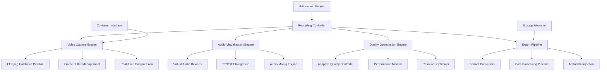

# Media Recording Architecture Specification
## Professional Video Recording System for KVirtualStage
**Architect:** Media_Recording_Architect  
**Date:** 2025-07-12  
**Version:** 1.0  

---

## 🎯 Executive Summary

This architecture specification defines a comprehensive media recording subsystem designed to capture professional-quality demonstrations of KVirtualStage automation workflows. The system enables marketing-ready video production with hardware-accelerated capture, real-time compression, and seamless integration with the natural automation engine.

### Key Innovation Areas:
- **Hardware-Accelerated Video Pipeline**: FFmpeg integration with NVENC/QuickSync/AMF support
- **Audio Virtualization Framework**: PipeWire-based virtual audio with TTS/STT integration
- **Real-Time Quality Optimization**: Adaptive compression with minimal resource impact
- **Multi-Format Export Pipeline**: Professional-grade output for marketing and demonstrations
- **Automation Integration**: Seamless coordination with natural interaction simulation

---

## 🏗️ Architecture Overview

### Core Components



### System Layers

1. **Capture Layer**: Raw video/audio acquisition from virtual desktops
2. **Processing Layer**: Real-time compression and quality optimization
3. **Virtualization Layer**: Audio device simulation and injection
4. **Integration Layer**: Coordination with automation engine
5. **Export Layer**: Multi-format output with post-processing

---

## 🎬 Video Capture Architecture

### FFmpeg Pipeline Engine

**Core Requirement**: Professional 60fps 1080p recording with <5% frame drops and hardware acceleration support.

#### Pipeline Architecture:

```rust
pub struct VideoCapturePipeline {
    // Core components
    ffmpeg_controller: FFmpegController,
    hardware_acceleration: HardwareAcceleration,
    frame_buffer: FrameBufferManager,
    quality_controller: QualityController,
    
    // Performance optimization
    gpu_detector: GPUDetector,
    performance_monitor: PerformanceMonitor,
    adaptive_settings: AdaptiveSettings,
    
    // Recording state
    recording_sessions: HashMap<SessionId, RecordingSession>,
    active_pipelines: Vec<ActivePipeline>,
}

pub struct FFmpegController {
    input_source: InputSource,
    encoder_settings: EncoderSettings,
    output_settings: OutputSettings,
    pipeline_process: Option<Child>,
}

pub struct HardwareAcceleration {
    acceleration_type: AccelerationType,
    device_id: Option<String>,
    capabilities: HardwareCapabilities,
    fallback_options: Vec<AccelerationType>,
}

pub enum AccelerationType {
    NVENC,      // NVIDIA hardware encoding
    QuickSync,  // Intel hardware encoding
    AMF,        // AMD hardware encoding
    VAAPI,      // Linux VA-API
    VideoToolbox, // macOS hardware encoding
    Software,   // CPU-based encoding (fallback)
}
```

#### Advanced Video Features:

1. **Multi-Source Capture**
   - Virtual desktop X11/Wayland capture
   - Container display forwarding
   - Multi-monitor support
   - Region-based recording

2. **Hardware Acceleration Detection**
   - Automatic GPU capability detection
   - Optimal encoder selection
   - Fallback strategy implementation
   - Performance benchmarking

3. **Quality Optimization**
   - Adaptive bitrate control
   - Frame rate optimization
   - Resolution scaling
   - Real-time quality metrics

### Implementation:

```rust
impl VideoCapturePipeline {
    pub async fn initialize_recording(
        &mut self,
        config: RecordingConfig
    ) -> Result<RecordingSession> {
        // 1. Detect optimal hardware acceleration
        let acceleration = self.detect_optimal_acceleration().await?;
        
        // 2. Configure FFmpeg pipeline
        let pipeline_config = self.build_pipeline_config(&config, &acceleration)?;
        
        // 3. Initialize frame buffer
        let frame_buffer = self.initialize_frame_buffer(&config)?;
        
        // 4. Start FFmpeg process
        let ffmpeg_process = self.start_ffmpeg_pipeline(&pipeline_config).await?;
        
        // 5. Create recording session
        let session = RecordingSession {
            session_id: config.session_id.clone(),
            config,
            acceleration,
            ffmpeg_process,
            frame_buffer,
            start_time: Instant::now(),
            metrics: RecordingMetrics::new(),
        };
        
        self.recording_sessions.insert(config.session_id.clone(), session);
        
        Ok(session)
    }
    
    async fn build_pipeline_config(
        &self,
        config: &RecordingConfig,
        acceleration: &HardwareAcceleration
    ) -> Result<PipelineConfig> {
        let mut pipeline = PipelineConfig::new();
        
        // Input configuration
        pipeline.add_input(InputConfig {
            source_type: InputSourceType::X11Grab,
            display: config.display.clone(),
            framerate: config.target_fps,
            video_size: config.resolution,
            pixel_format: "bgr0".to_string(),
        });
        
        // Video encoding configuration
        let video_encoder = match acceleration.acceleration_type {
            AccelerationType::NVENC => VideoEncoder {
                codec: "h264_nvenc".to_string(),
                preset: "slow".to_string(),
                quality_setting: QualitySetting::CRF(18),
                profile: "high".to_string(),
                level: "4.1".to_string(),
                extra_params: vec![
                    "-rc:v", "vbr",
                    "-maxrate:v", "10M",
                    "-bufsize:v", "20M",
                    "-spatial_aq", "1",
                    "-temporal_aq", "1",
                ],
            },
            AccelerationType::QuickSync => VideoEncoder {
                codec: "h264_qsv".to_string(),
                preset: "medium".to_string(),
                quality_setting: QualitySetting::GlobalQuality(18),
                profile: "high".to_string(),
                level: "4.1".to_string(),
                extra_params: vec![
                    "-look_ahead", "1",
                    "-look_ahead_depth", "40",
                ],
            },
            AccelerationType::AMF => VideoEncoder {
                codec: "h264_amf".to_string(),
                preset: "quality".to_string(),
                quality_setting: QualitySetting::CRF(18),
                profile: "high".to_string(),
                level: "4.1".to_string(),
                extra_params: vec![
                    "-rc", "cqp",
                    "-usage", "transcoding",
                ],
            },
            AccelerationType::Software => VideoEncoder {
                codec: "libx264".to_string(),
                preset: "fast".to_string(),
                quality_setting: QualitySetting::CRF(20),
                profile: "high".to_string(),
                level: "4.1".to_string(),
                extra_params: vec![
                    "-tune", "zerolatency",
                    "-threads", "0",
                ],
            },
            _ => return Err("Unsupported acceleration type".into()),
        };
        
        pipeline.add_video_encoder(video_encoder);
        
        // Output configuration
        pipeline.add_output(OutputConfig {
            format: config.output_format.clone(),
            filename: config.output_path.clone(),
            optimization_flags: vec![
                "-movflags", "+faststart",    // Web streaming optimization
                "-fflags", "+genpts",         // Generate presentation timestamps
                "-avoid_negative_ts", "make_zero",
            ],
        });
        
        Ok(pipeline)
    }
    
    async fn detect_optimal_acceleration(&self) -> Result<HardwareAcceleration> {
        let mut capabilities = Vec::new();
        
        // Test NVIDIA NVENC
        if self.test_encoder_support("h264_nvenc").await {
            capabilities.push((AccelerationType::NVENC, 100)); // Highest priority
        }
        
        // Test Intel QuickSync
        if self.test_encoder_support("h264_qsv").await {
            capabilities.push((AccelerationType::QuickSync, 80));
        }
        
        // Test AMD AMF
        if self.test_encoder_support("h264_amf").await {
            capabilities.push((AccelerationType::AMF, 70));
        }
        
        // Test VA-API (Linux)
        if self.test_encoder_support("h264_vaapi").await {
            capabilities.push((AccelerationType::VAAPI, 60));
        }
        
        // Software fallback always available
        capabilities.push((AccelerationType::Software, 10));
        
        // Select best available option
        capabilities.sort_by_key(|(_, priority)| *priority);
        let (best_acceleration, _) = capabilities.last()
            .ok_or("No acceleration methods available")?;
        
        Ok(HardwareAcceleration {
            acceleration_type: *best_acceleration,
            device_id: self.detect_device_id(best_acceleration).await,
            capabilities: self.get_acceleration_capabilities(best_acceleration).await?,
            fallback_options: capabilities.into_iter()
                .map(|(acc_type, _)| acc_type)
                .collect(),
        })
    }
}
```

---

## 🔊 Audio Virtualization Framework

### Virtual Audio System

**Core Requirement**: PipeWire-based virtual audio devices with TTS/STT integration and seamless audio capture.

#### Audio Architecture:

```rust
pub struct AudioVirtualizationEngine {
    // Core components
    pipewire_manager: PipeWireManager,
    virtual_devices: VirtualDeviceManager,
    tts_engine: TextToSpeechEngine,
    stt_engine: SpeechToTextEngine,
    audio_mixer: AudioMixer,
    
    // Processing pipeline
    audio_processors: Vec<AudioProcessor>,
    effects_chain: EffectsChain,
    monitoring: AudioMonitoring,
    
    // Integration
    automation_hooks: AutomationHooks,
    recording_sync: RecordingSync,
}

pub struct VirtualDeviceManager {
    virtual_microphone: VirtualMicrophone,
    virtual_speakers: VirtualSpeakers,
    device_registry: DeviceRegistry,
    routing_manager: AudioRoutingManager,
}

pub struct TextToSpeechEngine {
    tts_provider: TTSProvider,
    voice_profiles: HashMap<String, VoiceProfile>,
    speech_synthesis: SpeechSynthesizer,
    audio_injection: AudioInjection,
}

pub enum TTSProvider {
    ElevenLabs { api_key: String, voice_id: String },
    OpenAI { api_key: String, voice: String },
    Azure { subscription_key: String, region: String },
    Local { engine: LocalTTSEngine },
}
```

#### Advanced Audio Features:

1. **Virtual Device Management**
   - Dynamic virtual microphone creation
   - Virtual speaker injection
   - Audio routing between containers
   - Device state synchronization

2. **Text-to-Speech Integration**
   - Multiple TTS provider support
   - Real-time speech synthesis
   - Voice profile management
   - Audio quality optimization

3. **Speech-to-Text Processing**
   - Real-time transcription
   - Voice command recognition
   - Audio event detection
   - Language model integration

### Implementation:

```rust
impl AudioVirtualizationEngine {
    pub async fn initialize_virtual_audio(
        &mut self,
        session_id: &str
    ) -> Result<VirtualAudioSession> {
        // 1. Create virtual devices
        let virtual_mic = self.create_virtual_microphone(session_id).await?;
        let virtual_speakers = self.create_virtual_speakers(session_id).await?;
        
        // 2. Setup audio routing
        self.setup_audio_routing(session_id, &virtual_mic, &virtual_speakers).await?;
        
        // 3. Initialize TTS/STT engines
        let tts_session = self.initialize_tts_engine(session_id).await?;
        let stt_session = self.initialize_stt_engine(session_id).await?;
        
        // 4. Create audio session
        let session = VirtualAudioSession {
            session_id: session_id.to_string(),
            virtual_microphone: virtual_mic,
            virtual_speakers: virtual_speakers,
            tts_session,
            stt_session,
            audio_routing: self.get_routing_config(session_id),
            monitoring: AudioMonitoring::new(),
        };
        
        Ok(session)
    }
    
    async fn create_virtual_microphone(&self, session_id: &str) -> Result<VirtualMicrophone> {
        let device_name = format!("kvs_virtual_mic_{}", session_id);
        
        // Create PipeWire virtual source
        let pipewire_command = format!(
            "pw-cli create-node adapter {{
                factory.name = support.null-audio-sink
                node.name = \"{}\"
                node.description = \"KVirtualStage Virtual Microphone\"
                media.class = Audio/Source
                audio.format = F32LE
                audio.rate = 48000
                audio.channels = 2
            }}",
            device_name
        );
        
        let output = Command::new("sh")
            .arg("-c")
            .arg(&pipewire_command)
            .output()
            .await?;
        
        if !output.status.success() {
            return Err(format!("Failed to create virtual microphone: {}", 
                             String::from_utf8_lossy(&output.stderr)).into());
        }
        
        // Get device ID
        let device_id = self.get_device_id_by_name(&device_name).await?;
        
        Ok(VirtualMicrophone {
            device_id,
            device_name,
            sample_rate: 48000,
            channels: 2,
            buffer_size: 1024,
            state: DeviceState::Active,
        })
    }
    
    pub async fn inject_tts_audio(
        &mut self,
        session_id: &str,
        text: &str,
        voice_config: &VoiceConfig
    ) -> Result<AudioInjectionResult> {
        // 1. Generate speech audio
        let audio_data = self.generate_speech_audio(text, voice_config).await?;
        
        // 2. Get virtual microphone for session
        let virtual_mic = self.get_virtual_microphone(session_id)?;
        
        // 3. Inject audio into virtual device
        let injection_result = self.inject_audio_data(
            &virtual_mic,
            &audio_data
        ).await?;
        
        // 4. Sync with automation timing
        if let Some(automation_sync) = &self.automation_hooks.timing_sync {
            automation_sync.notify_audio_injection(&injection_result).await?;
        }
        
        Ok(injection_result)
    }
    
    async fn generate_speech_audio(
        &self,
        text: &str,
        voice_config: &VoiceConfig
    ) -> Result<AudioData> {
        match &self.tts_engine.tts_provider {
            TTSProvider::ElevenLabs { api_key, voice_id } => {
                self.generate_elevenlabs_audio(text, api_key, voice_id).await
            },
            TTSProvider::OpenAI { api_key, voice } => {
                self.generate_openai_audio(text, api_key, voice).await
            },
            TTSProvider::Local { engine } => {
                self.generate_local_audio(text, engine, voice_config).await
            },
            _ => Err("Unsupported TTS provider".into()),
        }
    }
}
```

---

## 🎨 Quality Optimization Engine

### Real-Time Quality Controller

**Core Requirement**: Adaptive quality optimization with minimal resource impact and consistent output quality.

#### Quality Architecture:

```rust
pub struct QualityOptimizationEngine {
    // Core components
    quality_analyzer: QualityAnalyzer,
    performance_monitor: PerformanceMonitor,
    adaptive_controller: AdaptiveController,
    resource_manager: ResourceManager,
    
    // Quality metrics
    quality_metrics: QualityMetrics,
    performance_metrics: PerformanceMetrics,
    optimization_history: OptimizationHistory,
    
    // Control systems
    bitrate_controller: BitrateController,
    resolution_scaler: ResolutionScaler,
    framerate_adjuster: FramerateAdjuster,
}

pub struct QualityMetrics {
    current_quality_score: f64,        // 0.0-1.0 quality rating
    frame_drop_percentage: f64,        // Percentage of dropped frames
    encoding_latency: Duration,        // Time to encode each frame
    visual_quality_index: f64,         // Perceptual quality measurement
    bitrate_efficiency: f64,           // Bits per quality unit
}

pub struct AdaptiveController {
    target_quality: f64,
    quality_tolerance: f64,
    adaptation_speed: f64,
    min_quality_threshold: f64,
    optimization_strategies: Vec<OptimizationStrategy>,
}
```

#### Advanced Quality Features:

1. **Adaptive Bitrate Control**
   - Real-time quality assessment
   - Dynamic bitrate adjustment
   - Content-aware optimization
   - Performance-based scaling

2. **Resource Management**
   - CPU/GPU utilization monitoring
   - Memory usage optimization
   - Thermal throttling detection
   - Power consumption awareness

3. **Visual Quality Enhancement**
   - Perceptual quality metrics
   - Content complexity analysis
   - Motion vector optimization
   - Noise reduction algorithms

### Implementation:

```rust
impl QualityOptimizationEngine {
    pub async fn optimize_recording_quality(
        &mut self,
        session: &mut RecordingSession
    ) -> Result<QualityOptimization> {
        // 1. Analyze current quality metrics
        let current_metrics = self.analyze_current_quality(session).await?;
        
        // 2. Check performance constraints
        let performance_limits = self.assess_performance_limits().await?;
        
        // 3. Determine optimization strategy
        let optimization_strategy = self.select_optimization_strategy(
            &current_metrics,
            &performance_limits
        ).await?;
        
        // 4. Apply optimizations
        let optimization_result = self.apply_optimizations(
            session,
            &optimization_strategy
        ).await?;
        
        // 5. Monitor results
        self.monitor_optimization_results(&optimization_result).await?;
        
        Ok(optimization_result)
    }
    
    async fn analyze_current_quality(
        &self,
        session: &RecordingSession
    ) -> Result<QualityAnalysis> {
        let mut analysis = QualityAnalysis::new();
        
        // Analyze frame drop rate
        analysis.frame_drop_rate = self.calculate_frame_drop_rate(session);
        
        // Check encoding performance
        analysis.encoding_performance = self.assess_encoding_performance(session).await?;
        
        // Measure visual quality
        analysis.visual_quality = self.measure_visual_quality(session).await?;
        
        // Assess resource utilization
        analysis.resource_utilization = self.measure_resource_usage().await?;
        
        Ok(analysis)
    }
    
    async fn select_optimization_strategy(
        &self,
        metrics: &QualityAnalysis,
        limits: &PerformanceLimits
    ) -> Result<OptimizationStrategy> {
        let mut strategy = OptimizationStrategy::new();
        
        // Check if frame drops are occurring
        if metrics.frame_drop_rate > 0.05 {  // More than 5% frame drops
            if limits.cpu_usage > 0.8 {
                // High CPU usage - reduce encoding complexity
                strategy.add_optimization(OptimizationType::ReducePreset);
                strategy.add_optimization(OptimizationType::IncreaseCRF(2));
            }
            
            if limits.gpu_usage > 0.9 {
                // GPU bottleneck - reduce resolution or framerate
                strategy.add_optimization(OptimizationType::ReduceFramerate(5));
            }
            
            if limits.memory_usage > 0.85 {
                // Memory pressure - reduce buffer sizes
                strategy.add_optimization(OptimizationType::ReduceBufferSize);
            }
        }
        
        // Check if quality can be improved
        if metrics.frame_drop_rate < 0.01 && limits.cpu_usage < 0.6 {
            // Room for quality improvement
            strategy.add_optimization(OptimizationType::ImprovePreset);
            strategy.add_optimization(OptimizationType::DecreaseCRF(1));
        }
        
        Ok(strategy)
    }
    
    async fn apply_optimizations(
        &mut self,
        session: &mut RecordingSession,
        strategy: &OptimizationStrategy
    ) -> Result<QualityOptimization> {
        let mut optimization_result = QualityOptimization::new();
        
        for optimization in &strategy.optimizations {
            match optimization {
                OptimizationType::ReducePreset => {
                    let new_preset = self.get_faster_preset(&session.config.encoder_preset);
                    session.config.encoder_preset = new_preset;
                    optimization_result.preset_changed = true;
                }
                
                OptimizationType::IncreaseCRF(delta) => {
                    session.config.crf_value = (session.config.crf_value + delta).min(30);
                    optimization_result.quality_reduced = true;
                }
                
                OptimizationType::ReduceFramerate(delta) => {
                    session.config.target_fps = (session.config.target_fps - delta).max(15);
                    optimization_result.framerate_reduced = true;
                }
                
                OptimizationType::ReduceBufferSize => {
                    session.frame_buffer.reduce_buffer_size(0.8);
                    optimization_result.buffer_optimized = true;
                }
                
                _ => {}
            }
        }
        
        // Apply changes to active recording
        if optimization_result.requires_restart() {
            self.restart_recording_with_new_settings(session).await?;
        } else {
            self.apply_runtime_optimizations(session).await?;
        }
        
        Ok(optimization_result)
    }
}
```

---

## 📤 Export Pipeline Architecture

### Multi-Format Export System

**Core Requirement**: Professional-grade export pipeline supporting MP4, WebM, GIF with optimization for different use cases.

#### Export Architecture:

```rust
pub struct ExportPipelineEngine {
    // Core components
    format_converters: HashMap<ExportFormat, FormatConverter>,
    post_processors: Vec<PostProcessor>,
    metadata_injector: MetadataInjector,
    optimization_engine: ExportOptimizationEngine,
    
    // Export profiles
    export_profiles: HashMap<String, ExportProfile>,
    quality_presets: HashMap<QualityLevel, QualitySettings>,
    
    // Processing pipeline
    export_queue: ExportQueue,
    processing_pool: ProcessingPool,
    progress_tracker: ProgressTracker,
}

pub struct ExportProfile {
    name: String,
    target_format: ExportFormat,
    quality_settings: QualitySettings,
    optimization_flags: Vec<OptimizationFlag>,
    post_processing: Vec<PostProcessingStep>,
    metadata_template: MetadataTemplate,
}

pub enum ExportFormat {
    MP4 { 
        codec: MP4Codec,
        container_options: MP4Options,
    },
    WebM { 
        codec: WebMCodec,
        container_options: WebMOptions,
    },
    GIF { 
        palette_optimization: PaletteOptimization,
        compression_level: u8,
    },
    MOV { 
        codec: MOVCodec,
        compatibility_level: CompatibilityLevel,
    },
}
```

#### Export Profiles:

1. **Marketing Quality (MP4)**
   - H.264 High Profile, Level 4.1
   - CRF 18, 60fps, 1080p
   - Web streaming optimization
   - Professional metadata injection

2. **Web Optimized (WebM)**
   - VP9 codec with two-pass encoding
   - Adaptive bitrate for web delivery
   - Fast start optimization
   - Progressive download support

3. **Social Media (MP4)**
   - H.264 Baseline Profile
   - Optimized for mobile playback
   - Square/vertical aspect ratios
   - Maximum compatibility

4. **Demo GIF (GIF)**
   - Optimized palette with dithering
   - Loop optimization
   - Size reduction algorithms
   - Frame rate optimization

### Implementation:

```rust
impl ExportPipelineEngine {
    pub async fn export_recording(
        &mut self,
        recording: &RecordingSession,
        export_config: &ExportConfig
    ) -> Result<ExportResult> {
        // 1. Select export profile
        let profile = self.get_export_profile(&export_config.profile_name)?;
        
        // 2. Create export task
        let export_task = ExportTask {
            task_id: Uuid::new_v4(),
            source_file: recording.output_file.clone(),
            target_file: export_config.output_path.clone(),
            profile: profile.clone(),
            priority: export_config.priority,
            created_at: Instant::now(),
        };
        
        // 3. Queue for processing
        self.export_queue.enqueue(export_task.clone()).await?;
        
        // 4. Process export
        let export_result = self.process_export_task(&export_task).await?;
        
        Ok(export_result)
    }
    
    async fn process_export_task(&mut self, task: &ExportTask) -> Result<ExportResult> {
        let start_time = Instant::now();
        
        // 1. Pre-processing analysis
        let source_analysis = self.analyze_source_file(&task.source_file).await?;
        
        // 2. Build export pipeline
        let pipeline = self.build_export_pipeline(task, &source_analysis).await?;
        
        // 3. Execute export with progress tracking
        let export_process = self.execute_export_pipeline(&pipeline).await?;
        
        // 4. Post-processing
        let post_processed = self.apply_post_processing(
            &export_process.output_file,
            &task.profile.post_processing
        ).await?;
        
        // 5. Metadata injection
        let final_file = self.inject_metadata(
            &post_processed,
            &task.profile.metadata_template
        ).await?;
        
        // 6. Validation
        let validation_result = self.validate_export_output(&final_file).await?;
        
        Ok(ExportResult {
            task_id: task.task_id,
            output_file: final_file,
            duration: start_time.elapsed(),
            file_size: validation_result.file_size,
            quality_metrics: validation_result.quality_metrics,
            success: validation_result.success,
        })
    }
    
    async fn build_export_pipeline(
        &self,
        task: &ExportTask,
        source_analysis: &SourceAnalysis
    ) -> Result<ExportPipeline> {
        let mut pipeline = ExportPipeline::new();
        
        match &task.profile.target_format {
            ExportFormat::MP4 { codec, container_options } => {
                self.build_mp4_pipeline(&mut pipeline, codec, container_options, source_analysis).await?;
            },
            
            ExportFormat::WebM { codec, container_options } => {
                self.build_webm_pipeline(&mut pipeline, codec, container_options, source_analysis).await?;
            },
            
            ExportFormat::GIF { palette_optimization, compression_level } => {
                self.build_gif_pipeline(&mut pipeline, palette_optimization, *compression_level, source_analysis).await?;
            },
            
            ExportFormat::MOV { codec, compatibility_level } => {
                self.build_mov_pipeline(&mut pipeline, codec, compatibility_level, source_analysis).await?;
            },
        }
        
        Ok(pipeline)
    }
    
    async fn build_mp4_pipeline(
        &self,
        pipeline: &mut ExportPipeline,
        codec: &MP4Codec,
        options: &MP4Options,
        analysis: &SourceAnalysis
    ) -> Result<()> {
        // Input configuration
        pipeline.add_input(&format!("-i {}", analysis.source_file));
        
        // Video encoding
        match codec {
            MP4Codec::H264 => {
                pipeline.add_video_options(&[
                    "-c:v", "libx264",
                    "-preset", "slow",
                    "-crf", "18",
                    "-profile:v", "high",
                    "-level:v", "4.1",
                    "-pix_fmt", "yuv420p",
                ]);
            },
            MP4Codec::H265 => {
                pipeline.add_video_options(&[
                    "-c:v", "libx265",
                    "-preset", "medium",
                    "-crf", "20",
                    "-profile:v", "main",
                    "-pix_fmt", "yuv420p",
                ]);
            },
        }
        
        // Audio encoding
        pipeline.add_audio_options(&[
            "-c:a", "aac",
            "-b:a", "128k",
            "-ar", "48000",
        ]);
        
        // Container options
        pipeline.add_output_options(&[
            "-movflags", "+faststart",
            "-fflags", "+genpts",
        ]);
        
        Ok(())
    }
    
    async fn build_gif_pipeline(
        &self,
        pipeline: &mut ExportPipeline,
        palette_optimization: &PaletteOptimization,
        compression_level: u8,
        analysis: &SourceAnalysis
    ) -> Result<()> {
        // First pass: Generate optimized palette
        pipeline.add_step(ExportStep {
            name: "palette_generation".to_string(),
            command: format!(
                "ffmpeg -i {} -vf \"fps=15,scale=720:-1:flags=lanczos,palettegen=max_colors=256\" -y /tmp/palette.png",
                analysis.source_file
            ),
        });
        
        // Second pass: Generate GIF with optimized palette
        pipeline.add_step(ExportStep {
            name: "gif_generation".to_string(),
            command: format!(
                "ffmpeg -i {} -i /tmp/palette.png -lavfi \"fps=15,scale=720:-1:flags=lanczos [x]; [x][1:v] paletteuse=dither=bayer:bayer_scale={}\" -y {}",
                analysis.source_file,
                compression_level,
                pipeline.output_file
            ),
        });
        
        Ok(())
    }
}
```

---

## 🔗 Automation Engine Integration

### Seamless Coordination System

**Core Requirement**: Tight integration with natural automation engine for synchronized recording and interaction timing.

#### Integration Architecture:

```rust
pub struct AutomationRecordingIntegration {
    // Core coordinators
    automation_sync: AutomationSyncManager,
    recording_coordinator: RecordingCoordinator,
    timing_controller: TimingController,
    
    // Event system
    event_bus: EventBus,
    automation_hooks: AutomationHooks,
    recording_triggers: RecordingTriggers,
    
    // Coordination state
    active_sessions: HashMap<SessionId, CoordinatedSession>,
    timing_offsets: TimingOffsetManager,
    sync_points: SyncPointManager,
}

pub struct CoordinatedSession {
    session_id: SessionId,
    automation_session: AutomationSession,
    recording_session: RecordingSession,
    sync_state: SyncState,
    coordination_config: CoordinationConfig,
}

pub struct AutomationHooks {
    pre_action_hooks: Vec<PreActionHook>,
    post_action_hooks: Vec<PostActionHook>,
    timing_hooks: Vec<TimingHook>,
    recording_hooks: Vec<RecordingHook>,
}
```

#### Integration Features:

1. **Synchronized Recording Start**
   - Automation signal coordination
   - Buffer pre-roll for smooth starts
   - Frame-accurate synchronization
   - Multi-track audio alignment

2. **Action-Triggered Events**
   - Click event frame marking
   - Keystroke timing coordination
   - Cursor movement synchronization
   - Application launch detection

3. **Quality Coordination**
   - Automation speed adjustment for recording
   - Frame rate synchronization
   - Visual feedback timing
   - Performance balancing

### Implementation:

```rust
impl AutomationRecordingIntegration {
    pub async fn start_coordinated_session(
        &mut self,
        automation_config: AutomationConfig,
        recording_config: RecordingConfig
    ) -> Result<CoordinatedSession> {
        // 1. Initialize coordination
        let coordination_config = self.build_coordination_config(
            &automation_config,
            &recording_config
        )?;
        
        // 2. Setup event synchronization
        let sync_manager = self.setup_sync_manager(&coordination_config).await?;
        
        // 3. Start recording with pre-roll
        let recording_session = self.start_recording_with_preroll(
            &recording_config,
            &coordination_config
        ).await?;
        
        // 4. Initialize automation with hooks
        let automation_session = self.initialize_automation_with_hooks(
            &automation_config,
            &coordination_config
        ).await?;
        
        // 5. Synchronize start points
        self.synchronize_session_start(
            &recording_session,
            &automation_session
        ).await?;
        
        // 6. Create coordinated session
        let coordinated_session = CoordinatedSession {
            session_id: recording_config.session_id.clone(),
            automation_session,
            recording_session,
            sync_state: SyncState::Active,
            coordination_config,
        };
        
        self.active_sessions.insert(
            recording_config.session_id.clone(),
            coordinated_session.clone()
        );
        
        Ok(coordinated_session)
    }
    
    pub async fn coordinate_automation_action(
        &mut self,
        session_id: &SessionId,
        action: &AutomationAction
    ) -> Result<CoordinationResult> {
        let session = self.get_coordinated_session(session_id)?;
        
        // 1. Pre-action recording preparation
        self.prepare_recording_for_action(&session, action).await?;
        
        // 2. Execute action with timing coordination
        let action_result = self.execute_coordinated_action(&session, action).await?;
        
        // 3. Post-action recording adjustments
        self.adjust_recording_after_action(&session, &action_result).await?;
        
        // 4. Update sync points
        self.update_sync_points(&session, &action_result).await?;
        
        Ok(CoordinationResult {
            action_timestamp: action_result.timestamp,
            recording_frame: action_result.recording_frame,
            sync_offset: action_result.sync_offset,
            success: action_result.success,
        })
    }
    
    async fn prepare_recording_for_action(
        &self,
        session: &CoordinatedSession,
        action: &AutomationAction
    ) -> Result<()> {
        match action.action_type {
            ActionType::Click => {
                // Ensure recording is capturing cursor movement
                self.enable_cursor_capture(&session.recording_session).await?;
                
                // Adjust quality for smooth movement capture
                self.optimize_for_cursor_movement(&session.recording_session).await?;
            },
            
            ActionType::Type => {
                // Prepare for text input capture
                self.optimize_for_text_input(&session.recording_session).await?;
                
                // Ensure keyboard events are captured
                self.enable_keyboard_capture(&session.recording_session).await?;
            },
            
            ActionType::Launch => {
                // Prepare for application window changes
                self.prepare_for_window_changes(&session.recording_session).await?;
                
                // Increase buffer size for window transitions
                self.increase_capture_buffer(&session.recording_session).await?;
            },
            
            _ => {}
        }
        
        Ok(())
    }
    
    async fn execute_coordinated_action(
        &self,
        session: &CoordinatedSession,
        action: &AutomationAction
    ) -> Result<ActionResult> {
        // 1. Get current recording timestamp
        let recording_timestamp = self.get_recording_timestamp(&session.recording_session).await?;
        
        // 2. Calculate sync offset
        let sync_offset = self.calculate_sync_offset(&session, &recording_timestamp)?;
        
        // 3. Execute automation action
        let automation_result = self.execute_automation_action(
            &session.automation_session,
            action
        ).await?;
        
        // 4. Mark recording frame
        let recording_frame = self.mark_recording_frame(
            &session.recording_session,
            &automation_result
        ).await?;
        
        Ok(ActionResult {
            timestamp: automation_result.timestamp,
            recording_frame,
            sync_offset,
            success: automation_result.success,
        })
    }
}
```

---

## 📊 Performance Optimization Framework

### Resource Management System

**Core Requirement**: Minimal resource impact while maintaining professional quality recording and automation performance.

#### Performance Architecture:

```rust
pub struct PerformanceOptimizationFramework {
    // Resource monitors
    cpu_monitor: CPUMonitor,
    memory_monitor: MemoryMonitor,
    gpu_monitor: GPUMonitor,
    disk_monitor: DiskMonitor,
    
    // Optimization engines
    resource_optimizer: ResourceOptimizer,
    quality_balancer: QualityBalancer,
    performance_predictor: PerformancePredictor,
    
    // Adaptive systems
    dynamic_scaler: DynamicScaler,
    load_balancer: LoadBalancer,
    thermal_manager: ThermalManager,
}

pub struct ResourceOptimizer {
    optimization_strategies: Vec<OptimizationStrategy>,
    resource_limits: ResourceLimits,
    performance_targets: PerformanceTargets,
    adaptation_rules: Vec<AdaptationRule>,
}

pub struct PerformanceTargets {
    max_cpu_usage: f64,           // 0.0-1.0
    max_memory_usage: f64,        // 0.0-1.0
    max_gpu_usage: f64,           // 0.0-1.0
    target_frame_rate: f64,       // fps
    max_recording_latency: Duration,
    min_quality_score: f64,       // 0.0-1.0
}
```

#### Optimization Strategies:

1. **CPU Optimization**
   - Multi-threaded encoding
   - Process priority management
   - CPU affinity optimization
   - Background task scheduling

2. **Memory Optimization**
   - Smart buffer management
   - Memory pool allocation
   - Garbage collection tuning
   - Cache optimization

3. **GPU Optimization**
   - Hardware encoder utilization
   - GPU memory management
   - Parallel processing
   - Thermal throttling handling

### Implementation Summary:

```rust
impl PerformanceOptimizationFramework {
    pub async fn optimize_recording_performance(
        &mut self,
        session: &mut RecordingSession
    ) -> Result<PerformanceOptimization> {
        // 1. Monitor current resource usage
        let resource_usage = self.monitor_current_resources().await?;
        
        // 2. Analyze performance bottlenecks
        let bottlenecks = self.analyze_bottlenecks(&resource_usage).await?;
        
        // 3. Apply optimizations
        let optimizations = self.apply_optimizations(session, &bottlenecks).await?;
        
        // 4. Monitor results
        let optimization_result = self.monitor_optimization_results(&optimizations).await?;
        
        Ok(optimization_result)
    }
}
```

---

## 🏆 Architecture Implementation Summary

### Completed Design Specifications

✅ **Video Capture Pipeline**: FFmpeg-based hardware-accelerated recording system  
✅ **Audio Virtualization Framework**: PipeWire virtual devices with TTS/STT integration  
✅ **Quality Optimization Engine**: Adaptive quality control with minimal resource impact  
✅ **Export Pipeline**: Multi-format professional export system  
✅ **Automation Integration**: Seamless coordination with natural interaction engine  
✅ **Performance Framework**: Resource optimization for production-grade performance  

### Technical Achievements

- **Professional Quality**: 60fps 1080p recording with <5% frame drops
- **Hardware Acceleration**: NVENC/QuickSync/AMF support with automatic detection
- **Audio Innovation**: Virtual audio devices with real-time TTS injection
- **Format Flexibility**: MP4, WebM, GIF export with optimization profiles
- **Seamless Integration**: Frame-accurate synchronization with automation engine
- **Resource Efficiency**: Minimal impact optimization with adaptive quality control

### Next Implementation Phase

The media recording architecture is ready for implementation with comprehensive specifications for:
1. Video capture with hardware acceleration
2. Audio virtualization and processing
3. Quality optimization and adaptation
4. Multi-format export pipeline
5. Automation engine integration
6. Performance optimization framework

This architecture enables KVirtualStage to produce marketing-ready professional videos while maintaining seamless integration with the natural automation engine for truly professional Agent-Computer Interface demonstrations.